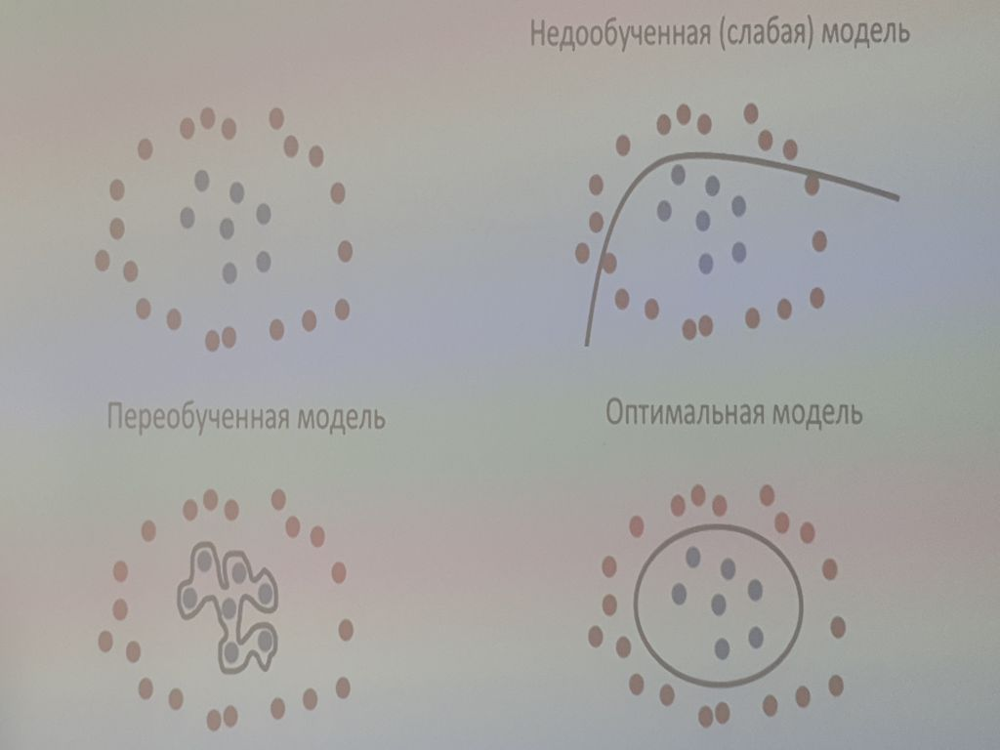
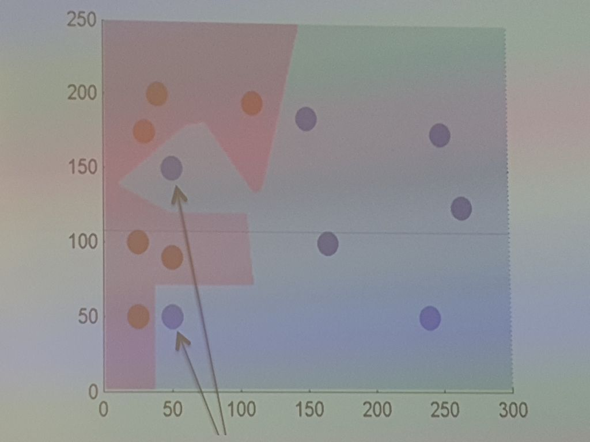
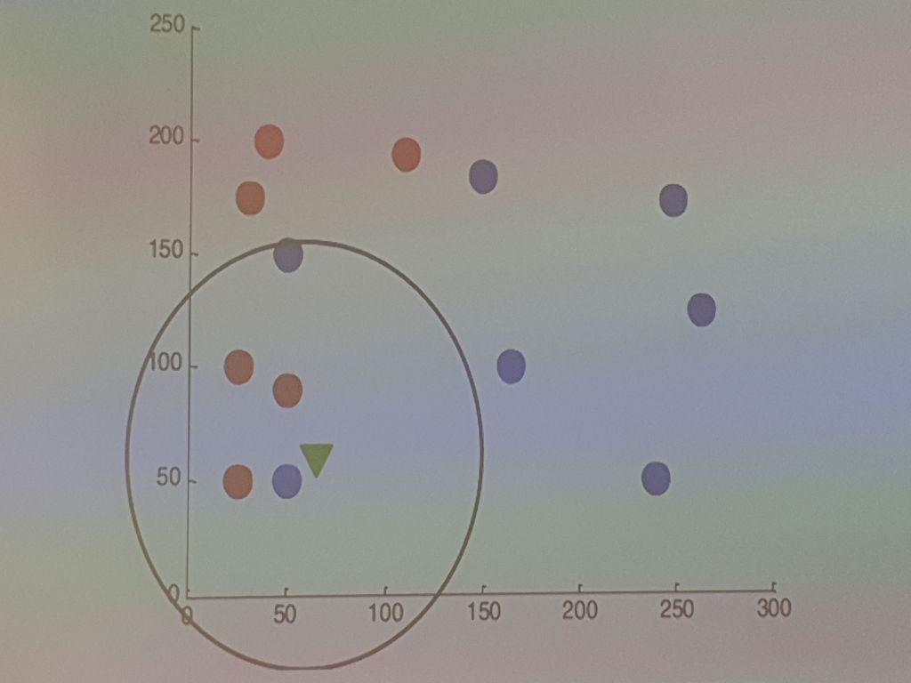
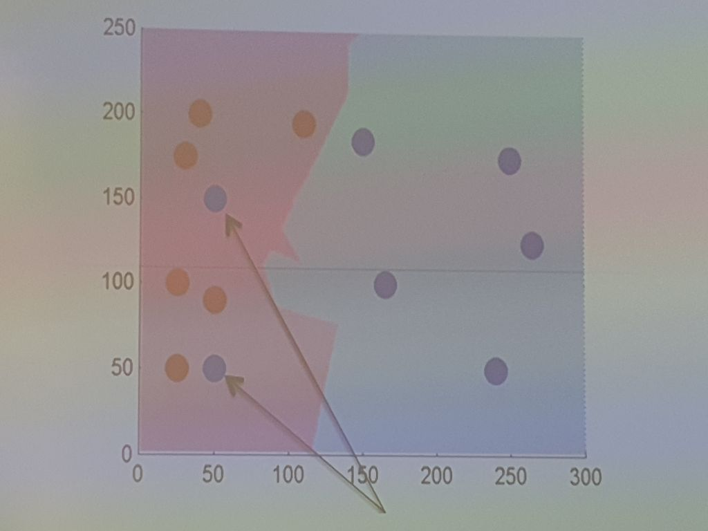
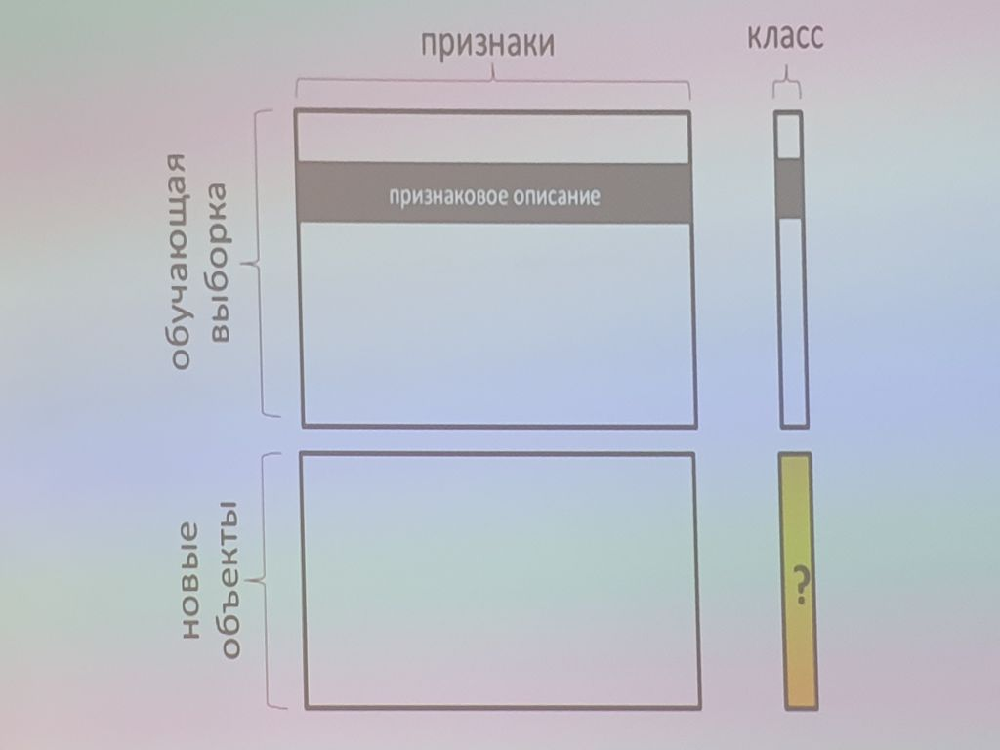
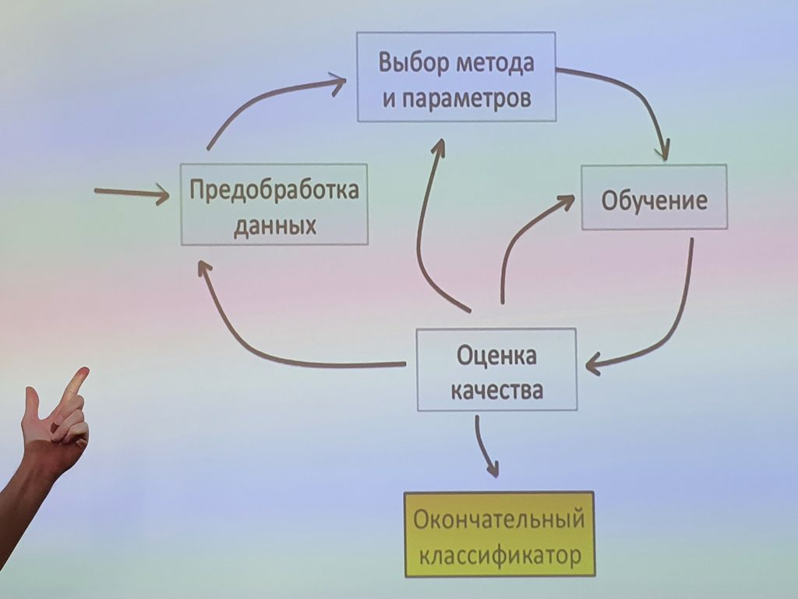

___
___
___
## Информация о занятии
- __Дисциплина:__ Машинное обучение в системах искусственного интеллекта (MLiAIS)
- __Преподаватель:__ Смагин Сергей Владимирович
- __Тип занятия:__ Лабораторная работа №1
- __Формат занятия:__ Очно (ДВФУ, D733a)
- __Дата и время занятия:__ 27.09.2022, вт (чет.), 16:50-18:20
___
___
___

&nbsp;

## Лабораторная работа (презентация со слайдами) (продолжение лекции от 21.09.2022)

&nbsp;

### ___17. Специфика машинного обучения___

&nbsp;

__Проблема вычислительной эффективности__

_Эффективность_ - это продуктивность использования ресурсов в достижении
какой-либо цели.
_Вычислительная сложность алгоритма_ - это функция, определяющая зависимость
объема работы, выполняемой некоторым алгоритмом, от размера входных данных.

__Переобучение (переподгонка)__

Явление, когда алгоритм хорошо классифицирует объекты из обучающей выборки,
но отностительно плохо работает на объектах, не участвовавших в обучении
(на объектах из контрольной выборки).
Это связано с тем, что в процессе обучения в обучающей выборке
обнаруживаются некоторые случайные закономерности, которые отсутствуют в
генеральной совокупности.

&nbsp;

#### ___17.1. Далее устная информация___

&nbsp;

Переобучение - это немного неправильный перевод Overfitting.

&nbsp;

### ___18. Недообучение и переобучение___

&nbsp;

&nbsp;

#### ___18.1. Далее устная информация___

&nbsp;

Модель, в данном случае, это линия.

&nbsp;

### ___19. Теория и практика___

&nbsp;

__Машинное обучение__ - не только математическая, но и практическая
инженерная дисциплина.

Чистая теория, как правило, не приводит сразу к методам и алгоритмам,
применимым на практике.
Чтобы заставить их хорошо работать, приходится изобретать дополнительные
эвристики, компенсирующие несоответствие сделанных в теории предположений
условиям реальных задач.

Практически ни одно исследование в машинном обучении не обходится без
эксперимента на модельных или реальных данных, подтверждающего
практическую работоспособность метода.

&nbsp;

#### ___19.1. Далее устная информация___

&nbsp;

Задание:
- подучить Python;
- выбрать выборку откуда-то.

&nbsp;

### ___20. Области применения машинного обучения___

&nbsp;

1. Распознавание образов, звуков, речи.
2. Робототехника и компьютерное зрение.
3. Медицинская и техническая диагностика.
4. Анализ информации в интернете: поиск, реклама, спам, плагиат, модерация,
вбросы, популярность.
5. Военные приложения: мониторинг, прогноз.
6. Астрономия, геология, геофизика, экономика.
7. Перевод текстов, компьютерная лингвистика и обработка естественных
языков, рубрикация.
8. Маркетинговые исследования, кредитный скоринг, биржевой надзор,
обнаружение мошенничества.
9. Интеллектуальные игры.

&nbsp;

### ___21. Примеры приложений машинного обучения___

&nbsp;

Machine Learning Applications:
- Predictive policing
- Surveillance systems
- Facial recognition
- Autonomous ("self-driving") vehicles
- Advertising and business intelligence
- Personal assistants: Google Now, Microsoft Cortana, Apple Siri, etc.
- Filtering algorithms/news feeds
- Recommendation engines
- Optical character recognition
- Political campaigns

&nbsp;

### ___22. Открытые вопросы___

&nbsp;

1. Какое количество и какой информации необходимо для обучения?
2. Какие данные лучше выбирать для обучения и почему?
3. Какой алгоритм решает поставленную задачу наилучшим образом?
4. Как свести какую-либо из задач обучения к аппроксимации или
оптимизации некоторой функции?

&nbsp;

### ___23. Data Science___

&nbsp;

#### ___23.1. Далее устная информация___

&nbsp;

Data Science - наука о данных.

Data Science объединяет в себе такие направления, как:
- Statistics
- Pattern Recognition
- Neurocomputing
- Machine Learning
- AI
- Data Mining
- KDD
- Databases & Data Processing
- Visualisations

&nbsp;

### ___24. Эволюция направлений___

&nbsp;

- Artificial Intelligence (1950's - 1980's)
    - Early artificial intelligence stirs excitement.
- Machine Learning (1980's - 2010's)
    - Machine learning begins to flourish.
- Deep Learning (2010's - nowadays)
    - Deep learning breakthroughs drive AI boom

&nbsp;

### ___25. Соревнования по машинному обучению___

&nbsp;

Площадки для соревнований по машинному обучению:
- Kaggle (рекомендация от Смагина): kaggle.com
- ML Boot Camp: mlbootcamp.ru
- Sberbank Data Science Contest: contest.sdsj.ru

&nbsp;

### ___26. Современная концепция анализа данных___

&nbsp;

1. Данные могут быть разнородными, неточными, неполными (т.е. содержать
пропуски), противоречивыми, косвенными, и при этом иметь гигантские объемы
(поэтому понимание данных в конкрентых приложениях требует значительных
интеллектуальных усилий).
2. Алгоритмы анализа данных могут обладать "элементами интеллекта",
в частности, способностью обучаться по прецедентам, то есть делать общие
выводы на основе частных наблюдений (разработка таких алгоритмов также
требует значительных интеллектуальных усилий).
3. Процессы переработки сырых данных в информацию, а информации - в знания,
требуют нетривиальной автоматизации.

&nbsp;

### ___27-32. Пример. Метод ближайшего соседа___

&nbsp;

На плоскости разбросаны точки двух цветов: красные и синие.
Координаты и цвет каждой из них нам известны...

&nbsp;

Пусть новый объект принадлежит...

&nbsp;

Таким образом, у нас получаются две области: в одной велика вероятность
появления красных точек, а в другой - синих.

&nbsp;

Далее попробуем немного изменить алгоритм, и ориентироваться на
нексколько (k) ближайших соседей.
Пускай k будет равно пяти.

&nbsp;

В этом случае мы сможем отсечь потенциально шумовые объекты и получить более
ровную границу разделения классов.

&nbsp;

#### ___27-32. Далее устная информация___

&nbsp;

Шум - это вид ошибки.

Метод ближайшего соседа - один из самых популярных методов машинного
обучения среди простых (работает только при очень большой выборке).

&nbsp;

### ___33. Представление обучающей выборки___

&nbsp;

В общем случае в задачах машинного обучения рассматриваются точки в
многомерном пространстве, а не на плоскости.
Каждая координата - признак.

&nbsp;

### ___34. Признаковое описание объектов обучающих и контрольных выборок___

&nbsp;

- Фиксируется совокупность $n$ показателей, измеряемых у всех объектов.
- Если все $n$ показателей числовые, то признаковые описания представляют
собой числовые векторы размерности $n$.
Каждый элемент вектора признаков несет информацию о некотором свойстве
объекта.
- Объекты могут описываться временными рядами, сигналами, изображениями,
видеорядами, текстами, попарными отношениями сходства или интенсивности
взаимодействия.
Наиболее интересным случаем является тот, при котором описание объектов
имеет внутреннюю логическую структуру.
Такими объектами могут быть последовательности событий, иерархически
организованные сети, алгоритмические и программные схемы.

&nbsp;

### ___35. Цикл решения задачи___

&nbsp;

&nbsp;

___