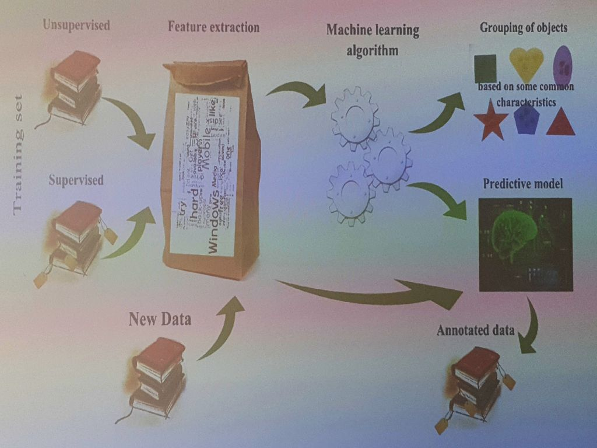

___
___
___
## Информация о занятии
- __Дисциплина:__ Машинное обучение в системах искусственного интеллекта (MLiAIS)
- __Преподаватель:__ Смагин Сергей Владимирович
- __Тип занятия:__ Лекционное занятие №2
- __Формат занятия:__ Очно (ДВФУ, D940)
- __Дата и время занятия:__ 05.10.2022, ср (нечет.), 16:50-18:20
___
___
___

&nbsp;

## Про следующее занятие

&nbsp;

Есть предложение в 16:50 прийти всей группой на лабы.

По поводу ноутбуков.
Потом, после теории, нужно будет тоскать ноутбуки.

&nbsp;

___

&nbsp;

## Лекционное занятие (презентация со слайдами)

&nbsp;

### ___2. Содержание___

&nbsp;

1. Типология задач обучения по прецедентам.
2. Типы и примеры задач обучения с учителем.
3. Типы и примеры задач обучения без учителя.
4. Другие типы задач обучения.
5. Формальные определения терминов.

&nbsp;

### ___3. Типология задач обучения по прецедентам___

&nbsp;

1. __Обучение с учителем__
    - Для каждого объекта обучающей выборки известен выход (класс), поэтому
    можно считать, что его указывает некий учитель.
2. __Обучение без учителя__
    - Для объектов обучающей выборки выходы (классы) не известны.
    Необходимо определить, как объкты связаны друг с другом, например,
    выделить группы (кластеры) близких по своим свойствам объектов.
3. __Другие типы задач обучения__

&nbsp;

### ___4. Схема машинного обучения___

&nbsp;

&nbsp;

#### ___4.1. Далее устная информация___

&nbsp;

- Supervised - это обучение с учителем
- Unsupervised - это обучающая выборка
- Test set - контрольная выборка
- Feature extraction - извлечение признаков
- Predictive model - предсказательная модель (классификатор?)
- Annotated data - данные, которые стали классифицированы
- Grouping of objects based on some common characteristics - разбиение
объектов на группы, основываясь на каких-то общих признаках.

&nbsp;

### ___5. Типы и примеры задач обучения с учителем___

&nbsp;

1. __Задача классификации__
    - Множество допустимых ответов конечно (их называют метками классов).
    Класс - это множество всех объектов с данным значением метки.
2. __Задача регрессии__
    - Допустимым ответом является действительное число
    (или числовой вектор).
3. __Задача ранжирования__
    - Ответы надо получить сразу на множестве объектов, после чего
    отсортировать их по значениям ответов.
    Задача может сводиться к задачам классификации или регрессии.
    Часто применяется в информационном поиске и анализе текстов.
4. __Задача прогнозирования__
    - Объектами являются отрезки временных рядов, обрывающиеся в том момент,
    когда требуется сделать прогноз на будущее.
    Для решения часто удается приспособить методы регрессии или
    классификации.

&nbsp;

#### ___5.1. Далее устная информация___

&nbsp;

Релевантность - это степень соответствия найденных данных информационным
нуждам пользователя.

&nbsp;

### ___6. 1.1 Задача классификации___

&nbsp;

__1.1.1. Задача медицинской диагностики__

_Объекты_ - пациенты, _признаки_ характеризуют симптомы заболевания,
результаты обследований и применявшиеся методы лечения.

_Бинарные признаки_: пол, "наличие признака".

_Порядковые признаки_: тяжесть состояния.

_Количественные признаки_: возраст, АД, СОЭ.

_История болезни_ - совокупность описаний признаков.

__Подзадачи__: ...

&nbsp;

### ___7. 1.1 Задача классификации___

&nbsp;

__1.1.2. Задача оценивания заемщиков__

_Объекты_ заемщики, _признаки_ - анкеты, дополнительная информация из
собственных источников банка.

_Номинальные признаки_: адрес, профессия, работа.

_Бинарные признаки_: пол, наличие телефона.

_Порядковые признаки_: образование, должность.

_Количественные признаки_: возраст, стаж, доход, задолженность, сумма.

_Классификация_: на "хороших" заемщиков и "плохих".

__Кредитный скоринг__ - оценивание суммарного числа баллов, набранных на
совокупности инфопризнаков.

__Подзадачи__: отбор инфопризнаков и их весов (чтобы риск был минимальным),
определение ставок, срока погашения.

&nbsp;

### ___8. 1.1 Задача классификации___

&nbsp;

__1.1.3. Задача предсказания ухода клиента__

_Кто решает_: крупные компании, работающие с большим количеством клиентов,
как правило, с физическими лицами (телекоммуникационные компании), для
которых удержание приоритетнее поиска новых клиентов.

_Объекты_ - клиенты в моменты времени, _признаки_ - анкеты, данные о
частоте пользования услугами компании ...

&nbsp;

### ___10. 1.2 Задача регрессии___

&nbsp;

__1.2.1. Задача прогнозирования потребительского спроса__

_Кто решает_: супермаркеты и торговые розничные сети.

_Цель_: прогнозировать объемы продаж для каждого товара на заданное число
дней вперед.

_Результат_: на основе прогнозов осуществляется планирование закупок,
управление ассортиментом, формирование ценовой политики и акций.

_Специфика_: количество исчисляется десятками тысяч.

_Обучающая выборка_: данные с кассовых аппаратов.

_Факторы_: реклама, социум, конкуренты, праздники.

_Предмет анализа_: товары, магазины, товары-магазины.

_Особенность_: несимметричность функции потерь (потери от заниженного
прогноза выше, чем от завышенного).

&nbsp;

### ___12. 1.3 Задача ранжирования___

&nbsp;

__1.3.1. Задача ранжирования текстовых документов__

_Кто решает_: поисковые системы.

_Объекты_: пара "запрос, документ".

_Ответ_: оценки релевантности, сделанные оценщиками (могут быть бинарными
или порядковыми, в баллах).

_Признаки_: числовые характеристики, вычисляемые по паре "запрос, документ".

_Виды признаков_:
- __текстовые__ (подсчет числа вхождений слов запроса в документы: с учетом
синонимов или без, с учетом числа вхождений или без, во всем документе или
только в заголовках и т.д.),
- __ссылочные__ (подсчет числа документов, ссылающихся на данный),
- __кликовые__ (подсчет числа обращений к данному документу).

&nbsp;

### ___13. 2. Типы и примеры задача обучения без учителя___

&nbsp;

__2.1. Задача кластеризации__

Нужно сгруппировать объекты в класетры, используя данные о попарном сходстве
объектов.
Функционалы качества могут определяться по-разному, например, как
отношение средних межкластерных и внутрикластерных расстояний.

__2.2. Задача поиска ассоциативных правил__

Исхожные данные представляются в виде признаковых описаний.
Требуется найти такие наборы признаков, и такие значения этих признаков,
которые особенно часто (неслучайно часто) встречаются в признаковых
описаниях объектов.

__2.3. Задача фильтрации выбросов (детекция аномалий)__

Обнаружение в обучающей выборке небольшого числа нетипичных объектов.
В некоторых приложениях их поиск является самоцелью (например, обнаружение
мошенничества). В других приложениях эти объекты являются следствием ошибок
в данных или неточности модели, то есть шумом, мешающим настраивать модель,
и должны быть удалены из выборки.

&nbsp;

### ___14. 2. Типы и примеры задача обучения без учителя___

&nbsp;

__2.4. Задача построения доверительной области__

Область минимального объема с достаточно гладкой границей, содержащей
заданную долю выборки. В доверительную область будут попадать наблюдения с
высокой вероятностью, а наблюдения, попавшие за ее пределы, могут быть
отброшены.

__2.5 Задача сокращения размерности__

Заключается в том, чтобы по исходным признакам с помощью некоторых функций
преобразования перейти к наименьшему числу новых признаков, не потеряв при
это существенной информации об объектах выборки.

__2.6 Задача заполнения пропущенных значений__

Заключается в замене недостающих значений в матрице объекты-признаки их
прогнозными значениями.

&nbsp;

### ___16. 2.1. Задачи кластеризации___

&nbsp;

__2.1.1. Задачи рубрикации текстов__

_Обучающая выборка_: множество документов, классифицированных по рубрикатору
вручную.

_Требуется_: классифицировать по тем же рубрикам второе множество
документов, которое может быть существенно больше первого.

_Метод решения_: ...

&nbsp;

### ___17. 3. Другие типы задач___

&nbsp;

__3.1. Частичное обучение__

Занимает пробежуточное положение между обучением с учителем и без учителя.
Каждый прецедент представляет собой пару "объект, ответ", но ответы
известны только на части прецедентов.
_Пример_: автоматическая рубрикация большого количества текстов при условии,
что часть из них уже отнесена к каким-то рубрикам.

__3.2. Трансдуктивное обучение__

Обучение с частичным привлечением учетиеля, когда прогноз предполагается
делать только для прецедентов из тестовой выборки ("от чатсного - 
к частному").

__3.3. Обучение с подкреплением__

Роль объектов играют пары "ситуация, принятое решение", ответами являются
значения функционала качества, характеризующего правильность принятых
решений (реакцию среды).
_Примеры_: формирование инвестиционных стратегий, самообучение роботов,
автоматическое упралвение технологическими процессами и т.д.

&nbsp;

### ___18. 3. Другие типы задач___

&nbsp;

__3.4 Динамическое обучение__

Может быть как обучением с учителем, так и без учителя.
Специфика в том, что прецеденты поступают потоком.
Требуется немедленно принимать решение по каждому прецеденту и одновременно
доучивать модель зависимости с учетом новых прецедентов.

__3.5 Активное обучение__

Обучаемый имеет возможность самостоятельно назначать следующий прецедент,
который станет известен.

__3.6 Метаобучение__

Прецедентами являются ренее решенные задачи обучения.
Требуется определить, какие из используемых в них эвриситк работают наиболее
эффективно.
Конечная цель состоит в обеспечении постоянного автоматического
совершенствования алгоритма с течением времени.

&nbsp;

___