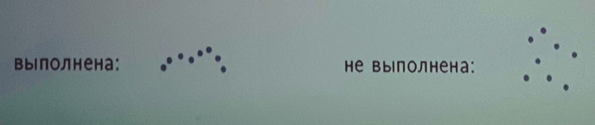
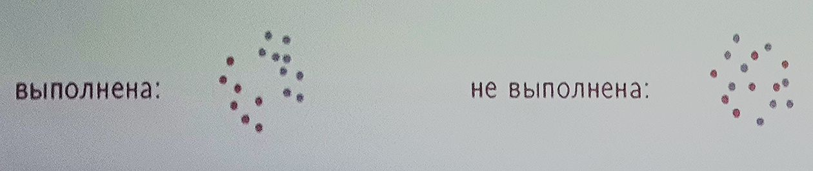
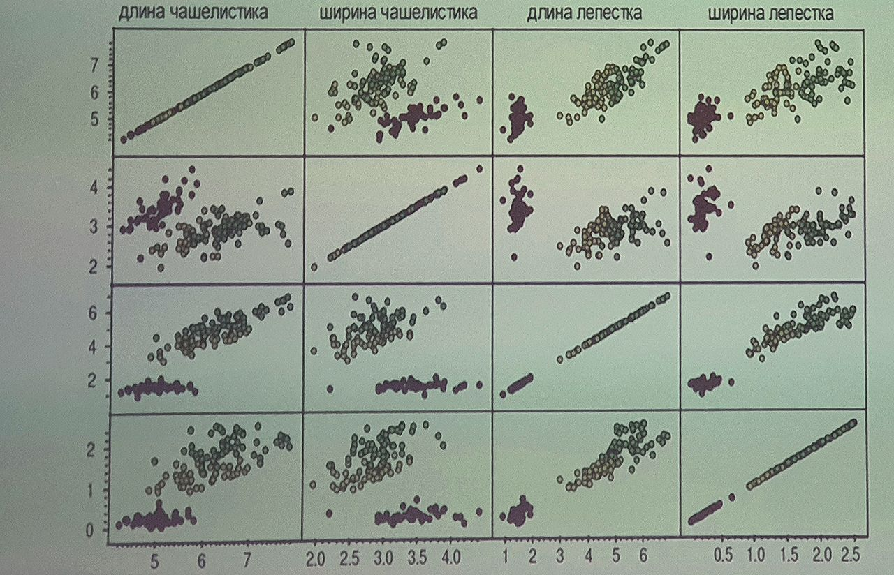
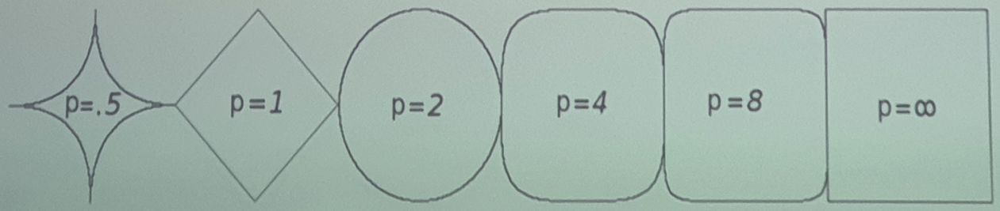
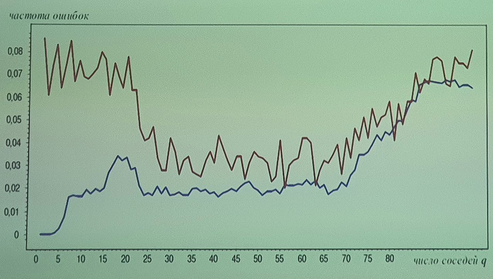
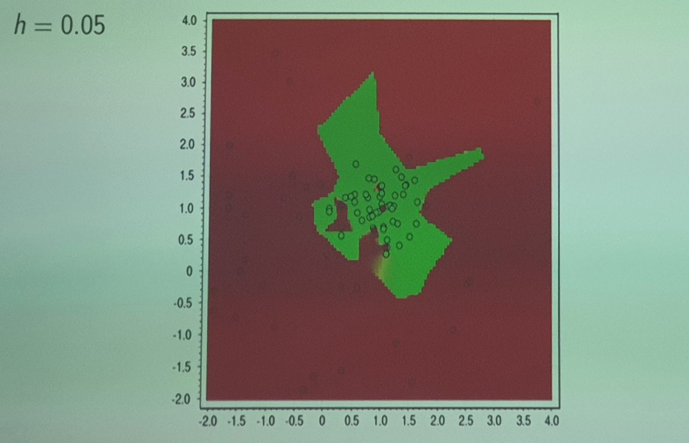
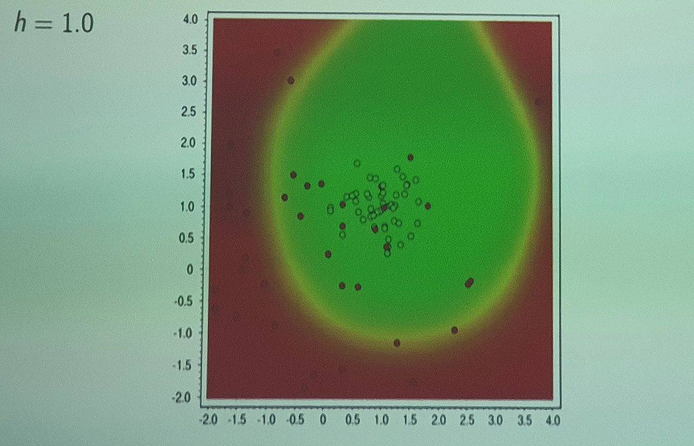
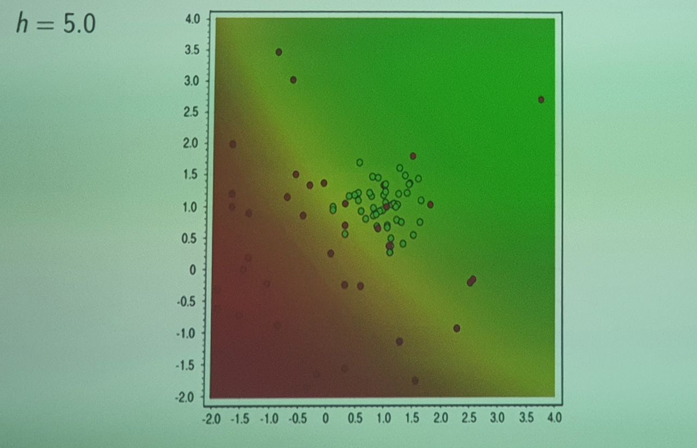

___
___
___
## Информация о занятии
- __Дисциплина:__ Машинное обучение в системах искусственного интеллекта (MLiAIS)
- __Преподаватель:__ Смагин Сергей Владимирович
- __Тип занятия:__ Лабораторная работа №2
- __Формат занятия:__ Очно (ДВФУ, D809)
- __Дата и время занятия:__ 11.10.2022, вт (чет.), 16:50-18:20
___
___
___

&nbsp;

## Лабораторная работа (презентация со слайдами) 

&nbsp;

### ___1. Методы машинного обучения. Лекция 3. Метрические методы классификации___

&nbsp;

### ___2. Содержание___

&nbsp;

1. Определение расстояний между объектами
    - Метрика, метрическое пространство
    - Гипотезы компактности и непрерывности.
2. Метрические методы классификации
    - Обобщенный метрический классификатор
    - Метод ближайших соседей и его обобщения
    - Метод окна Парзена, метод понетциальных функций
3. Отбор эталонов и признаков, оптимизация метрики
    - Понятие отступа, алгоритм отбора эталонных объектов STOLP
    - Задача выбора метрики, жадный алгоритм отбора признаков
    - Полный скользящий контроль CCV (другая презентация)

&nbsp;

### ___3. Гипотеза компактности___

&nbsp;

__Гипотеза компактности__ - в задачах классификации предположение о том,
что схожие объекты гораздо чаще лежат в одном классе, чем в разных.
Классы образуют компактно локализованные подмножества в пространстве
объектов.
Граница между классами имеет достаточно простую форму.

В математическом анализе _компактными_ называются ограниченные замкнутные
множества.
_Гипотеза компактности_ не имеет ничего общего с этим понятием и должна
пониматься в "более бытовом" смысла этого слова.

Для формализации понятия "сходства" вводится функция расстояния или
__метрика__ $\rho (x, x')$ в пространстве объектов $X$.
Алгоритмы, основанные на анализе сходства объектов, называют
__метрическими__, даже тогда, когда функция $\rho$ не удовлетворяет всем
аксиомам метрики (чаще - неравенству треугольника).

&nbsp;

### ___4. Метрическое пространство___

&nbsp;

__Метрикой__ на множестве $X$ называется отображение $d \!: X \times X
\rightarrow R$
сопоставляющее каждой паре $(x, y) \in X \times X$ вещественное число
$d(x,y)$, удовлетворяющее условиям:
- неотрицательность: $d(x, y)\geq 0 $ для любых $(x,y)$;
- $d(x,y)=0$ тогда и только тогда, когда $x=y$;
- симметричность: $d(x,y)=d(y,x)$;
- неравенство треугольника:
$$d(x,y) \leq d(x,z) + d(z,y) \;\; \text{для любых} \;\; x, y, z \in X.$$

Множество $X$ вместе с отображением $d$ называется
__метрическим пространством__, и обозначается $(X, d)$.

Метрика является обобщением понятия _расстояния_ на произвольные
пространства.
Всякое пространство может быть наделено метрикой.

Методы основаны на предположении, что __эксперт уже построил достаточно
адекватную метрику__, для которой выполняется гипотеза компактности.
Выбор адекватности метрики является наиболее сложной и наименее
исследованной подзадачей (возможен автоматический подбор).

&nbsp;

### ___5. Гипотезы для объектов___

&nbsp;

__Задачи классификации и регрессии:__
- $X$ - объекты, $Y$ - ответы;
- $X^l = {(x_i, y_i)}^l_{i=1}$ - обучающая выборка;

__Гипотеза непрерывности__ (для регрессии):
\
_близким объектам соответствуют близкие ответы._

__Гипотеза компактности__ (для классификации):
\
_близкие объекты, как правило, лежат в одном классе._

__Регрессия__: каждый следующий объект связан с предыдущим некоторой
(непрерывной) функцией.

__Классификация__: объекты образуют компактные сгустки.

&nbsp;

### ___6. Пример: ирисы Фишера___

&nbsp;

Привычная мера близости - евклидова метрика в $\R^2$.

__Выборка__: 150 экземпляров ириса, по 50 экземплярова из трех видов:
- Ирис щетинистый (Iris setosa);
- Ирис разноцветный (Iris versicolor);
- Ирис виргинский (Iris virginica).

Для каждого экземпляра измерялись 4 характеристики (в сантиметрах).

&nbsp;

### ___7. Формализация понятия "близости"___

&nbsp;

Евклидова метрика и обобщенная метрика Минковского:

$$\rho(x,x_i) = {\left( \sum_{j=1}^n{\left| x^j - x^j_i
\right|}^2\right)}^{1/2} \qquad \rho(x,x_i) = {\left(
\sum_{j=1}^n{w_j \left| x^j - x^j_i \right|}^p\right)}^{1/p}$$

- $x = (x^1, \ldots, x^n)$ - вектор признаков объекта $x$,
- $x_i = (x_i^1, \ldots, x_i^n)$ - вектор признаков объекта $x_i$,

$w_1, \ldots, w_n$ - веса признаков, которое можно обучать.

__Вводится функция расстояния (метрика)__.

Делать это можно по-разному:
1. Через масштабный коэффициент - веса признаков (км-кг, 1К-0,1 и т.д.).
2. Через показатель $p$ (рисунки слайда).

&nbsp;

### ___8. Обобщенный метрический классификатор___

&nbsp;

Для произвольного $x \in X$ отранжируем объекты $x_1, \ldots, x_l$:
$$\rho(x, x^{(1)}) \leqslant \rho(x, x^{(2)}) \leqslant \ldots \leqslant
\rho(x, x^{(l)}),$$

- $x^{(i)}$ - $i$-й сосед объекта $x$ среди $x_1, \ldots, x_l$;
- $y^{(i)}$ - ответ на $i$-м соседе объекта $x$.

__Метрический алгоритм классификации:__

$$\displaystyle \text{a}(x;X^l) = \argmax_{y \in Y} \underbrace{\sum^l_{i=1}
{[y^{(i)} = y] \; w(i, x)}}_{Г_y(x)},$$

- $w(i,x)$ - вес (степень важности) $i$-го соседа объекта $x$,
неотрицателен, не возрастает по $i$.
- $Г_y(x)$ - _оценка близости_ объекта $x$ к классу $y$.

__Принцип__:
для классифицируемого объекта смотреть, рядом с какими объектами он
находится, и к каким они относятся классам.

$\argmax$ - значение аргумента, при котором данное выражение достигает
максимума.

&nbsp;

### ___9. Метод k ближайших соседей___

&nbsp;

- $w(i,x) = [i \leqslant 1]$ - метод ближайшего соседа
- $w(i,x) = [i \leqslant k]$ - метод $k$ ближайших соседей

__Преимущества:__

- простота реализации (lazy learning);
- параметр $k$ можно оптимизировать по критерию скользящего контроля
(leave-one-out):
$$\text{LOO}{(k, X^l)} = \sum^l_{i=1}{\left[ \text{a}
{\left(x_i; X^l \backslash \lbrace x_i \rbrace, k \right)}
\neq y_i \right]} \rightarrow \min_k.$$

__Недостатки:__
- неоднозначность классификации при $Г_y(x) = Г_s(x), \;\; y \neq s$.
- не учитываются значения расстояний

__k nearest neighbors (kNN)__

При $k=1$ как такового обучения нет - приходится запоминать всю выборку.

Интерпретируемость (медицина, геология).

Неустойчивость к шуму и выбросам.

&nbsp;

### ___10. Зависимости LOO от числа соседей___

&nbsp;

__Пример.__ Задача UCI: Iris.

- смещенное число ошибок, когда объект
учитывается как сосед самого себя
- несмещенное число ошибок LOO

__Leave-one-out (LOO)__.

Нужно выбирать нижние точки графика, при этом чтобы значение $k$ было не
очень велико.

&nbsp;

### ___11. Метод k взвешенных ближайших соседей___

&nbsp;

$$w(i,x) = [i \leqslant k]w_i,$$
где $w_i$ - вес, зависящий только от номера соседа;

__Возможные эвристики:__
- $w_i = \frac{k+1-i}{k}$ - линейные убывающие веса;
- $w_i = q^i$ - экспоненциально убывающие веса, $0 < q < 1$;

__Проблемы:__
- как более обоснованно задать веса?
- возможно, было бы лучше, если бы вес $w(i,x)$ зависел не от порядкового
номера соседа $i$, а от расстояния до него $\rho (x, x^{(i)})$.

Попытка устранить неоднозначность, когда соседей пополам в одном и в другом
классах.

Если номера 1 и 4 в одном классе, а 2 и 3 - в другом, то основа
неоднозначность.

Нужно учитывать расстояние, оно может меняться в разы, а то и на порядки.

&nbsp;

### ___12. Метод окна Парзена___

&nbsp;

- $\displaystyle w(i,x) = K{\left(\frac{\rho(x, x^{(i)})}{h}\right)}$, где
$h$ - ширина окна,
- $K(r)$ - ядро, не возрастает и положительно на $[0,1]$.

Метод парзеновского окна _фиксированной ширины_:

$$\text{a}(x; X^l, h, K) = \argmax_{y \in Y}{\sum^l_{i=1}{[y_i = y] K
\left( \frac{\rho(x, x_i)}{h} \right)}}$$

Метод парзеновского окна _переменной ширины_:

$$\text{a}(x; X^l, k, K) = \argmax_{y \in Y}{\sum^l_{i=1}{[y_i = y] K
\left( \frac{\rho(x, x_i)}{\rho{(x, x^{(k+1)})}} \right)}}$$

__Оптимизация параметров__ - по критерию LOO:
- выбор ширины окна $h$ или числа соседей $k$
- выбор ядра $K$

$h$ - радиус, дальше которого объекты не рассматриваются.

$k$ - элементы, которые должны "влезть в окно"

Переменная ширина окна применяется при неравномерности выборки
(часть - сгустками, часть - разрежена).

&nbsp;

### ___13-18. Парзеновское окно фиксированной ширины h___

&nbsp;

__Пример:__ двумерная выборка, два класса $Y = \lbrace -1, +1 \rbrace$.

$$\text{a}(x) = \argmax_{y \in Y} Г_y(x) = \text{sign}
\underbrace{\left( Г_{+1}(x) - Г_{-1}(x) \right)}$$

&nbsp;

### ___19. Метод потенциальных функций___

&nbsp;

$$w(i, x) = \gamma^{(i)} K{\left( \frac{\rho(x, x^{(i)})}{h^{(i)}}
\right)}$$

Более простая запись (здесь можно не ранжировать объекты):

$$\text{a}(x;X^l) = \argmax_{y \in Y} \sum_{i=1}^l{\left[ y_i = y \right]
\gamma_i K \left( \frac{\rho(x, x_i)}{h_i} \right)},$$

где $\gamma_i$ - веса объектов, $\gamma_i \geqslant 0$, $h_i > 0$.

__Физическая аналогия__ из электростатики:
- $\gamma_i$ - величина "заряда" в точке $x_i$;
- $h_i$ - "радиус действия" потенциала с центром в точке $x_i$;
- $y_i$ - знак "заряда" (в случае двух классов $Y = \{ -1, +1 \}$);
- $K(r) = \frac{1}{r}$ или $\frac{1}{r+\text{a}}$

В задачах классификации нет ограничений ни на $K$, ни на $|Y|$.

В каждый объект обучающей выборки поставим шапочку:
- в классе +1 $\wedge$,
- в классе -1 $\vee$.

Возникает физическая аналогия этой задачи с электостатикой:
есть точки (точечные заряды) - одни положительные, другие отрицательные.
Возникает потенциал (там, где он нулевой - разделяющая поверхность).

&nbsp;

___