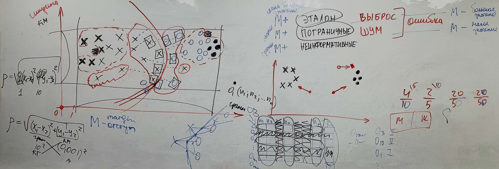

___
___
___
## Информация о занятии
- __Дисциплина:__ Машинное обучение в системах искусственного интеллекта (MLiAIS)
- __Преподаватель:__ Смагин Сергей Владимирович
- __Тип занятия:__ Лекционное занятие №3
- __Формат занятия:__ Очно (ДВФУ, D811)
- __Дата и время занятия:__ 19.10.2022, ср (нечет.), 16:50-18:20
___
___
___

&nbsp;

## Лекционное занятие (презентация, но без слайдов)

&nbsp;

### ___Общая на всю лекцию картинка___

&nbsp;

&nbsp;

### ___Типы объектов в зависимости от отступа___

&nbsp;

Типы объектов в зависимости от отступа:
- __Эталон__ - это элемент, находящийся "в глубине" своего класса, либо
максимально далеко от элементов других классов
- __Пограничные объекты__
- __Неинформативные элементы__ (рядом с эталонными)
- __Выброс__ - это ???
- __Шум__ - это ???

Это были все группы, на которые можно разбить элементы каждого класса, в
зависимости от чего-то.

Эталонные объекты - это образец: что-то, с чем мы сравниваем.

И выброс, и шум являются __ошибкой__.

&nbsp;

### ___Отступ (margin) M___

&nbsp;

__Отступ (margin)__ ($M$) - расстояние элемента от границы класса.

Если объект имеет положительный отступ и этот $M$ очень большой, тогда мы
назовем его эталонным.

|Группы объектов|Значение группы|Обозначение|
|-|-|:-:|
|эталон|очень большое значение|$M+$|
|пограничные|малое значение|$M+$|
|неинформативные|среднее значение|$M+$|
|выброс|большое значение|$M-$|
|шум|малое значение|$M-$|

&nbsp;

### ___Алгоритм СТОЛП (STOLP)___

&nbsp;

__Алгоритм СТОЛП (STOLP)__ - это алгоритм отбора эталонных объектов для
_метрического классификатора_.

Этапы алгоритма СТОЛП:
1. Выбрать эталоны
2. Убрать все выбросы, на которых большой $M-$
3. Выстроить границу между классами (пограничные элементы)
4. Все отсальные элементы можно удалить - их можно считать неинформативными
(ну и шумы тоже)

&nbsp;

### ___Дополнительное пояснение к группам объектов по отступам___

&nbsp;

__Исключение__ - это выбивающееся из закономерности, факт изъяна нашего
правила.

__Отступ__ - это велечина, которая показывает степень типичности объекта.

- __Выброс__ - это то, чего не может быть: большое значение отступа и
находится в другом классе
- Самый типичный - __эталон__
- __Неинформативность__ - заурядность
- __Шум__ - это пограничный объект, но по ту сторону

&nbsp;

### ___Преимущества и недостатки алгоритма СТОЛП (STOLP)___

&nbsp;

__Преимущества алгоритма__:
- сокращается число хранимых объектов;
- сокращается время классификации.

__Недостатки алгоритма__:
- нужно задать вручную параметр $\delta$ (дельта).

&nbsp;

### ___Прочая информация___

&nbsp;

Мы используем Алгоритм СТОЛП (STOLP), чтобы избавиться от того количества
элементов, которое могло бы усложнить (увеличить время) выполнения чего-то.

Можно избавиться от зависимых признаков.

Можно попробовать одним признаком классифицировать вообще всё (пример:
длина волос при классах мужщина/женщина).

Нужно оставить совокупность самых лучших признаков.

Алгоритм поиска информативных признаков.

&nbsp;

___