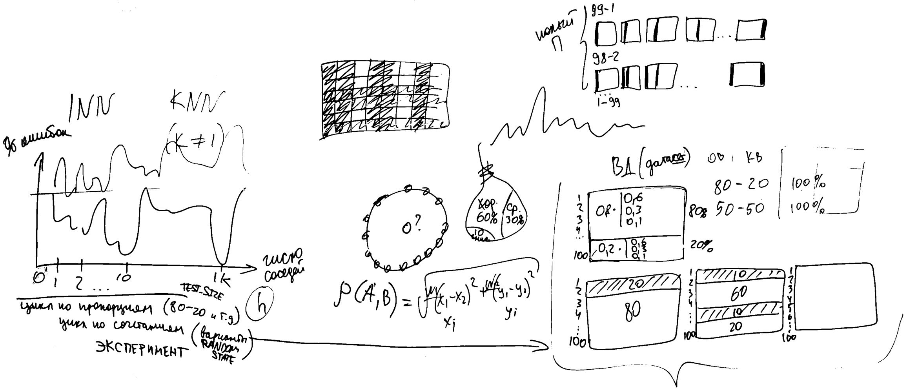

___
___
___
## Информация о занятии
- __Дисциплина:__ Машинное обучение в системах искусственного интеллекта (MLiAIS)
- __Преподаватель:__ Смагин Сергей Владимирович
- __Тип занятия:__ Лабораторная работа №4
- __Формат занятия:__ Очно (ДВФУ, D809)
- __Дата и время занятия:__ 08.11.2022, вт (чет.), 16:50-18:20
___
___
___

&nbsp;

## Лабораторная работа

&nbsp;

### ___Разная информация о домашней работе №1___

&nbsp;

Общая на всю пару картинка:



То, что мы делали до этого, было в точке.
Пора перейти на циклы для настоящего эксперимента.

Чем более подробно описано задание, тем лучше.

Не нужно использовать неуместные жаргонизмы.
Вообще лучше не использовать жаргоны.
- Выборка данных вместо Датасет (например).

Чем проще мы выражаем вещи, тем лучше.

Не шутить шутки в лаборатоных работах.

Если признаков слишком много, нужно заняться отбором лучших.

Умение формализовывать критерии - важно.

Есть ещё __отложенная (верефицирующая) выборка__ (помимо тестовой и
контрольной).

Выборку лучше разбирать поровну по классам.
Пример:
- есть:
    - хорошой 60% картошки
    - средней 30% картошки
    - гнилой 10% картошки
- train/test - 80%/20%
- тогда
    - train хорошая - 0.8 * 0.6
    - train средняя - 0.8 * 0.3
    - train гнилая - 0.8 * 0.1
    - test хорошая - 0.2 * 0.6
    - test средняя - 0.2 * 0.3
    - test гнилая - 0.2 * 0.1

Сущеуствует такое понятие, как __полный перебор__.
Из всех возможных диапазонов выбрать только самый лучший (например, 92%/8%)

- Можно случайно менять random_state.
- Можно случайно менять Train/Test.

```
цикл по пропорциям (80-20 и т.д.)
    цикл по сочетаниям (варианты, random_state)
        ЭКСПЕРИМЕНТ
```

Домашнее задание - организовать полный цикл.
Сделать табличку для сочетаний.

&nbsp;

___