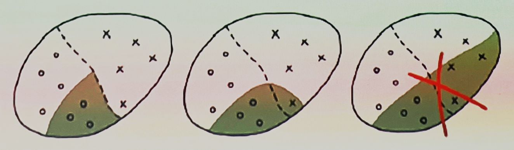
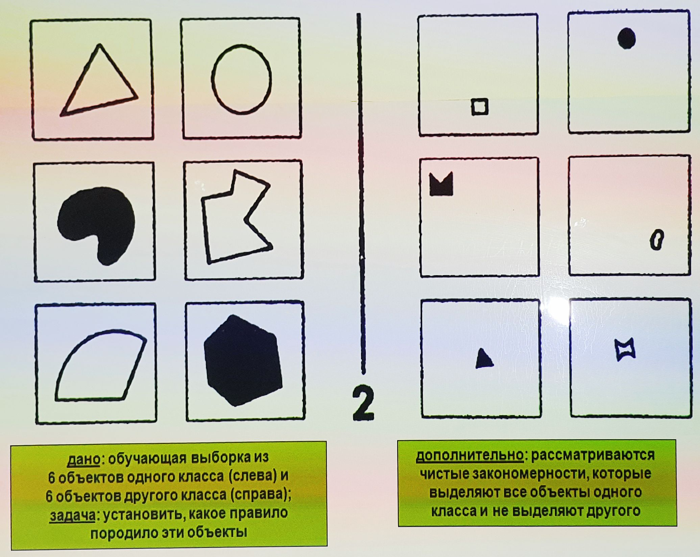
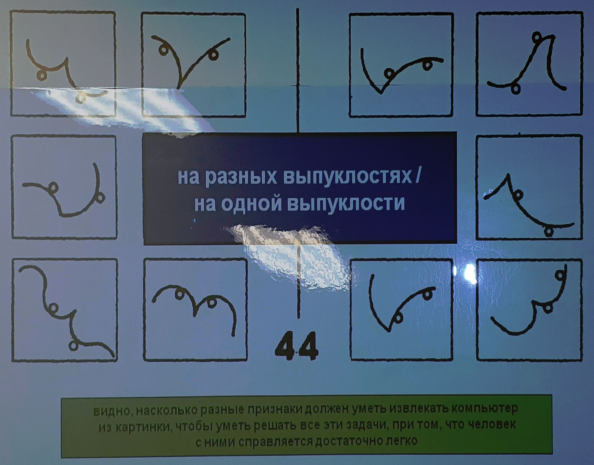
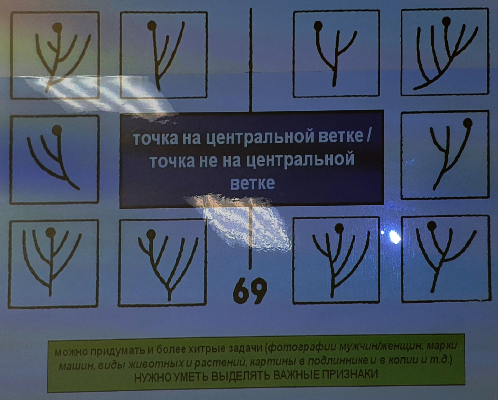
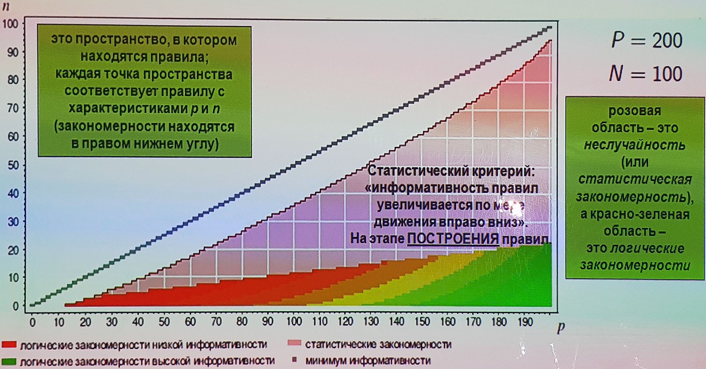
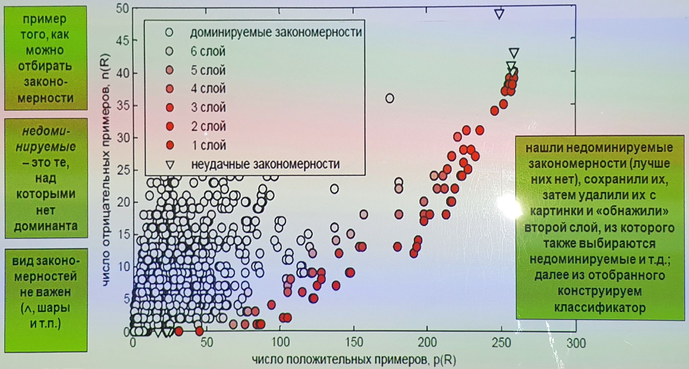

___
___
___
## Информация о занятии
- __Дисциплина:__ Машинное обучение в системах искусственного интеллекта (MLiAIS)
- __Преподаватель:__ Смагин Сергей Владимирович
- __Тип занятия:__ Лекционное занятие №4
- __Формат занятия:__ Очно (ДВФУ, D811)
- __Дата и время занятия:__ 09.11.2022, вт (чет.), 16:50-18:20
___
___
___

&nbsp;

## Лекционное занятие

&nbsp;

### ___2. План лекции___

&nbsp;

- Понятия закономерности и информативности
    - Логическая закономерность
    - Интерпретируемость
    - Критерии информативности
- Решающие деревья
    - Алгоритм ID3
    - Небрежные решающие деревья - ODT
    - Бинаризация данных

&nbsp;

### ___3. Идея логических методов___

&nbsp;

Смоделировать человеческую логику принятия решений в ситуациях, когда есть
неточности, нечеткости, прецеденты и т.п.

_Ожидания_: правильность и понятность людям (что весьма полезно в
определенных предметных областях, таких как медицина, геология,
социология, техничечкая диагностика и т.д.).

Идея получить не только решающее правило, но и понять, разумно ли оно, а
также выявить какие ___логические закономерности___ оно сформировало на
основе имеющихся данных.

&nbsp;

### ___4. Логическая закономерность (определение и свойства)___

&nbsp;

$$X^l = {\left( x_i, y_i \right)}^l_{i=1} \subset X \times Y \text{- обучающая выборка}, \; y_i = y{(x_i)}.$$

_Логическая закономерность_ (правило, rule) - это предикат
$R \! : X \rightarrow {\lbrace 0, 1\rbrace}$, удовлетворяющий двум требованиям:

1. _интерпретируемость_:
    1. $R$ записывается на ествественном языке;
    2. $R$ зависит от небольшого числа признаков (1-7);
2. _информативность_ относительно одного из классов $c \in Y$ :
    - $p(R) = \# {\lbrace x_i \! : R(x_i)=1 \;\; \text{и} \;\; y_i=c \rbrace} \rightarrow \max$;
    - $n(R) = \# {\lbrace x_i \! : R(x_i)=1 \;\; \text{и} \;\; y_i \neq c \rbrace} \rightarrow \min$;
```
c - предсказательная сила (способность)?
p - positive
n - negative
```

Если $R(x) = 1$, то говорят "$R$ выделяет $x$" ($R$ covers $x$).

___Решающее правило___ в данном случае - это совокупность логических
закономерностей.

```
непротиворечивая (чистая) закономерность, которую нужно построить для
каждого класса
```



```
противоречивая закономерность (бесполезна, не несет никакой информации о классах)
```

__Генеральная совокупность__ $(X \times Y)$ - это совокупность всех
объектов в рассматриваемой нами предметной области.

$\subset$ - подмножество.

&nbsp;

### ___5. Логическая закономерность (требования и задачи)___

&nbsp;

Отдельная закономерность - это еще не классификатор, это
"недоклассификатор".
Каждый из таких "недоклассификаторов" не может решить задачу, но если
набрать из достаточное количество и построить композицию, то она - сможет.

$\mathbf{n}$ ___должно быть как можно меньше,___ $\mathbf{p}$
___- как можно больше.___

Эти требования могут входить в противоречия, поэтому необходимо найти
разумный компромисс.

___Решаемые задачи:___
- Определить, что есть закономерность (на основе статистических критериев).
- Какой вид могут иметь правила (чаще это конъюнкции простых условий).
- Научиться их строить (это, как правило, переборные алгоритмы).
- Понять, как объединять правила в композиции (существует много разных
идей - независимо, последовательно и т.д.).

&nbsp;

### ___6. Пример реализации свойства интерпретируемости___

&nbsp;

1. $R(x)$ записывается на естественном языке;
2. $R(x)$ зависит от небольшого числа признаков (1-7);

```
такие правила соответствуют способу мышления врача или кредитного аналитика
```

__Пример (из области медицины)__

__Если__ _возраст_ $> 60$ __и__ _пациент ранее перенёс инфаркт,_ ___то___
_операцию не делать, риск отрицательного исхода 60%._

__Пример (из области кредитного скоринга)__

__Если__ _в анкете указан домашний телефон_ __и__ _зарплата_ $>$ _$2000_ ___и___ _сумма кредита_ $<$ _$5000_ ___то___
_кредит можно выдать, риск дефолта 5%._

```
естественное накладывание пороговых условий для количественных признаков
```

```
отнесение к классу указано с некоторой "уверенностью" (риски отрицательного
исхода и дефолта); вероятность уверенности находится из обучающей выборки
(доля отрицательных исходов).
```

&nbsp;

### ___7-14. Как понимают закономерность люди? Тесты М.М. Бонгарда [Проблема узнавания, 1967]___

&nbsp;







&nbsp;

### ___15. Что нужно делать, чтобы извлекать закономерности из данных?___

&nbsp;

1. Как изобретать признаки $f_1(x), \ldots, f_n(x)$?
    - не наука, а искусство (размышление, озарения, эксперименты,
    консультации, мозговые штурмы, ...)
```
в учебных задачах признаки даны
```
2. Какого вида закономерности $R(x)$ нам нужны?
    - простые формулы от малого числа признаков
```
пространство поиска зависит от задачи
```
3. Как определять информативность?
    - так, чтобы одновременно $p \rightarrow \max$, $n \rightarrow \min$
```
определяем, что является критерием поиска (свертка двух критериев)
```
4. Как искать закономерности?
    - перебором подмножеств признаков
```
эвристики для сокращения полного перебора, который лучше, но долгий
```
5. Как объединять закономерности в алгоритм?
    - любым классификатором ($R(x)$ - это тоже признаки)
```
признак - это тоже функция от объекта, поэтому закономерность может являться
признаком
```

_Закономерность_ - интерпретируемый высокоинформативный одноклассовый
классификатор с отказами.

&nbsp;

### ___16-17. В каком виде ищут закономерности? (часто используемые виды)___

&nbsp;

1. _Конъюнкция_ пороговых условий (термов):

```
число признаков j должно быть маленьким, чтобы закономерность ...
```

$$R{(x)} = \bigwedge_{j \in J}{\left[ a_j \leqslant f_j{(x)} \leqslant b_j \right].} $$

```
пороговое условие может быть также односторонним
```

2. _Синдром_ - когда выполнено не менее $d$ термов из $J$, (при $d = |J|$
это конъюнкция, при $d = 1$ - дизъюнкция):

```
задачи дифференциальной диагностики (должны подтвердиться хотя бы несколько
симптомов)
```

$$R{(x)} = {\left[ \sum_{j \in J}{\left[ a_j \leqslant f_j{(x)} \leqslant b_j \right]} \geqslant d \right]},$$

```
симптом - это признак, синдром - их совокупность для заболевания
```

Синдромы обнаруживаются во многих прикладных областях: в медицинской
диагностике, в кредитном скоринге, в геологическом прогнозировании, и др.

Параметры $J, a_j, b_j, d$ настраиваются по обучающей выборке.

3. _Полуплоскость_ - линейная пороговая функция:

```
снова используется небольшое число признаков j (некое подпространство)
```

$$R{(x)} = {\left[ \sum_{j \in J}{w_j f_j{(x)}} \geqslant w_0 \right]}.$$

```
получаем линейную комбинацию признаков (будут рассмотрены далее), а не ∧,
но здесь складываются "км с кг" 
```

4. _Шар_ - пороговая функция близости:

```
если вокруг точки x₀ описали шар радиусом w₀, в котором много объектов
одного класса (а других - мало), то это закономерность
```

$$R{(x)} = {\left[ r{(x, x_0)} \leqslant w_0 \right]},$$

```
метрика r, аналог того, что было в метрических методах (эталонность
сравнения)
```

ABO - алгоритмы вычисления оценок \[Ю.И. Журавлёв, 1971\]:

```
способ вычисления оценки
```

$$r{(x, x_0)} = \max_{j \in J}{w_j{\vert f_j{(x)} - f_j{(x_0)} \vert}}.$$

SCM - машины покрывающих множеств \[M. Marchand, 2001\]:

```
способ вычисления оценки
```

$$r{(x, x_0)} = \sum_{j \in J}{w_j{\vert f_j{(x)} - f_j{(x_0)} \vert}^{\gamma}}.$$

```
используется прецедентная логика в проверке и интерпретации результата
```

Параметры $J, w_j, w_0, x_0$ настраиваются по обучающей выборке путем
оптимизации _критерия информативности_.

&nbsp;

### ___18. Часто используемые критерии информативности___

&nbsp;

__Проблема:__ надо сравнивать закономерности
$R$. ```для определения лучшей```

Как свернуть два критерия в один критерий информативности?

$$
\begin{cases}
p{\left( R \right)} \rightarrow \max \\
n{\left( R \right)} \rightarrow \min
\end{cases}
\quad
\xRightarrow{?}
\quad
l{\left( p, n \right)} \rightarrow \max
$$

__Очевидные, но не всегда адекватные свёртки:__
```
все предложенные здесь меры не очень адекватны, т.к. для них легко найти
контрпримеры (см. след. слайд) ->
```
- $\displaystyle \frac{p}{p+n} \rightarrow \max \quad \text{(precision);}$
```безошибочность```
- $\displaystyle p - n \rightarrow \max \quad \text{(accuracy);}$
```точность```
- $\displaystyle p - Cn \rightarrow \max \quad \text{(linear cost accuracy);}$
```линейная функция стоимости```
- $\displaystyle \frac{p}{P} - \frac{n}{N} \rightarrow \max \quad \text{(relative accuracy);}$ ```относительная точность```

$P = \# {\lbrace x_i \! : y_i = c \rbrace}$ - число "своих" во всей выборке;

$N = \# {\lbrace x_i \! : y_i \neq c \rbrace}$ - число "чужих" во всей выборке.

&nbsp;

### ___19. Нетривиальность проблемы свертки двух критериев (контрпримеры для них)___

&nbsp;

__Пример.__
```
берем пары предикатов: чтобы первый был явно хорошей закономерностью, а
второй - явно нет, но формула дала бы равную оценку информативности
```

Претенденты на звание "Критерий информативности" при
$P \stackrel{\text{свои}}{=} 200$, $N \stackrel{\text{чужие}}{=} 100$ и
различных $p$ и $n$. ```примеры успешных сверток```

||||||||||Фишер|энтропия|бустинг|
|-|:-:|:-:|:-:|:-:|:-:|:-:|:-:|:-:|:-:|:-:|:-:|
||$p$|$n$||$p-n$|$p-5n$|$\frac{p}{P}-\frac{n}{N}$|$\frac{p}{n+1}$||$\text{IStat}$|$\text{IGain}$|$\sqrt{p}-\sqrt{n}$|
|||||||||||||
|хор.|50|0||__50__|50|0.25|50||22.65|23.70|7.07|
|плох.|100|50||__50__|-150|0|1.96||2.33|1.98|2.93|
|||||||||||||
|хор.|50|9||41|__5__|0.16|__5__||7.87|7.94|4.07|
|плох.|5|0||5|__5__|0.03|__5__||2.04|3.04|2.24|
|||||||||||||
|хор.|100|0||__100__|100|__0.5__|100||52.18|53.32|10.0|
|плох.|140|20||__120__|40|__0.5__|6.67||37.09|37.03|7.36|

__Рассматриваем разные пары правил - хорошее и не очень.__

__Бустинг__ (англ. boosting - улучшение) - это процедура последовательного
построения композиции алгоритмов машинного обучения, когда каждый следующий
алгоритм стремится компенсировать недостатки композиции всех предыдущих
алгоритмов.

&nbsp;

### ___20. Часто используемые критерии информативности (обзор)___

&nbsp;

__Адекватные, но неочевидные критерии:__
- энтропийный критерий информационного выигрыша:
$$\text{IGain}{\left( p, n \right)} = h{\left( \frac{P}{l} \right)} - \frac{p+n}{l}h{\left( \frac{p}{p+n} \right)} - \frac{l-p-n}{l}h{\left( \frac{P-p}{l-p-n} \right)} \rightarrow \max,$$
где $h(q) = -q \log_2{q} - {\left( 1-q \right)}\log_2{\left( 1-q \right)}$
- точный статистический тест Фишера (Fisher's Exact Test):
$$\text{IStat}{\left( p, n \right)} = -\log_2{C^p_P C^n_N / C^{p+n}_{P+N}} \rightarrow \max$$
- перестановочный статистический тест
- критерий бустинга \[Cohen, Singer, 1999\]:
$$\sqrt{p} - \sqrt{n} \rightarrow \max$$
- нормированный критерий бустинга:
$$\sqrt{p/P} - \sqrt{n/N} \rightarrow \max$$

```
нет однозначного ответа на то, КАКОЙ критерий лучше и КАК сворачивать два
критерия p и n, но есть с десяток разумных способов это сделать
```

&nbsp;

### ___21. Часто используемые критерии информативности (IGain)___

&nbsp;

__Адекватные, но неочевидные критерии:__

- энтропийный критерий информационного выигрыша:
$$\displaystyle \text{IGain}{\left( p, n \right)} =
\underset{\text{энтропия} \atop \text{всей выборки}}{h{\left( \frac{P}{l} \right)}} -
\stackrel{\text{частота}}{\frac{p+n}{l}}h\underset{\text{энтропия} \atop \text{части выборки}}{\left( \frac{p}{p+n} \right)} -
\stackrel{\text{частота}}{\frac{l-p-n}{l}}h
\underset{\text{энтропия} \atop \text{части выборки}}{\left( \frac{P-p}{l-p-n} \right)} \rightarrow \max,$$
где $h(q) = -q \log_2{q} - {\left( 1-q \right)}\log_2{\left( 1-q \right)}$

__Информационная энтропия__ - мера неопределенности или непредсказуемости
информации, неопределенность появления какого-либо символа алфавита.

Если есть два взаимоисключающие исхода, которым приписаны вероятности
(которые в сумме дают 1), то мы можем связать с этими исходами количество
информации, которое они несут.
"_Чем меньше вероятность исхода, тем больше информации мы получаем, если
этот исход реализуется_".
Энтропия определяется как мат. ожидание количества информации.
Первое событие берем с вероянтностью $\mathbf{q}$, второе $\mathbf{(1-q)}$
и получаем формулу (см. выше).

Вычисляем энтропию, которой обладает обучающая выборка, ДО того, как узнали
предикат $\mathbf{R}$, и ПОСЛЕ того.
Разность этих энтропий покажет, сколько информации $\mathbf{R}$ несет о
делении выборки на классы.
Разность энтропий называется _информационным выигрышем_.

&nbsp;

### ___22. Часто используемые критерии информативности (IStat)___

&nbsp;

__Адекватные, но неочевидные критерии:__

- точный статистический тест Фишера (Fisher's Exact Test):
$$
\text{IStat}{\left( p, n \right)} =
-\log_2{C^p_P C^n_N / C^{p+n}_{P+N}} \rightarrow \max
$$

```
-log используется для того, чтобы получить величину, которая чем больше, тем
лучше
```

```
Что-то здесь выделяет предикат R
```

$$
\underbrace{
{\overbrace{
\boxed{\begin{matrix}
\varphi{( x_i )} = 1 \\
y_i = c
\end{matrix}}
}^{p}}

\boxed{\begin{matrix}
\varphi{( x_i )} = 0 \\
y_i = c
\end{matrix}}
}_{P}

\underbrace{
{\overbrace{
\boxed{\begin{matrix}
\varphi{( x_i )} = 1 \\
y_i \neq c
\end{matrix}}
}^{n}}

\boxed{\begin{matrix}
\varphi{( x_i )} = 0 \\
y_i \neq c
\end{matrix}}
}_{N}
$$

```
чтобы предикат R был закономерностью, должен быть перекос в сторону p
```

Другая идеология того, как получить оценку информативности - это
статистические тесты.

Пусть предикат $\mathbf{R}$, покрывающий долю объектов выборки, и класс
$\mathbf{c}$, также покрывающий долю объектов, (если трактовать их как
вероятностные события) - это независимые события.

Пусть предикат $\mathbf{R}$ зафиксирован, а у классов есть вероятность
$\mathbf{C^p_{N+P}}$ вариантов распределиться по выборке, и мы считаем все
эти варианты равновероятными.
Т.е. это другой способ сказать, что _предикат_ и _класс_ - это независимые
случайные величины.

Интуиция говорит, что чтобы $\mathbf{R}$ был закономерностью,
$\mathbf{n/p}$ должно быть много меньше $\mathbf{N/P}$, а статистика выдает
точную количественную формулу (см. выше), которая позволяет судить о том,
насколько не случайно это событие (соответствующее соотношение $\mathbf{n}$
и $\mathbf{p}$).

&nbsp;

### ___23. Иллюстрация к тому, где находятся закономерности___

&nbsp;

Логические закономерности:
$\frac{n}{p+n} \leqslant 0.1, \;\; \frac{p}{P+N} \geqslant 0.05$.
```p-n пространство```

Статистические закономерности:
$\text{IStat}{\left(p, n\right)} \geqslant 3$.



__Вывод:__ неслучайность - ещё не значит закономерность.

&nbsp;

### ___24. Парето-критерий информативности в (p, n)-плоскости___

&nbsp;

__Парето-фронт__ - множество недоминируемых закономерностей (точка $R$
недоминируема, если правее и ниже точек нет)



задача UCI:german

&nbsp;

___