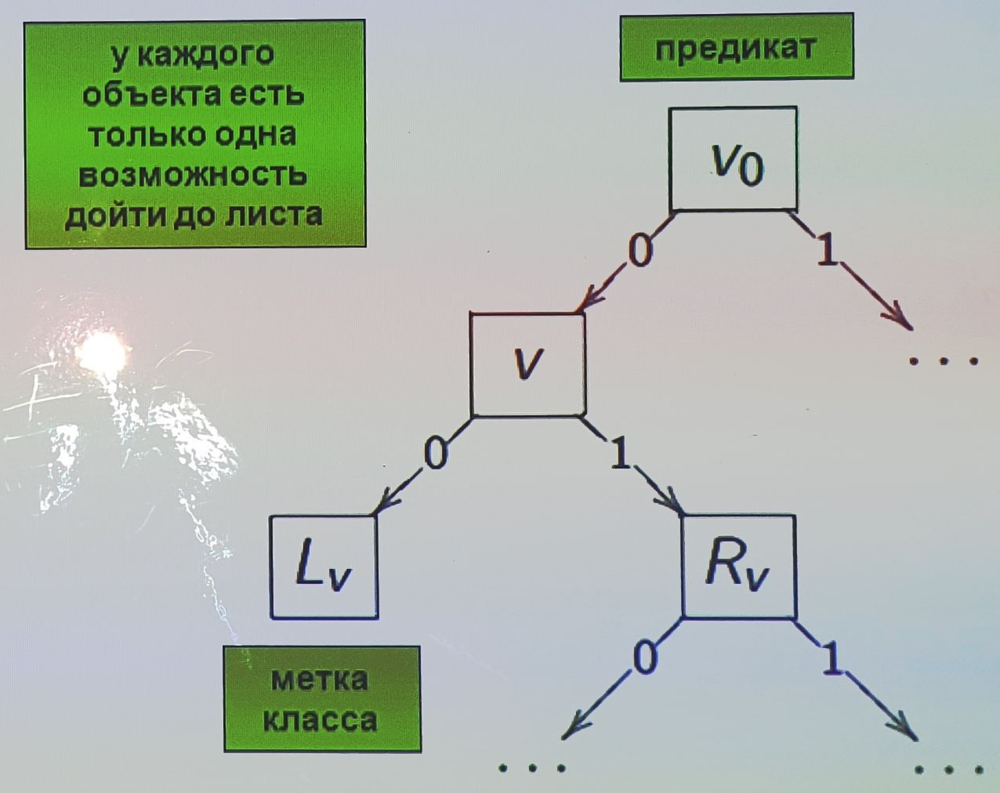
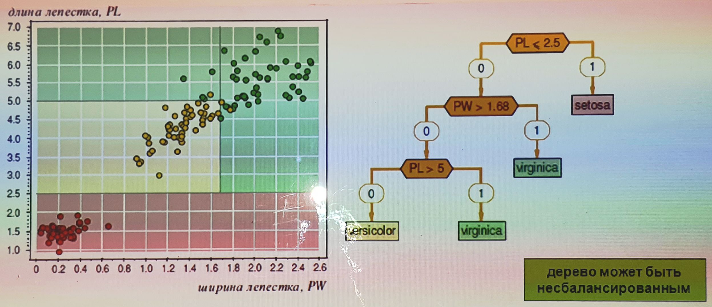
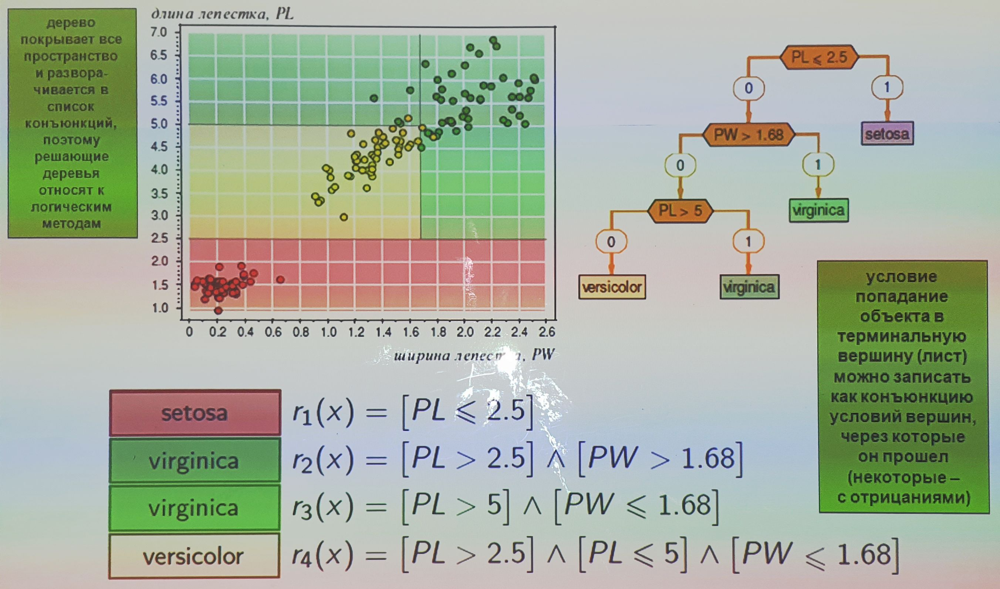
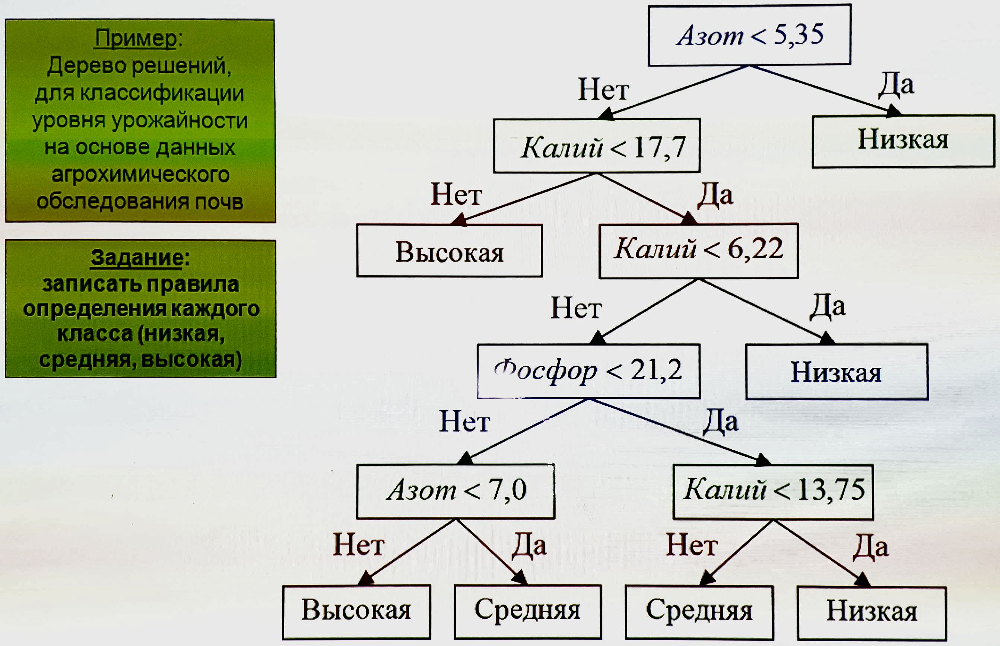
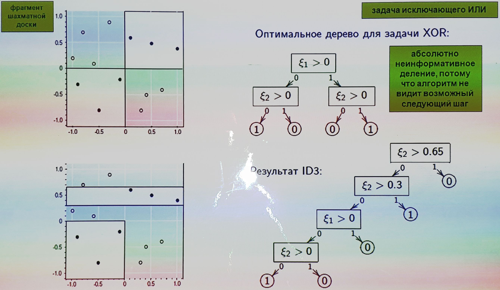
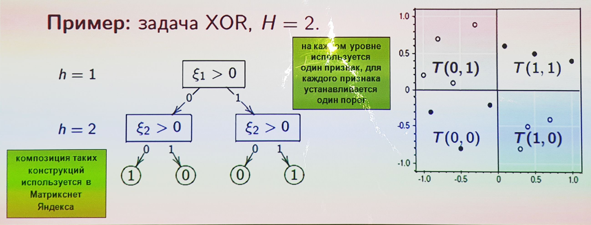

___
___
___
## Информация о занятии
- __Дисциплина:__ Машинное обучение в системах искусственного интеллекта (MLiAIS)
- __Преподаватель:__ Смагин Сергей Владимирович
- __Тип занятия:__ Лекционное занятие №5
- __Формат занятия:__ Очно (ДВФУ, D811)
- __Дата и время занятия:__ 16.11.2022, ср (нечет.), 16:50-18:20
___
___
___

&nbsp;

## Лекционное занятие

&nbsp;

### ___24. Как происходит поиск информативных закономерностей?___

&nbsp;

Частные случаи:
- стохастический локальный поиск,
- генетические алгоритмы,
- метод ветвей и границ

```
алгоритмов множество, здесь представлена общая идея, под которую подходят
следующие частные случаи
```

__Вход:__ выборка $X^l$;

__Выход:__ множество закономерностей $Z$;

```
общая эвристика, которая может быть реализована по-разному
```

1. начальное множество правил $Z$; ```одно или несколько```
2. __пока__ правила не перестают улучшаться
    - $Z' \coloneqq$ множество модификаций правил $R \in Z$;
    - удалить слишком похожие правила из $Z \cup Z'$;
    - оценить информативность всех правил $R \in Z'$;
    ```по любому критерию```
    - $Z \coloneqq$ наиболее информативные правила из $Z \cup Z'$;
3. __вернуть__ $Z$.

```
по идее, количество правил не должно увеличиваться - оставляем некоторое
изначально заданное их количество
```

&nbsp;

### ___25. Определение бинарного решающего дерева___

&nbsp;

_Бинарное решающее дерево_ - алгоритм классификации $a(x)$, задающийся
бинарным деревом:
- $\forall{v} \in V_{\text{внутр}} \rightarrow$ предикат $\beta_v : X \rightarrow {\lbrace 0, 1 \rbrace}, \quad \beta \in \Beta$
- $\forall{v} \in V_{\text{лист}} \rightarrow$ имя класса $c_v \in Y$.
 
1. $v \coloneqq v_0$;
2. __пока__ $v \in V_{внутр}$
3. &emsp;__если__ $\beta_v{(x)} = 1$ __то__
4. &emsp;&emsp;переход вправо: $v \coloneqq R_v$;
5. &emsp;__иначе__
6. &emsp;&emsp;переход влево: $v \coloneqq L_v$;
7. __вернуть__ $c_v$.



&nbsp;

### ___26. Пример решающего дерева___

&nbsp;

Задача Фишера о классификации цветков ириса на 3 класса, в выборке по 50
объектов каждого класса, 4 признака.



__На графике__: в осях двух самых информативных признаков (из 4) два класса
разделились без ошибок, на третьем 3 ошибки.

&nbsp;

### ___27. Решающее дерево, покрывающее набор конъюнкций___

&nbsp;



&nbsp;

### ___28. Пример и задание. Классификации уровня урожайности___

&nbsp;



- $r_?(x) = [\text{Азот} \geqslant 5.35] \wedge [\text{Калий} < 17.7] \wedge [\text{Калий} \geqslant 6.22] \wedge [\text{Фосфор} \geqslant 21.2] \wedge [\text{Азот} < 7.0]$

&nbsp;

### ___29. Жадный алгоритм построения дерева ID3___

&nbsp;

```
в начале передается вся выборка U
```

1. __ПРОЦЕДУРА__ LearnID3 ${\left( U \subseteq X^l \right)}$;
```рекурсивная процедура, берущая на входе часть выборки и строящая поддерево```
2. __если__ все объекты из $U$ лежат в одном классе $c \in Y$ __то__
3. &emsp;__вернуть__ новый лист $v, \; c_v \coloneqq c$;
    ```когда нечего расщеплять, создается лист```
4. найти предикат с максимальной информативностью:
$$\beta \coloneqq \argmax_{\beta \in \Beta}{I{\left( \beta, U \right)}};$$
```
когда есть что расщеплять, строится функционал β (по критерию ветвления
I), который пытается разбить объекты так, чтобы какие-то классы желательно
целиком ушли в одно из поддеревьев (см. след. слайд)
```
5. разбить выборку на две части $U = U_0 \cup U_1$ по предикату $\beta$:
$$
\begin{matrix}
U_0 \coloneqq {\lbrace x \in U: \; \beta{(x)} = 0 \rbrace};\\
U_1 \coloneqq {\lbrace x \in U: \; \beta{(x)} = 1 \rbrace};
\end{matrix}
$$
6. __если__ $U_0 = \varnothing$ или $U_1 = \varnothing$ __то__
7. &emsp;__вернуть__ новый лист
$v, \; c_v \coloneqq \text{Мажоритарный класс}{\left( U \right)}$;
```
построен неинформативный предикат (даже когда получена просто малая
мощность множества);
в этом случае листу приписывается (мажоритарный) класс - которого было
больше в выборке U
```
8. создать новую внутреннюю вершину $v: \; \beta_v \coloneqq \beta$;
```было несколько классов```
$$
\begin{matrix}
\text{построить левое поддерево: } L_v \coloneqq \text{LearnID3}{\left( U_0 \right)};\\
\text{построить правое поддерево: } R_v \coloneqq \text{LearnID3}{\left( U_1 \right)};
\end{matrix}
$$
9. __вернуть__ $v$;

&nbsp;

### ___30. Разновидности многоклассовых критериев ветвления___

&nbsp;

1. __Отделение одного класса__ (слишком сильное ограничение):
$$I{\left( \beta, X^l \right)} = \max_{c \in Y}{I_c}{\left( \beta, X^l \right)}$$
2. __Многоклассовый энтропийный критерий:__
```
насколько много информации о разделении выборки на классы несет β;
разность энтропии до того, как его узнали, и после дает выигрыш в информации
```
$$
I{\left( \beta, X^l \right)} =
\sum_{c \in Y}{h{\left( \frac{P_c}{l} \right)}} -
\frac{p}{l} \sum_{c \in Y}{h{\left( \frac{p_c}{p} \right)}} -
\frac{l-p}{l} \sum_{c \in Y}{h{\left( \frac{P_c - p_c}{l - p} \right)}},
$$
где
- $P_c = \#{\lbrace x_i \! : \: y_i = c \rbrace}$,
- $p = \#{\lbrace x_i \! : \: \beta{(x_i)} = 1 \rbrace}$,
- $h{(z)} \equiv -z \log_2{z}$.
3. __Критерий Джинн:__
```
предикат β тем более информативен, чем больше пар объектов, принадлежащих
одному классу, пошли в одно поддерево
```
$$I{\left( \beta, X^l \right)} = \#{\lbrace {\left( x_i, x_j \right)} \! : \: \beta{\left( x_i \right)} = \beta{\left( x_j \right)} \quad \text{и} \quad y_i=y_j \rbrace}.$$
4. $D\textbf{-критерий}$ __В.И.Донского:__
```
двойственный критерий предикат β тем более информативен, чем больше пар
объектов, принадлежащих разным классам, пошли в разные поддеревья
(разделимость ЛУЧШЕ объединения)
```
$$I{\left( \beta, X^l \right)} = \#{\lbrace {\left( x_i, x_j \right)} \! : \: \beta{\left( x_i \right)} \neq \beta{\left( x_j \right)} \quad \text{и} \quad y_i \neq y_j \rbrace}.$$

&nbsp;

### ___31. Обработка пропусков (логические алгоритмы толерантны к пропускам)___

&nbsp;

__На стадии обучения:__
```
дерево обладает тем свойством, что можно не знать значения всех признаков,
но тем не менее успешно классифицировать
```
- $\beta_v{(x)}$ не определено $\Rightarrow$ $x_i$ исключается из $U$ для
$I{\left( \beta, U \right)}$
```
если для объекта отсутствует признак, объект исключается из оценки
информативности
```
- $\displaystyle q_v = \frac{|U_0|}{|U|}$ - оценка вероятности левой ветви,
$\forall v \in V_{\text{внутр}}$
```
оценивается вероятность того, что объекты идут по одной или по другой ветке
(для всех ветвей)
```

__На стадии классификации:__
- $\beta_v{(x)}$ определено $\Rightarrow$ либо налево, либо направо:
$$\displaystyle P_v{(y|x)} = {\left( 1 - \beta_v{(x)} \right)} P_{L_v}{\left( y|x \right)} + \beta_v{\left( x \right)} P_{R_v}{\left( y|x \right)}.$$
_четко_: предикат $\beta_v{(x)}=1$, значит он выделил объект $x$.

- $\beta_v{(x)}$ не определено $\Rightarrow$
_пропорциональное распределение_:
$$\displaystyle P_v{(y|x)} = q_v P_{L_v}{\left( y|x \right)} + {\left( 1-q_v \right)} P_{R_v}{\left( y|x \right)}.$$

_размыто_: считаем вероятность дочерней вершины.

- Окончательное решение - наиболее вероятный класс:
$$y = \argmax_{y \in Y}{P_{v_0}}{\left( y|x \right)}.$$

```
в терминальной вершине может быть как метка одного класса, так и
распределение нескольких (в случае, если при обучениии в вершину
пришла подвыборка с объектами разных классов)
```

&nbsp;

### ___32. Решающие деревья ID3: достоинства и недостатки___

&nbsp;

__Достоинства:__
- Интерпретируемость и простота классификации.
- Гибкость: можно варьировать множество $\Beta$.
- Допустимы разнотипные данные и данные с пропусками.
- Трудоемкость линейна по длине выборки $O{\left( {|\Beta|} hl \right)}$.
- Не бывает отказов от классификации. ```наилучшее дерево можно найти полный перебором```

```
условия могут быть любого типа, при этом любой признак любого типа можно
бинаризовать
```
__Недостатки:__
- Жадный ID3 переусложняет струткуру дерева, и, как следствие, сильно
переобучается. ```иногда листы построены по малым (статистически ненадежным) подвыборкам```
- Фрагментация выборки: чем дальше $v$ от корня, тем меньше статистическая
надежность выбора $\beta_v$, $c_v$.
- Высокая чувствительность к шуму, к составу выборки, к критерию
информативности.

&nbsp;

### ___33. Иллюстрация того, что каждый ID3 переусложняет структуру дерева___

&nbsp;



&nbsp;

### ___34. Редукция дерева ("стрижка кустов", pruning: C4.5, CART)___

&nbsp;

```
хотим понять, какие вершины оказались лишними - до которых не дошел ни один
объект контрольной выборки
```

$X^k$ - независимая контрольная выборка, $k \approx 0.5l$.
1. __для всех__ $v \in V_{\text{внутр}}$
2. &emsp;$S_v \coloneqq$ подмножество объектов $X^k$, дошедших до $v$;
3. &emsp;__если__ $S_v = \varnothing$ __то__ ```от этой вершины удаляется поддерево и она заменяется на лист```
4. &emsp;&emsp;__вернуть__ новый лист $v, \; c_v \coloneqq \text{Мажоритарный класс}{\left( U \right)}$;
5. &emsp;число ошибок при классификации $S_v$ четырьмя способами:
    - $r{(v)}$ - поддеревом, растущим из вершины $v$;
    - $r_L{(v)}$ - поддеревом левой дочерней вершины $L_v$;
    - $r_R{(v)}$ - поддеревом правой дочерней вершины $R_v$;
    - $r_c{(v)}$ - к классу $c \in Y$.
```
если до этой вершины дошла какая-то часть объектов, считаем число ошибок
```
6. &emsp;в зависимости от того, какое из них минимально:
    - сохранить поддерево $v$;
    - заменить поддерево $v$ поддеревом $L_v$; ```срезали правое поддерево```
    - заменить поддерево $v$ поддеревом $R_v$; ```срезали левое поддерево```
    - заменить поддерево $v$ листом, $\displaystyle c_v \coloneqq \argmin_{c \in Y}{r_c{\left( v \right)}}$. ```срезали все```
```
вопросы при реализации: в каком порядке обходить, сверху или снизу, случайно
или по критериям и т.п.
```

&nbsp;

### ___35. Небрежные решающие деревья - ODT (Oblivious Decision Tree)___

&nbsp;

```
еще одна конструкция с идеей строить деревья быстро
```

__Решение проблемы фрагментации__:

- строится сбалансированное дерево высоты $H$;
- для всех узлов уровня $h$ условие ветвления $\beta_h{(x)}$ _одинаково_;
- на уровне $h$ ровно $2^{h-1}$ вершин;
- $X$ делится на $2^H$ ячеек.

Классификатор задается _таблицей решений_
$T : {\lbrace 0, 1 \rbrace}^H \rightarrow Y$:
$$a{(x)} = T{\left( \beta_1{(x)}, \ldots, \beta_H{(x)} \right)}.$$



&nbsp;

___