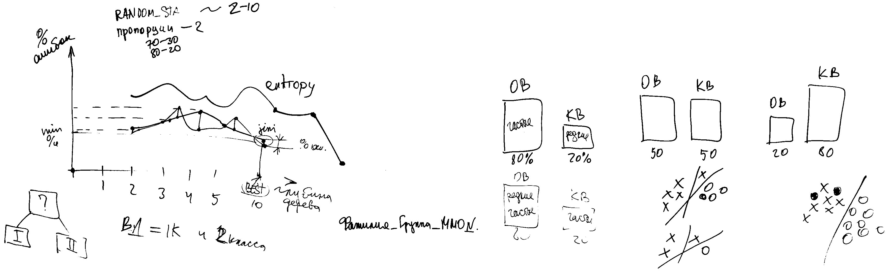

___
___
___
## Информация о занятии
- __Дисциплина:__ Машинное обучение в системах искусственного интеллекта (MLiAIS)
- __Преподаватель:__ Смагин Сергей Владимирович
- __Тип занятия:__ Лабораторная работа №5
- __Формат занятия:__ Очно (ДВФУ, D???)
- __Дата и время занятия:__ 22.11.2022, вт (чет.), 16:50-18:20
___
___
___

&nbsp;

## Лабораторная работа

&nbsp;

### ___Разная информация___

&nbsp;



Ответы на некоторые вопросы:
- Название файлов для сдачи: ```фамилия_групп_ММО_№.ipynb```
- Задания сдавать в отдельных файлах (метрические методы - в первом файле,
логические методы - во втором и т.д.)
- Зачем нам процент ошибок на обучении?
Мы смотрим процент ошибок на обучении, чтобы узнать насколько разделимы
классы.
__Ожидать__ процент ошибок на контроле меньше, чем на обучении, не стоит.
- В линейных методах: learning rate и velocity.

Чаще всего в обзоре литературы то - что было сделано до нас.
Ещё нужно сформировать некоторые ожидаемые критерии, которыми
будет оцениваться наша программа.

Посмотреть описания алгоритмов KNN и Parzen Window (только для меня).

&nbsp;

___