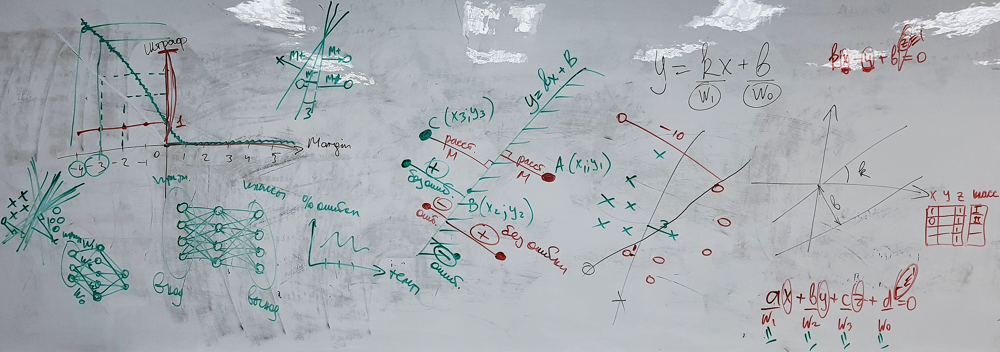
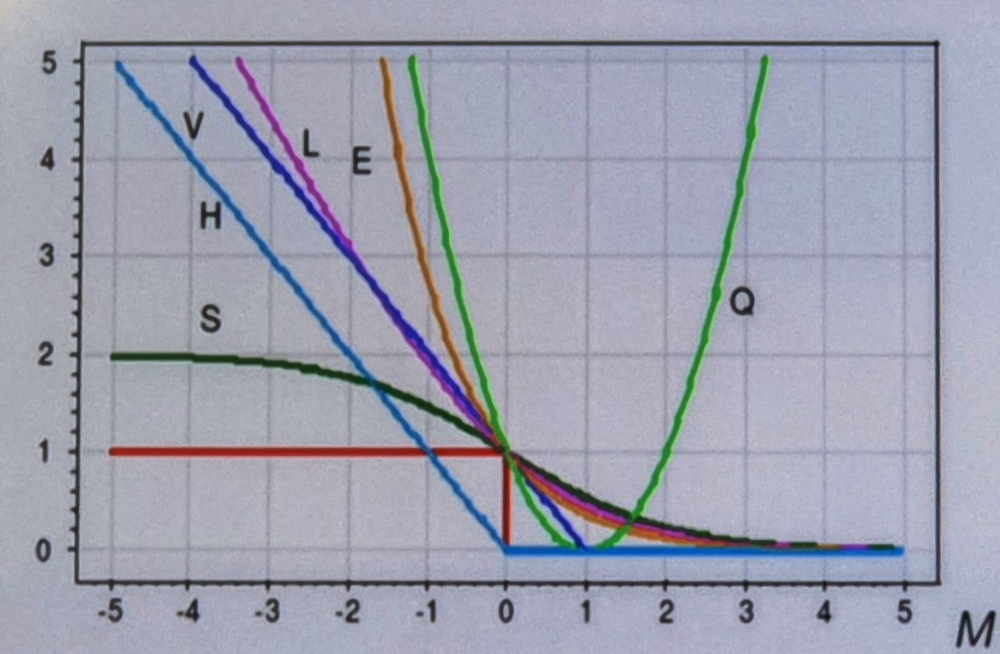
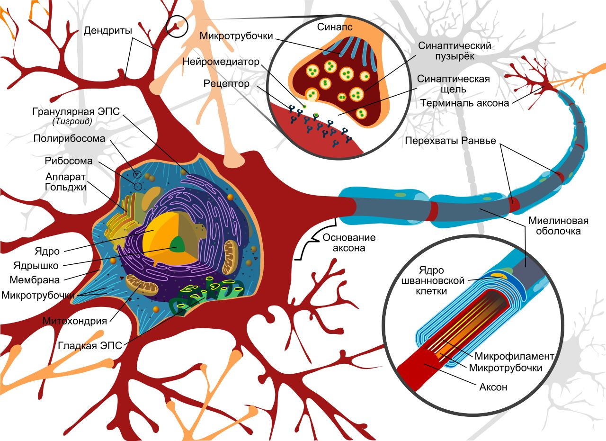
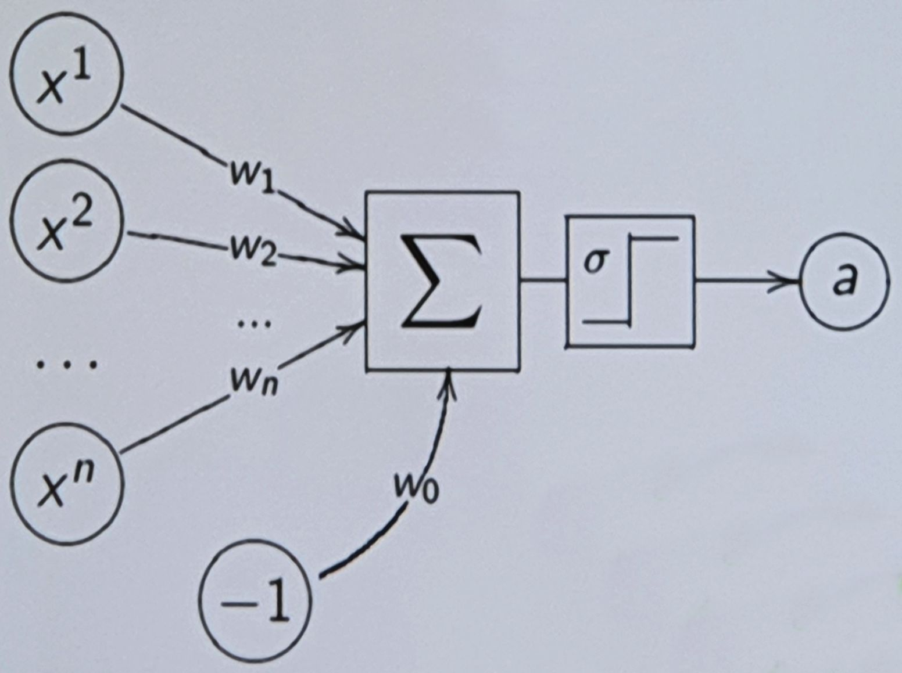

___
___
___
## Информация о занятии
- __Дисциплина:__ Машинное обучение в системах искусственного интеллекта (MLiAIS)
- __Преподаватель:__ Смагин Сергей Владимирович
- __Тип занятия:__ Лекционное занятие №6
- __Формат занятия:__ Очно (ДВФУ, D811)
- __Дата и время занятия:__ 30.11.2022, ср (нечет.), 16:50-18:20
___
___
___

&nbsp;

## Лекционное занятие. Тема 3 - линейные методы. 

&nbsp;

### ___Общая на всю пару картинка доски___

&nbsp;



&nbsp;

### ___2. План лекции___

&nbsp;

Градиентные методы обучения
- Минимизация эмпирического риска
- Линейный классификатор
- Метод стохастического градиента SG - Stochastic Gradient

&nbsp;

### ___3. Задачи построения разделяющей поверхности___

&nbsp;

Гиперплоскость - разделяющая поверхность.

- Задача классификации с двумя классами, $Y = {\lbrace -1, +1 \rbrace}$:\
по обучающей выборке $X^l = {\left( x_i, y_i \right)}^l_{i=1}$ построить
алгоритм классификации
$a{\left( x, w \right)} = \text{sign}{f{\left( x, w \right)}}$, где:
    - $f{\left( x, w \right)}$ - _разделяющая (дискриминантная) функция_,
    - $w$ - вектор параметров.
- $f{\left( x, w \right)} = 0$ - разделяющая поверхность;
```хотим, чтобы классификатор был основан на принципе разделения```\
$M_i{\left( w \right)} = y_i f{\left( x_i, w \right)}$ - _отступ_ (margin)
объекта $x_i$; ```от поверхности```\
$M_i{\left( w \right)} < 0 \iff$ алгоритм
$a{\left( x, w \right)}$ ошибается на $x_i$.

&nbsp;

- $x$ - признаковое описание объекта,
- $w$ - вектор параметров.

&nbsp;

Если функция $f$ возвратила на объекте $x_i$:
- значение $> 0$, то относим $x_i$ в класс $+1$,
- значение $< 0$, то относим $x_i$ в класс $-1$,
- значение $= 0$, то относим $x_i$, например, в класс $+1$

&nbsp;

Преимущество таких классификаторов: вводится понятие
_"надежность классификации"_, которое связано с тем, насколько далеко объект
находится от границы между классами (если объект лежит близко к границе, то
небольшое изменение в условиях задачи способно менять его классовую
принадлежность).

&nbsp;

- Если $y$ и $f$ __одного знака__, то __ошибки нет__:
    - чем больше абсолютное значение величины $M_i{(w)}$, тем надежнее
    классификация;
- Если $y$ и $f$ __разных знаков__, то __ошибка__:
    - если большое абсолютное значение $M_i{(w)}$, то это однозначно выброс.

&nbsp;

### ___4. Задачи построения разделяющей поверхности___

&nbsp;

```
понятие отступа позволяет записать функционал числа ошибок на обучающей
выборке (эмпирический риск)
```

- $f{\left( x, w \right)} = 0$ - разделяющая поверхность;\
$M_i{\left( w \right)} = y_i f{\left( x_i, w \right)}$ - _отступ_ (margin)
объекта $x_i$;\
$M_i{\left( w \right)} < 0 \iff$ алгоритм
$a{\left( x, w \right)}$ ошибается на $x_i$.
- _Минимизация эмпирического риска_:

```
замена пороговой функции потерь на непрерывную
```

$$Q{(w)} = \sum_{i=1}^{l}{\left[ M_i{(w)} < 0 \right]} \quad \leqslant  \quad \widetilde{Q}{(w)} = \sum_{i=1}^{l}{\mathscr{L}{\left( M_i{(w)} \right)}} \rightarrow \min_w;$$

```
огрубление характеристики - ошибка или не ошибка - теряется информация о
надежности i-ого объекта
```

```
сделаем так, чтобы функционал непрерывным образом зависел бы от отступов
```

_Функция потерь_ $\mathscr{L}{(M)}$ невозрастающая, неотрицательная.

&nbsp;

__Преимущества функции потерь__ $\mathscr{L}{(M)}$:
1. более тонкая характеристика надежности классификации,
2. получаем инструмент, который позволит применять градиентные методы
оптимизации

&nbsp;

Подбираем $\mathscr{L}{(M)}$ так, чтобы она сверху аппроксимировала
пороговую
функцию потерь, а т.к. $\mathscr{L}{(M)}$ мы минимизируем, то минимизируется
и исходный функционал;
если решать первую задачу, то это тяжелая задача комбинаторной оптимизации,
которая имеет бесконечно много решений.

&nbsp;

### ___5. Непрерывные аппроксимации пороговой функции потерь___

&nbsp;

Часто используемые непрерывные функции потерь $\mathscr{L}{(M)}$:



|||
|-|-|
|$V{(M)} = {(1 - M)}_+$|кусочно-линейная (SVM)|
|$H{(M)} = {(- M)}_+$|кусочно-линейная (Hebb's rule)|
|$L{(M)} = \log_2{(1 + e^{-M})}$|логарифмическая (LR)|
|$Q{(M)} = {(1 - M)}^2$|квадратичная (FLD)|
|$S{(M)} = 2{(1 + e^{M})}^{-1}$|сигмоидная (ANN)|
|$E{(M)} = e^{-M}$|экспоненциальная (AdaBoost)|
|${\left[ M < 0 \right]}$|пороговая функция потерь|

Градиентные методы - численные методы решения с помощью градиента задач,
сводящихся к нахождению экстремумов функции.

Градиент - это вектор, указывающий направление самого быстрого возрастания
функции.

__Современный принцип__: можно как угодно менять функции потерь и получать
тот или иной по качеству метод, потому что решение сильно зависит от
$\mathscr{L}{(M)}$ - зависит от того, как мы штрафуем за ошибки.

&nbsp;

### ___6. Линейный классификатор___

&nbsp;

$f_j \! : \; X \rightarrow \R, \; j = 1, \ldots, n$ - числовые признаки.

Возьмем вместно непонятной дискриминантной функции $f$ линейную функцию.

Будем считать, что объекты заданы векторами из $\R^n$, т.е. имеется $n$
числовых признаков $f_1, \ldots, f_n$ и мы состваляем их линейную
комбинацию с весами $w$.

$$a{(x, w)} = \text{sign}{\left( \sum_{j=1}^{n}{w_j f_j{(x)}} - w_0 \right)},$$

где $w_0, w_1, \ldots, w_n \in \R$ - коэффициенты (веса признаков);

Введем константный признак $f_0 \equiv -1$. ```технический прием для сокращения записи```

Векторная запись (нас интересует знак скалярного произведения $w$ на $x$):
$$a{(x, w)} = \text{sign}{\left( {\langle w, x\rangle} \right)}.$$


Отступы объектов $x_i$
($x$ и $w$ теперь находятся в пространстве $\R^{n+1}$):
$$M_i{(w)} = {\langle w, x_i \rangle} y_i.$$

&nbsp;

### ___7. Похож ли нейрон на линейный классификатор?___

&nbsp;



&nbsp;

### ___8. Похож ли нейрон на линейный классификатор?___

&nbsp;

__Нейрон__ - это структурно-функциональная единица нервной системы,
представляющая собой электрически возбудимую клетку, которая обрабатывает и
передает информацию посредством электрических и химических сигналов.

__Аксон__ - обычно длинный отросток нейрона, приспособленный для проведения
возбуждения и информации от тела нейрона к исполнительному органу или к
другим клеткам.

__Дендриты__ - как правило, короткие и сильно разветвленные отростки
нейрона,
служащие главным местом образования влияющих на нейрон возбуждающих и
тормозных синапсов (разные нейроны имеют различное соотношение длины аксона
и дендритов), и которые передают возбуждение к телу нейрона.

_Нейрон может иметь несколько дендритов и обычно только один аксон.
Один нейрон может иметь связи со многими (до 20 тысяч) другими нейронами._

&nbsp;

### ___9. Похож ли нейрон на линейный классификатор?___

&nbsp;

__Синапс__ - место контакта между двумя нейронами или между нейроном и
получающей сигнал эффекторной клеткой.
Служит для передачи нервного импульса между двумя клетками, причем в ходе
синаптической передачи амплитуда и частота сигнала могут регулироваться.

В синапсах начинает концентрироваться отрицательный заряд, который затем
переходит внутрь (ядра) клетки, и там, как только происходит концентрация
слишком большого отрицательного заряда, который пришел отовсюду (ото всех
её синапсов), клетка генерирует электрический импульс, который бежит по
аксону до конца, и так порождается "волна возбуждения";
если к той клетке, куда пришел импульс, также придут импульсы от других
клеток, она тоже возбудится и волна продолжится.

&nbsp;

### ___10. Похож ли нейрон на линейный классификатор?___

&nbsp;

Имеется некоторая аналогия с линейным классификатором:
_величина заряда_, который проходит в клетку через синапсы - это _признаки_
$f$, синоптические связи - это веса $w$, а коэффициент $w_0$ - это тот
порог, который необходим для того, чтобы началась генерация импульса.

Линейный классификатор - это, пусть и грубая, но модель нервной клетки,
поэтому создавая композиции таких классификаторов, есть надежда
конструировать обучающиеся системы, которые обучаются также как человек
(хотя видов нервных клеток позже было открыто много)

&nbsp;

### ___11. Математическая модель нейрона___

&nbsp;

Линейная модель нейрона МакКаллока-Питтса \[1943\]:

$$a{\left( x, w \right)} = \sigma{\left( {\langle w, x \rangle} \right)} = \sigma{\left( \sum_{j=1}^{n}{w_j f_j{\left( x \right)}} - w_0 \right)},$$

где $\sigma{\left( s \right)}$ - функция активации
(в частности, $\text{sign}$).

В 1940-1950 годы проводилось большое число нейрофизиологических
экспериментов в попытке понять, как происходит обучение в нервной клекте.

__Основной вывод__: запоминают синоптические связи, т.е. если две клетки
последовательно возбудились, то первая правильно предугадала тот ответ,
который генерирует следующая, за это синоптическая связь награждается
усилением - $w$ становится больше.



Сумматор - функция, преобразующая выход в $-1$ и $+1$.

Эти механизмы были открыты сначала в нейрофизиологии, а потом математики
усмотрели в них градиентную оптимизацию некоторого функционала качества.

&nbsp;

### ___14. Алгоритм SG (Stochastic Gradient)___

&nbsp;

Стохастический - умеющий угадывать, случайный.

__Вход:__
- выборка $X^l$;
- темп обучения $\eta$ (или "градиентный шаг");
- параметр $\lambda$ (сколько предыдущих объектов будет запомнено):
    - $\lambda$ можно назначить $1/k$, где $k$ - это количество
    усредняемых потерь $\varepsilon_i$.

__Выход:__
- веса $w_0, w_1, \ldots, w_n$.

&nbsp;

1. инициализировать веса $w_j, \; j = 0, \ldots, n$:
    - будет отдельный слайд на тему эвристик;
2. инициализировать текущую оценку функционала:\
$Q \coloneqq \sum_{i=1}^{l}{\mathscr{L}{\left( {\langle w, x_i \rangle} y_i \right)}}$:
    - текущая оценка нужна для учета средних потерь классификатора на
    выборке;
3. __повторять__
4. &nbsp; выбрать объект $x_i$ из $X^l$ (например случайно):
    - не всегда;
5. &nbsp; вычислить потерю:
$\varepsilon_{i} \coloneqq \mathscr{L}{\left( {\langle w, x_i \rangle} y_i \right)}$;
    - пропустили выбранный объект через классификатор;
6. &nbsp; градиентный шаг:
$w \coloneqq w - \eta \mathscr{L}'{\left( {\langle w, x_i \rangle} y_i \right)} x_i y_i$:
    - примеряем формулу для выбранного объекта;
7. &nbsp; оценить значение функционала:
$Q \coloneqq {\left( 1 - \lambda \right)} Q + \lambda \varepsilon_i$;
    - способ грубо оценить $Q$, не пересчитывая его на всей выборке:
8. __пока__ значение $Q$ и/или веса $w$ не стабилизируются:
    - стабилизация определяется __вручную__, когда значение $Q$ выходит на
    ровный участок, когда видно, что в течение ряда последних итераций
    значение $Q$ остается в неком диапазоне.

&nbsp;

___