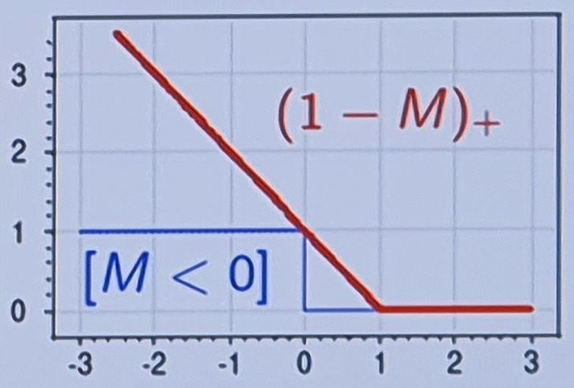
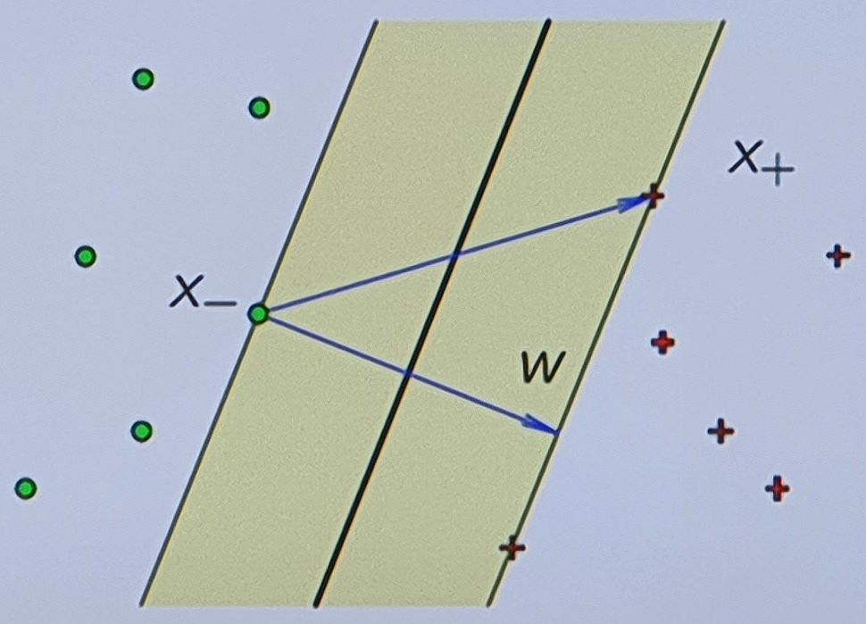
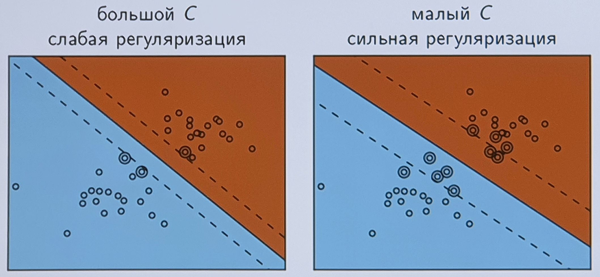
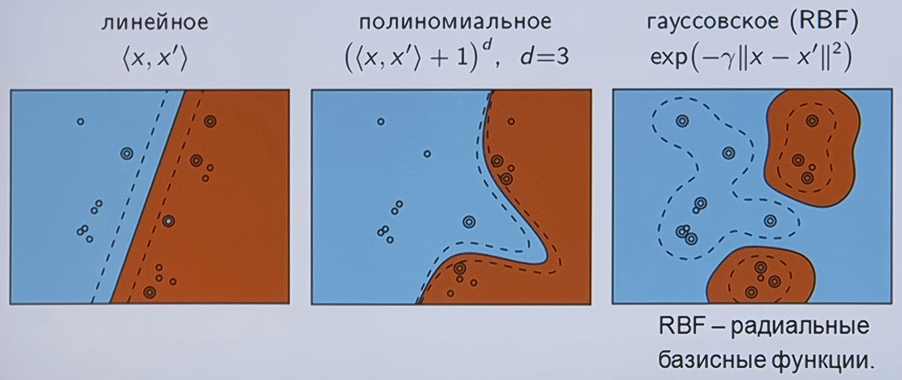
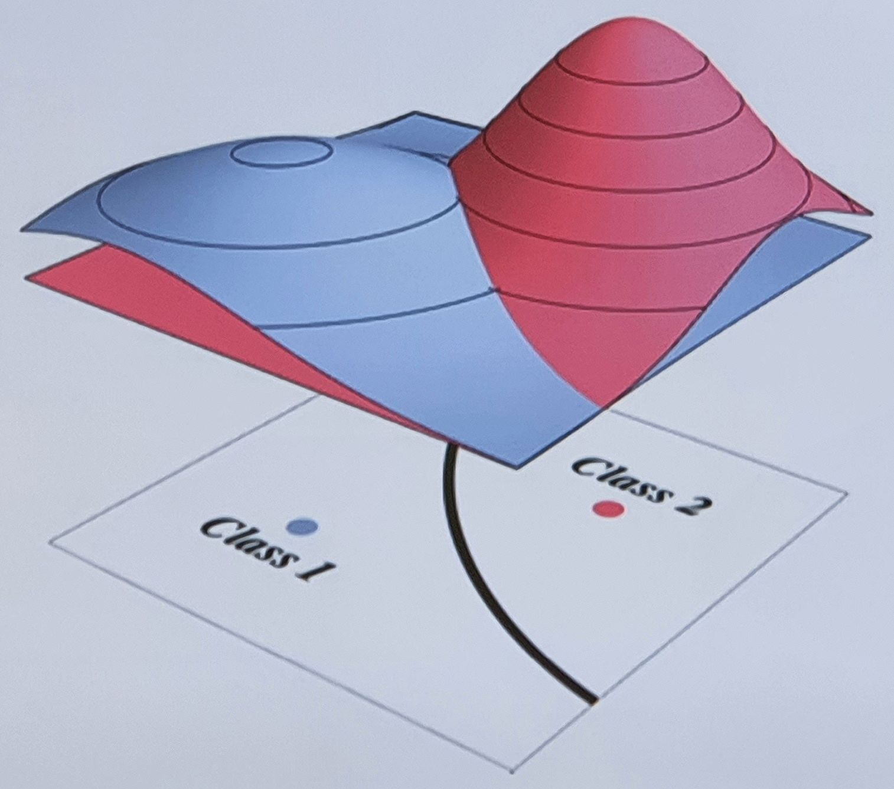

___
___
___
## Информация о занятии
- __Дисциплина:__ Машинное обучение в системах искусственного интеллекта (MLiAIS)
- __Преподаватель:__ Смагин Сергей Владимирович
- __Тип занятия:__ Лабораторная работа №6
- __Формат занятия:__ Очно (ДВФУ, D???)
- __Дата и время занятия:__ 06.12.2022, вт (чет.), 16:50-18:20
___
___
___

&nbsp;

## Информация о дисциплине

&nbsp;

Что Смагин ожидает от нас на экзамене:
1. Мы должны понимать всю концепцию:
    - обучение по прецедентам - что это такое?
2. Мы должны на пальцах объяснить каждую из групп методов:
    - метрические,
    - ...,
    - линейные,
    - ....

&nbsp;

___

&nbsp;

## Лабораторная работа - Лекция 6.

&nbsp;

### ___1. Лекция 6. Линейные методы классификации, SVM___

&nbsp;

### ___2. Задача обучения линейного классификатора___

&nbsp;

__Дано:__
- Обучающая выборка $X^l = {(x_i, y_i)}^l_{i=1}$,
- $x_i$ - объекты, векторы из множества $X = \R^n$,
- $y_i$ - метки классов, элементы множества $Y = {\lbrace -1, +1\rbrace}$.

__Найти:__

Параметры $w \in \R^n, \;\; w_0 \in \R$ линейной модели классификации
$$a{(x; w, w_0)} = \text{sign}{\left( {\langle x, w \rangle} - w_0 \right)}.$$

__Критерий__ - минимизация эмпирического риска:
$$\sum_{i=1}^{l}{\left[ a{(x_i; w, w_0)} \neq y_i \right]} = \sum_{i=1}^{l}{\left[ M_i{(w, w_0)} < 0 \right]} \rightarrow \min_{w, w_0},$$
где $M_i{(w, w_0)} = {\left( {\langle x_i, w \rangle} - w_0 \right)} y_i$ -
_отступ_ (margin) объекта $x_i$,

__Эмпирический риск__ - среднее число ошибок на обучающей выборке.

__Отступ (margin)__ - расстояние (со знаком) от объекта выборки до
разделяющей гиперплоскости.

&nbsp;

- Если знак "+", то ошибки нет.
- Если знак "-", то ошибка есть.

&nbsp;

### ___3. Аппроксимация и регуляризация эмпирического риска___

&nbsp;

__Мультиколлениарность__ - тесная корреляционная взаимосвязь между
отбираемыми для анализа признаками (совместно воздействующими на общий
результат), которая затрудняет оценивание параметров.

__Регуляризация__ - метод добавления некоторой дополнительной информации к
условию, с целью решить некорректно поставленную задачу или предотвратить
переобучение.

__Регуляризация решает проблему мультиколлениарности, а также снижает
переобучение.__

__Вектор__ $\mathbf{w}$ - это вектор нормали к разделяющей гиперплоскости.

__Скаляр__ $\mathbf{w_0}$ - это сдвиг гиперплоскости относительно начала
координат.

__Норма (длина) вектора__ $\mathbf{\Vert w \Vert}$ = корень из суммы
квадратов $w_i$.

&nbsp;

### ___4. Аппроксимация и регуляризация эмпирического риска___

&nbsp;

Эмпирический риск - это кусочно-постоянная функция.

Заменим его оценкой сверху, непрерывной по параметрам:
$$
\begin{split}
Q{(w, w_0)} &= \sum_{i=1}^{l}{\left[ M_i{(w, w_0)} < 0 \right]} \leqslant\\
&\leqslant \sum_{i=1}^{l}{\left( 1 - M_i{(w, w_0)} \right)}_{+} + \frac{1}{2C} {\Vert w \Vert}^2 \rightarrow \min_{w, w_0}.
\end{split}
$$

- _Аппроксимация_ штрафует объекты за приближение к границе классов,
увеличивая зазор между классами
- _Регуляризация_ штрафует неустойчивые решения в случае
мультиколлинеарности

На рисунке значение потерь - это невозврастающая функция от отступов.

Штрафуются все отрицательные отступы и объекты, лежащие на разделяющей
гиперплоскости - для поиска самого устойчивого решения.

&nbsp;

### ___5. Оптимальная разделяющая гиперплоскость___

&nbsp;

Линейный классификатор:
$a{(x, w)} = \text{sign}{\left( {\langle w, x \rangle} - w_0 \right)}$

Пусть выборка $X^l = {(x_i, y_i)}^l_{i=1}$ линейно разделима:
$$\exists w, w_0 : \quad M_i{(w, w_0)} = y_i{\left( {\langle w, x_i \rangle} - w_0 \right)} > 0, \quad i = 1, \ldots, l$$

Нормировка: $\displaystyle \min_{i=1,\ldots,l}{M_i{(w, w_0)}} = 1$

Разделяющая полоса (разделяющая гиперплоскость посередине):

$$
\begin{split}
&{\lbrace x: \; -1 \leqslant {\langle w, x \rangle} - w_0 \leqslant 1 \rbrace}\\
&\exists x_+ : \quad {\langle w, x_+ \rangle} - w_0 = +1\\
&\exists x_- : \quad {\langle w, x_- \rangle} - w_0 = -1
\end{split}
$$

Ширина полосы:
$$\frac{\langle x_+ - x_-, w \rangle}{\Vert w \Vert} = \frac{2}{\Vert w \Vert} \rightarrow \max$$

Для нормировки сделаем минимальное значение отступа равным 1.
Тогда этот минимум будет достигается на хотя бы двух объектах.

Задача максимизировать ширину полосы, т.е. $w$ нужно минимизировать по
норме:
$${\Vert w \Vert} \rightarrow \min.$$

&nbsp;

### ___7. Влияние константы C на решение SVM___

&nbsp;

SVM - аппроксимация и регуляризация эмпирического риска:
$$\sum_{i=1}^{l}{\left( 1 - M_i{(w, w_0)} \right)}_{+} + \frac{1}{2C} {\Vert w \Vert}^2 \rightarrow \min_{w, w_0}.$$

Константа $C$ - это гиперпараметр регуляризации, который необходимо
подбирать вручную.

От константы $C$ зависит геометрия получаемого решения:
- большое $C$ - сужение ширины, но меньше ошибок;
- малое $C$ - расширение полосы, но больше ошибок.

&nbsp;

### ___8. Классификация с различными ядрами___

&nbsp;

Гиперплоскость в спрямляющем пространстве соответствует нелинейной
разделяющей поверхности в исходном.

Примеры с различными ядрами $K{(x, x')}$

Линейный классификатор (с оптимальной разделяющей поверхностью)
преобразовывается в нелинейный (с такой же поверхностью).

Спрямляющее пространство - это пространство большей размерности, при
переходе в которое выборка становится разделимой.

&nbsp;

### ___9. Плюсы метода SVM___

&nbsp;

- хорошо работает с пространством признаков большого размера;
- хорошо работает с данными небольшого объема;
- алгоритм максимизирует разделяющую полосу, которая, как подушка
безопасности, позволяет уменьшить количество ошибок классификации;
- алгоритм сводится к решению задачи квадратичного программирования в
выпуклой области, то такая задача всегда имеет единственное решение
(разделяющая гиперплоскость с определенными гиперпараметрами алгоритма
всегда одна).

&nbsp;

### ___10. Минусы метода SVM___

&nbsp;

- долгое время обучения (для больших наборов данных);
- неустойчивость к шуму - выбросы в обучающих данных становятся опорными
объектами-нарушителями и напрямую влияют на построение разделяющей
гиперплоскости;
- не описаны общие методы построения ядер и спрямляющих пространств,
наиболее подходящих для конкретной задачи в случае линейной неразделимости
классов;
- приходтся подбирать константу $C$ при помощи кросс-валидации.

&nbsp;

___

&nbsp;

## Лабораторная работа - Лекция 7.

&nbsp;

### ___1. Байесовские методы классификации___

&nbsp;

### ___2. Содержание___

&nbsp;

Оптимальный байесовский классификатор:
- вероятностная постановка задачи классификации;
- задача восстановления плотности распределения;
- три подхода к оцениванию плотностей;
- наивный байесовский классификатор.

&nbsp;

### ___3. Вероятностная постановка задачи классификации___

&nbsp;

- $X$ - объекты,
- $Y$ - ответы,
- $X \times Y$ - в.п. с плотностью $p{(x, y)}$.

__Дано__: $X^l = {(x_i, y_i)}_{i=1}^{l} \sim p{(x, y)}$ - простая
выборка.

__Найти__: $a: \; X \rightarrow Y$ с минимальной вероятностью ошибки.

__Временное допущение:__ пусть известна совместная плотность
$$p{(x, y)} = p{(x)} P{(y \vert x)} = P{(y)} p{(x \vert y)}.$$

- $P{(y)}$ - _априорная вероятность_ класса $y$;
- $p{(x \vert y)}$ - _функция правдоподобия_ класса $y$;
- $P{(y \vert x)}$ - _апостериорная вероятность_ класса $y$.

Априорная вероянтность - вероятность до опыта.

__Принцип максимума апостериорной вероятности:__
$$a{(x)} = \argmax_{y \in Y}{P{(y \vert x)}} = \argmax_{y \in Y}{P{(y)} p{(x \vert y)}}.$$

- $p$ - плотность (функция).
- $P$ - вероятность (число).
- $p{(x)}$ - плотность распределения на всем пространстве объектов
(все классы вместе).
- $P{(y)}$ - доля объектов класса $y$ в выборке.
- $p{(x \vert y)}$ - плонтность распределения класса $y$.
- $P{(y \vert x)}$ - вероятность класса $y$ после получения некоторой
информации об объекте $x$ (этого достаточно для его классификации).

&nbsp;

### ___4. Классификация по максимуму функции правдоподобия___

&nbsp;

Частный случай: $\displaystyle a{(x)} = \argmax_{y \in Y}{p{(x \vert y)}}$
при равных $P{(y)}$.

$P{(y)}$ равны, т.е. классы равновероятны (иначе разделяющая линия начнет
смещаться в сторону одного из классов).

$p{(x)}$ - это модель классов.

Будем исходить из предположения, что мы умеем моделировать форму классов
(т.е. плотность их распределения).

&nbsp;

___