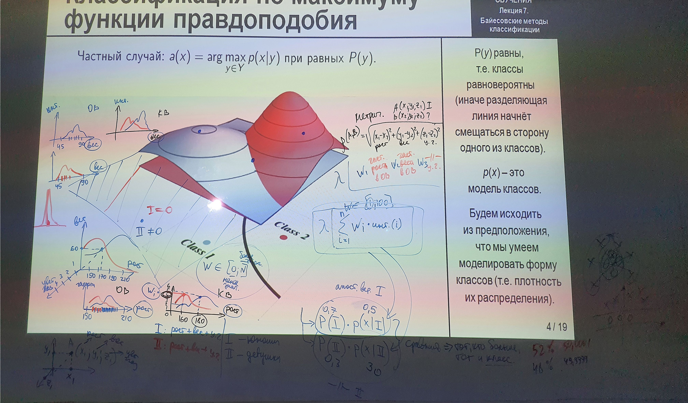
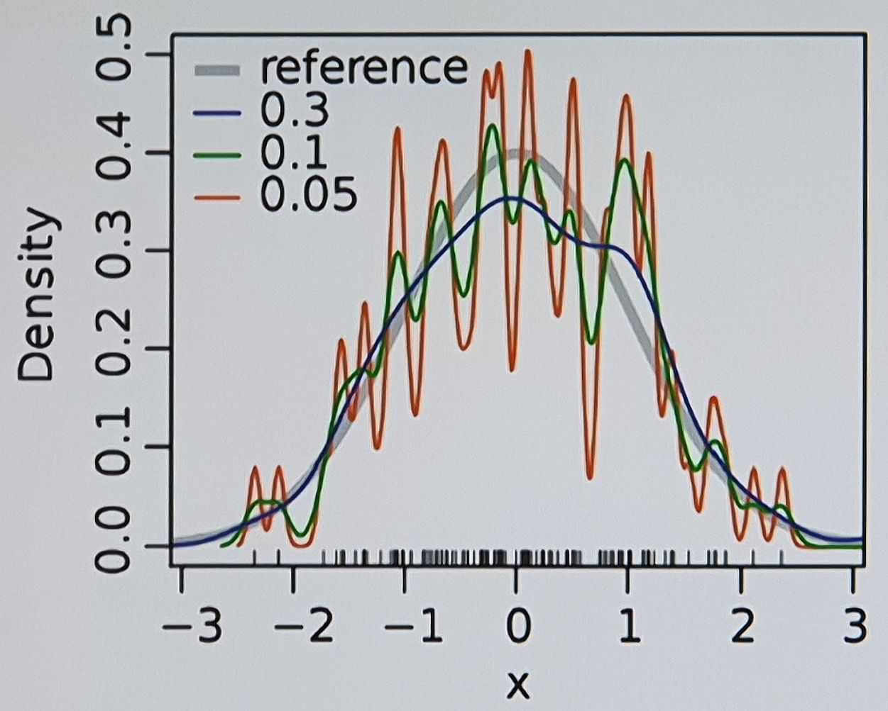
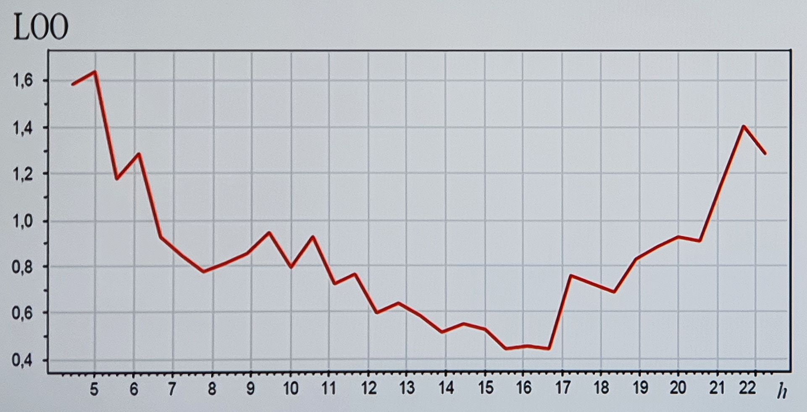

___
___
___
## Информация о занятии
- __Дисциплина:__ Машинное обучение в системах искусственного интеллекта (MLiAIS)
- __Преподаватель:__ Смагин Сергей Владимирович
- __Тип занятия:__ Лекционное занятие №7
- __Формат занятия:__ Очно (ДВФУ, D811)
- __Дата и время занятия:__ 14.12.2022, ср (нечет.), 16:50-18:20
___
___
___

&nbsp;

## Продолжение прошлой презентации 

&nbsp;

### ___Картинка с доски на всю пару и некоторые термины___

&nbsp;

- Байесовский метод;
- Функция интенсивности (частоты);
- Коеффициент значимости признака.

&nbsp;

### ___5. Оптимальный байесовский классификатор___

&nbsp;

> __Теорема__\
Пусть $P{(y)}$ и $p{(x \vert y)}$ известны,
$\lambda_y \geqslant 0$ - _потеря от ошибки_ на объекте класса $y \in Y$.
Тогда минимум среднего
риска $$\displaystyle R{(a)} = \sum_{y \in Y}{\lambda_{y} \int{{[ a{(x)} \neq y ]} p{(x, y)} dx}}$$
достигается _байесовским классификатором_ $$a{(x)} = \argmax_{y \in Y}{\lambda_y P{(y)} p{(x \vert y)}}.$$

$\lambda_y$ - это штраф за ошибку.

В случае, когда штраф за ошибку попадания объекта в один класс отличается от
штрафа за ошибку попадания в другой класс, $\lambda_y$ представляется
матрицей.

&nbsp;

### ___6. Задача восстановления плотности распределения___

&nbsp;

1. Восстановление плотности распределения по выборке\
__Дано:__ $X^l = {(x_i, y_i)}^{l}_{i=1}$ - обучающая выборка.\
__Найти:__ эмпирические оценки $\hat{P}{(y)}$ и $\hat{p}{(x \vert y)}$,
$y \in Y$.
2. Построение классификатора\
__Дано:__ вероятности $P{(y)}$ и плотности $p{(x \vert y)}$, $y \in Y$.\
__Найти:__ классификатор $a: \; X \times Y$, минимизирующий $R{(a)}$.

__Замечание 1:__ после замены $P{(y)}$ и $p{(x \vert y)}$ их эмпирическими
оценками байесовкий классификатор уже не оптимален.

__Замечание 2:__ задача оценивания плотности распределения - более сложная,
чем задача классификации.

Задача распадается на две подзадачи, и вторая уже решена.

На практике плотности распределения классов, как правило, не известны и их
приходится оценивать (восстанавливать) по обучающей выборке (но с некоторой
погрешностью).

$R{(a)}$ - средний риск.

&nbsp;

### ___7. Задачи эмпирической оценки P(y) и p(x|y)___

&nbsp;

- __Оценивание априорных вероятностей__ частотами
$$\hat{P}{(y)} = \frac{l_y}{l}, \quad l_y = {\vert X_y \vert}, \quad X_y = {\lbrace x_i \in X : \; y_i = y \rbrace}, \quad y \in Y.$$
- __Оценивание функций правдоподобия:__\
__Дано:__ $X^{m} = {\lbrace x_1, \ldots, x_m \rbrace}$ - простая выборка $(X_y$ без ответов $y_i)$.\
__Найти:__ _эмпирическую оценку плотности_ $\hat{p}{(x)}$, аппроксимирующую
истинную плотность $p{(x)}$ на всём $X$:
$$\hat{p}{(x)} \rightarrow p{(x)} \;\; \text{при} \;\; m \rightarrow \infty.$$

$$
\begin{split}
\textit{Это основная задача, для которой далее будут предложены}\\
\textit{различные варианты ее решения.}
\end{split}
$$

Для каждого класса рассматриваются объекты только этого класса, поэтому в
$p{(x \vert y)}$ нет $y$.

Если выборка генерируется независимо, то доля объектов с классом $y$ - это
есть несмещенная оценка вероятности.

$m$ - количество объектов одного из классов.

&nbsp;

### ___8. Три подхода к оценке плотностей___

&nbsp;

1. __Параметрическое оценивание плотности:__
$$\hat{p}{(x)} = \varphi{(x, \theta)}.$$
2. __Восстановление смеси распределений:__
$$\hat{p}{(x)} = \sum_{j=1}^{k}{w_j \varphi{(x, \theta_j)}}, \quad k \ll m.$$
3. __Непараметрическое оценивание плотности:__
$$\hat{p}{(x)} = \sum_{i=1}^{m}{w_i K{\left( \frac{\rho{(x, x_i)}}{h} \right)}}.$$

$\varphi$ - математическая модель плотности (ее нужно угадать).
Параметр $\theta$ нужно подобрать по выборке, он не известен.

Плотность представлена суммой одномерных плотностей ($k$ - число
компонентов смеси), каждая их них с заданной функцией $\varphi$ (со своим
вектором параметров $\theta$).

&nbsp;

### ___9. Наивный байесовский классификатор___

&nbsp;

__Допущение (действительно наивное):__
Признаки $f_j : \; X \rightarrow D_j$ - независимые случайные величины с
плотностями распределения,
$p_j{(\xi \vert y)}, \; y \in Y, \; j = 1, \ldots, n$.

Тогда функции правдоподобия классов представимы в виде произведения
одномерных плотностей по признакам:
$$p{(x \vert y)} = p_1{(\xi_1 | y)} \cdots p_n{(\xi_n \vert y)}, \quad x = {(\xi_1, \ldots, \xi_n)}, \quad y \in Y.$$

Прологарифмируем (для удобства).
Получим классификатор
$$a{(x)} = \argmax_{y \in Y}{\left( \ln{\lambda_y \hat{P}{(y)}} + \sum_{j=1}^{n}{\ln{\hat{p}_j{(\xi_j \vert y)}}} \right)}.$$

Восстановление $n$ одномерных плотностей - намного более простая задача, чем
одной $n$-мерной.

Для любой техники восстановления сделаем наивное предположение о том, что
признаки независимы, и что плотность распределения каждого признака в
каждом классе - своя.

$\xi$ - это значения признака на объекте $x$.

&nbsp;

### ___15. Пример зависимости оценки плотности от ширины окна___

&nbsp;

Оценка $\hat{p}_h{(x)}$ при различных значениях ширины окна $h$:

__Вывод:__ Качества восстановления плотности существенно зависит от ширины
окна $h$, но слабо зависит от вида ядра $K$.

При уменьшении ширины окна реакция функции плотности осуществляется на
каждый объект (и на его отсутствие - см. распределение объектов по оси $X$),
что приводит к сильным колебаниям.

При увеличении ширины окна результат оказывается "пересглаженным".

&nbsp;

### ___16. Выбор ширины окна___

&nbsp;

Скользящий контроль _Leave One Out_:
$$\text{LOO}{(h)} = \sum_{i=1}^{l}{\left[ a{(x_i; X^l \backslash x_i, h)} \neq y_i \right]} \rightarrow \min_{h},$$

Типичный вид зависимости $\text{LOO}{(h)}$:

Можно восстановить плотность для разных значений ширины окна, подставить
каждое их них в байесовский классификатор и посмотреть, насколько он
ошибается на каждом из этих значений.

&nbsp;

### ___17. Окна переменной ширины___

&nbsp;

__Проблема:__ при наличии локальных сгущений любая $h$ не оптимальна.

__Идея:__ задавать не ширину окна $h$, а число соседей $k$.
$$h_k{(x)} = \rho{(x, x^{(k+1)})},$$
где $x^{(i)}$ - $i$-й сосед объекта $x$ при ранжировании выборки $X^l$:
$$\rho{(x, x^{(1)}) \leqslant \cdots \leqslant \rho{(x, x^{(l)})}.}$$

__Замечание 1:__ нормировка $V{(h_k)}$ не должна зависеть от $y$, поэтому
выборка ранжируется целиком, а не по классам $X_y$.

__Замечание 2:__ оптимизация $\text{LOO}{(k)}$ аналогична $\text{LOO}{(h)}$.

Если объекты в каких-то местах расположены густо, а в других - нет.

&nbsp;

### ___18. Краткий конспект (1/2)___

&nbsp;

__Байесовский классификатор__ - широкий класс алгоритмов классификации,
основанный на _принципе максимума апостериорной вероятности_.

Данный подход лежит в основе многих удачных алгоритмов классификации:
- наивный байесовский классификатор,
- линейный дискриминант Фишера,
- квадратичный дискриминант,
- метод парзеновского окна,
- логиситческая регрессия,
- метод радиальных базисных функций.

Байесовский подход к классификации является одним из старейших, но до сих
пор успешно применяется при решении некоторых типов задач.

&nbsp;

### ___19. Краткий конспект (2/2)___

&nbsp;

__Апостериорная вероятность__ - условная вероятность случайного события при
условии того, что известны апостериорные данные (т.е. данные, полученные
после опыта).

Для классифицируемого объекта вычисляются функции правдоподобия (плотности
распределения) каждого из классов, и по ним вычисляются апостериорные
вероятности классов.

__Объект относится к тому классу, для которого апостериорная вероятность
максимальна.__

__Плотность распределения__ показывает то, как часто появляется случайная
величина $X$ в окрестности точки $x$ при повторении опытов.

Зная плотность распределения, можно вычислить вероятность того, что
случайная величина $X$ примет значение, принадлежащее заданному интервалу.

&nbsp;

___