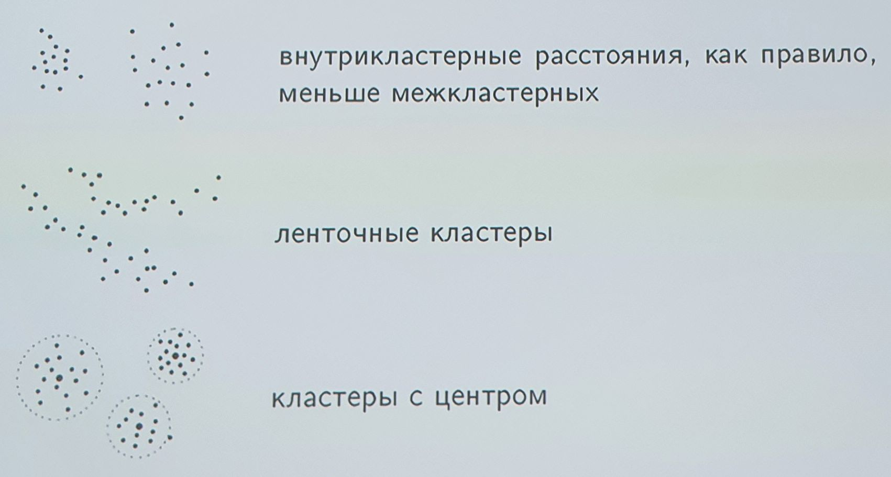
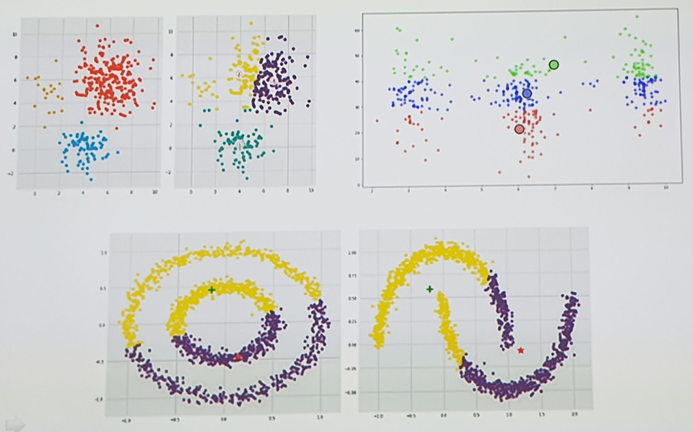

___
___
___
## Информация о занятии
- __Дисциплина:__ Машинное обучение в системах искусственного интеллекта (MLiAIS)
- __Преподаватель:__ Смагин Сергей Владимирович
- __Тип занятия:__ Лабораторная работа №6
- __Формат занятия:__ Очно (ДВФУ, D???)
- __Дата и время занятия:__ 06.12.2022, вт (чет.), 16:50-18:20
___
___
___

&nbsp;

## Лабораторная работа - Лекция 9.

&nbsp;

### ___1. Лекция 9. Методы кластеризации и частичного обучения___

&nbsp;

### ___2. Содержание___

&nbsp;

Задачи кластеризации и частичного обучения:
- постановка задач, некорректность первой;
- критерии качества кластеризации.

Алгоритмы кластеризации:
- метод $K$-средних ($\textit{K} \text{-means}$);
- алгоритм DBSCAN;
- иерархические методы.

&nbsp;

### ___3. Постановка задачи кластеризации___

&nbsp;

__Дано:__
- $X$ - пространство объектов;
- $X^l = {\lbrace x_1, \ldots, x_l \rbrace}$ - обучающая выборка;
- $\rho \! : X \times X \rightarrow {\left[ 0, \infty \right)}$ - функция расстояния между объектами.

__Найти:__
- $Y$ - множество кластеров,
- $a \! : X \rightarrow Y$ - алгоритм кластеризации,
- такие, что:
    - каждый кластер состоит из близких объектов;
    - объекты разных кластеров существенно различны.

Это задача _обучения без учителя_ (unsupervised learning).

Дано конечное множество объектов обучающей выборки, для которых указаны
их парные расстояния (без меток классов).

Нужно научиться объединять такие объекты в кластеры (сгустки) по принципу
взаимной близости.

Внутрикластерное расстояние - малое, межкластерное - большое.

&nbsp;

### ___4. Некорректность задачи кластеризации___

&nbsp;

Решение задачи кластеризации принципиально неоднозначно:
- точной постановки задачи кластеризации нет;
- существует много критериев качества кластеризации;
- существует много эвристических методов кластеризации;
- число кластеров $\vert Y \vert$, как правило, неизвестно заранее;
- результат кластеризации сильно зависит от метрики $\rho$, выбор которой
также является эвристикой.

__Пример:__ сколько здесь кластеров?

Иногда число кластеров задают директивно (из каких-то своих соображений
или условий задачи), при этом далеко не всегда удается понять, сколько
их на самом деле.

На слайде все ответы правильные, потому что результат зависит от того,
насколько далекими друг от друга мы считаем кластеры.

&nbsp;

### ___5. Цели кластеризации___

&nbsp;

- __Упростить дальнейшую обработку данных__, разбить множество $X^l$ на
группы схожих объектов чтобы работать с каждой группой в отдельности
(задачи классификации, регрессии, прогнозирования).
- __Сократить объём хранимых данных__, оставив по одному представителю от
каждого кластера (задачи сжатия данных).
- __Выделить нетипичные объекты__, которые не подходят ни к одному из
кластеров (задачи одноклассовой классификации).
- __Построить иерархию множества объектов__, пример - классификация
животных и растений К.Линнея (задачи таксономии).

Несмотря на неоднозначность, задачи кластеризации часто используются на
практике.

Карл Линней - создатель единой системы классификации растительного и
животного миров, в которой были обобщены и упорядочены знания всего
предыдущего периода развития биологии.

&nbsp;

### ___6. Типы кластерных структур___

&nbsp;

- внутрикластерные расстояния, как правило, меньше межкластерных
- ленточные кластеры
- кластеры с центром

Ленточные кластеры нарушают принцип о минимуме внутрикластерного
расстояния и максимуме межкластерного.

С ними бывает наоборот - межкластерное расстояние меньше, чем
внутрикластерное.

&nbsp;

### ___7. Типы кластерных структур___

&nbsp;

- кластеры могут соединяться перемычками
- класетры могут накладываться на разреженный фон из редко расположенных
объектов
- кластеры могут перекрываться

Наличие перемычек между кластерами приводит к тому, что графовые методы
кластеризации начинают работать допольно плохо (в местах перемычек
кластеры будут разделены).

Шумовые объекты также являются препятствием для алгоритмов кластеризации.

&nbsp;

### ___8. Типы кластерных структур___

&nbsp;

- кластеры могут образовываться не по сходству, а по иным типам
регулярностей
- кластеры могут вообще отсутствовать

- Каждый метод кластеризации имеет свои ограничения и выделяет кластеры
лишь некоторых типов.
- Понятие "тип кластерной структуры" зависит от метода и также не имеет
формального определения.

Приведены примеры на "геометрическую интуицию".
Такого рода задачи под силу пока решить только человеку.

Таким образом, под любой метод кластеризации можно подобрать контрпример
или вырожденный случай, на котором он не будет работать.

&nbsp;

### ___9. Проблема чувствительности к выборку метрики___

&nbsp;

Результат зависит от нормировки признаков:

После изменения масштаба по оси $X$ выделись кластеры "высокие студенты"
и "все остальные".

Пунктиром на втором рисунке изображен исходный кластер $B$ из первого
рисунка.

Проблема чувствительности метрики - это не хорошо и не плохо, это свойство
задачи кластеризации.

&nbsp;

### ___10. Постановка задачи частичного обучения (SSL)___

&nbsp;

__Дано:__
- множество объектов $X$, множество классов $Y$;
- $\begin{matrix}X^k = {\lbrace x_1, \ldots, x_k \rbrace} \text{ - размеченные объекты (labeled data);}\\{\lbrace y_1, \ldots, y_k \rbrace} \qquad \qquad \qquad \qquad \qquad \qquad \qquad \,\end{matrix}$
- $U = {\lbrace x_{k+1}, \ldots, x_l \rbrace}$ - неразмеченные объекты
(unlabeled data).

__Два варианта постановки задачи:__
- _Частичное обучение_ (semi-supervised learning): 
    - построить алгоритм классификации $a \! : X \rightarrow Y$.
- _Трансдуктивное обучение_ (transductive learning):
    - зная __все__ ${\lbrace x_{k+1}, \ldots, x_l \rbrace}$, получить
    метки ${\lbrace a_{k+1}, \ldots, a_l \rbrace}$.

__Типичные приложения:__
- классификация и каталогизация текстов, изображений, и т.п.

Задача является промежуточной между классификацией (не хватает объектов) и
кластеризацией (некоторые объекты уже размечены).

Трансдуктивное обучение - это вывод частного из частного (нужно разметить
неразмеченные объекты выборки, а алгоритм (функцию) строить не нужно).

&nbsp;

### ___11. SSL не сводится к классификации___

&nbsp;

__Пример 1.__
плотность классов, восстановленные:
- по размеченным данным $X^k$
- по полным даннмы $X^l$

Слева приведена оценка плотности распределения классов байесовским
классификатором (по пяти объектам каждого класса).

Справа - по всем объектам, а размеченные объекты указывают на то, какому
классу принадлежит соответствующая плотность.

&nbsp;

### ___12. SSL не сводится к классификации___

&nbsp;

__Пример 2.__
Методы классификации не учитывают кластерную структуру неразмеченных данных

Задача "Два полумесяца".

Метод ближайших соседей и SVM плохо работают на таких ленточных кластерах
при условии, когда частично размечены самые дальние друг от друга объекты
обучающей выборки (см. квадрат и треугольник).

&nbsp;

### ___13. SSL также не сводится и к кластеризации___

&nbsp;

__Пример 3.__
Методы кластеризации не учитывают приоритетность разметки над кластерной
структурой.

Нетривиальный контрпример.

При частичном обучении разметка (метки учителя) имеет приоритет над
кластерной структурой объектов выборки.

При кластеризации - наоборот.

&nbsp;

### ___14. Качество кластеризации в метрическом пространстве___

&nbsp;

Пусть известны только попарные расстояния между объектами.
- Среднее внутрикластерное расстояние:
$$\displaystyle F_0 = \frac{\displaystyle \sum_{i<j}{{\left[ a_i = a_j \right]} \rho{( x_i, x_j)}}}{\displaystyle \sum_{i<j}{{\left[ a_i = a_j \right]}}} \rightarrow \min.$$
- Среднее межкластерное расстояние:
$$\displaystyle F_1 = \frac{\displaystyle \sum_{i<j}{{\left[ a_i \neq a_j \right]} \rho{( x_i, x_j)}}}{\displaystyle \sum_{i<j}{{\left[ a_i \neq a_j \right]}}} \rightarrow \max.$$
- Отношение пары функционалов: $F_0 / F_1 \rightarrow \min$.

Эти метрики полезны для оценки качества кластеризации и для выбора
лучшей из них.

Для агрегации двух критериев чаще всего рассматривают частное.

&nbsp;

### ___15. Качество кластеризации в линейном векторном пространстве___

&nbsp;

Пусть объекты $x_i$ задаются векторами ${\left( f_1{(x_i)}, \ldots, f_n{(x_i)} \right)}$.
- Сумма средних внутрикластерных расстояний: $$\Phi_0 = \sum_{a \in Y}{\frac{1}{\vert X_a \vert}} \sum_{i \, : \; a_i = a}{\rho{(x_i, \mu_a)}} \rightarrow \min,$$
    - $X_a = {\lbrace x_i \in X^l \; \vert \; a_i = a \rbrace}$ - кластер $a$,
    - $\mu_a$ - центр масс кластера $a$.
- Сумма межкластерных расстояний: $$\Phi_1 = \sum_{a, b \in Y}{\rho{(\mu_a, \mu_b)}} \rightarrow \max.$$
- Отношение пары функционалов: $\Phi_0 / \Phi_1 \rightarrow \min$.

Предполагается, что векторы (признаки) являются числовыми.

Центры масс не работают, когда кластеры ленточные.
Возможное решение: разбить ленту на части, применив какой-то алгоритм.

Межкластерное расстояние - это расстояние между центрами кластеров.

&nbsp;

### ___16. Метод K-средних (K-means) для кластеризации___

&nbsp;

Минимизация суммы квадратов внутрикластерных расстояний:
$$\displaystyle \sum_{i=1}^{l}{\Vert x_i - \mu_{a_i} \Vert}^2 \rightarrow \min_{{\lbrace a_i \rbrace}, \; {\lbrace \mu_a \rbrace}}, \quad {\Vert x_i - \mu_a \Vert}^2 = \sum_{j=1}^{n}{\left( f_j{(x_i)} - \mu_{a_j} \right)}^2$$

__Алгоритм Ллойда__
> __вход:__ $X^l, \; K = {\vert Y \vert}$; __выход:__ центры кластеров
$\mu_a, \; a \in Y$;\
$\mu_a \coloneqq$ начальное приближение центров, для всех $a \in Y$;\
__повторять__
> - отнести каждый $x_i$ к ближайшему центру:$$a_i \coloneqq \argmin_{a \in Y}{\Vert x_i - \mu_a \Vert}, \quad i = 1, \ldots, l;$$
> - вычислить новые положения центров:$$\mu_a \coloneqq \frac{\sum_{i=1}^{l}{{\left[ a_i = a \right]} x_i}}{\sum_{i=1}^{l}{{\left[ a_i = a \right]}}}, \quad a \in Y;$$
>
> __пока__ $a_i$ не перестанут изменяться;

Минимизируется среднее расстояние до центров кластеров (причем расстояние - Эвклидово, объекты задаются числовыми признаками).

$a_i$ - это номер кластера, к которому алгоритм отнес $x_i$.

$\mu_a$ - это центр $a_i$.

Начальное: выбрать пару самых дальних, потом третий - самый дальний от них
и т.д.

&nbsp;

### ___17. Метод K-средних (K-means) для частичного обучения___

&nbsp;

__Модификация алгоритма Ллойда__ (при наличии размеченных объектов ${\lbrace x_1, \ldots, x_k \rbrace}$)

> __вход:__ $X^l, \; K = {\vert Y \vert}$;\
__выход:__ центры кластеров $\mu_{a}, \; a \in Y$;\
$\mu_a \coloneqq$ начальное приближение центров, для всех $a \in Y$;\
__повторять__
> - отнести каждый $x_i \in U$ к ближайшему центру:$$a_i \coloneqq \argmin_{a \in Y}{\Vert x_i - \mu_a \Vert}, \quad i = k+1, \ldots, l;$$
> - вычислить новые положения центров:$$\mu_a \coloneqq \frac{\sum_{i=1}^{l}{{\left[ a_i = a \right]} x_i}}{\sum_{i=1}^{l}{{\left[ a_i = a \right]}}}, \quad a \in Y;$$
>
> __пока__ $a_i$ не перестанут изменяться;

Отличие от предыдущего алгоритма: относить к центрам кластеров нужно только
неразмеченные объекты.

Если объект размечен, его не нужно кластеризовать.

Кластеры будут "обрастать" вокруг размеченных объектов.

&nbsp;

### ___18. Примеры неудачной кластеризации K-means___

&nbsp;

Причина - неудачное начальное приближение или существенная негауссовость
кластеров

Слева и справа вверху: кластера расщепился из-за того, что все объекты
начального приближения попали в один кластер.

Снизу: $K$-means не подходит для решения таких задач.

Решение проблемы: "растопыренная сетка", мультистарт и проверка результата
по критериям.

&nbsp;

### ___19. Алгоритм кластеризации DBSCAN___

&nbsp;

Объект $x \in U$, его $\varepsilon$-окрестность $U_{\varepsilon}{(x)} = {\lbrace u \in U \! : \rho{(x, u)} \leqslant \varepsilon \rbrace}$

Каждый объект может быть одного из трех типов:
- корневой: имеющий плотную окрестность, ${\vert U_{\varepsilon}{(x)}\vert} \geqslant m$
- граничный: не корневой, но в окрестности корневого
- шумовой (выброс): не корневой и не граничный

DBSCAN - Density-Based Spatial Clustering of Applications with Noise.

Алгоритм подходит для кластеров произвольной формы.

Настраиваются два параметра:
- $\varepsilon$ - окрестность точки (радиус окружности);
- $m$ - количество объектов в окрестности.

&nbsp;

### ___20. Алгоритм кластеризации DBSCAN___

&nbsp;

> __вход:__ выборка $X^l = {\lbrace x_1, \ldots, x_l \rbrace}$; параметры $\varepsilon$ и $m$;\
__выход:__ разбиение выборки на кластеры и шумовые выбросы;\
$U \coloneqq X^l$ - непомеченные; $a \coloneqq 0$;\
__пока__ в выборке есть непомеченные точки, $U \neq \varnothing$:
> - взять случайную точку $x \in U$;
> - __если__ ${\vert U_{\varepsilon}{(x)} \vert} < m$ __то__
>   - пометить $x$ как, возможно, шумовой;
> - __иначе__
>   - создать новый кластер: $\quad K \coloneqq U_{\varepsilon}{(x)}; \quad a \coloneqq a + 1$;
>   - __для всех__ $x' \in K$, не помеченных или шумовых
>       - __если__ ${\vert U_{\varepsilon}{(x')} \vert} \geqslant m$ __то__ $K \coloneqq K \cup U_{\varepsilon}{(x')}$;
>       - __иначе__ пометить $x'$ как граничный кластер $K$;
>   - $a_i \coloneqq a$ для всех $x_i \in K$;
>   - $U \coloneqq U \backslash K$;

&nbsp;

### ___21. Преимущества алгоритма DBSCAN___

&nbsp;

- быстрая кластеризация больших данных:
    - $O{(l^2)}$ в худшем случае,
    - $O{(l \ln{l})}$ при эффективной реализации $U_{\varepsilon}{(x)}$;
- кластеры произвольной формы (долой центры!);
- деление объектов на корневые, граничные, шумовые.

Замечание: граница между кластерами простраивается фрагментарно, однако
шумовые объекты определяются довольно точно.

&nbsp;

### ___22. Агломеративная иерархическая кластеризация___

&nbsp;

Алгоритм иерархической кластеризации (Ланс, Уильямс, 1967): итеративный
пересчет расстояний $R_{UV}$ между кластерами $U$, $V$.

> $C_1 \coloneqq {\lbrace {\lbrace x_1 \rbrace}, \ldots, {\lbrace x_l \rbrace} \rbrace}$ - все кластеры 1-элементные;\
> $R_{{\lbrace x_i \rbrace}{\lbrace x_j \rbrace}} \coloneqq \rho{(x_i, x_j)}$ - расстояние между ними;\
__для всех__ $t = 2, \ldots, l$ ($t$ - номер итерации):
> - найти в $C_{t-1}$ пару кластеров ${(U, V)}$ с минимальным $R_{UV}$;
> - слить их в один кластер;
> - $W \coloneqq U \cup V$;
> - $C_t \coloneqq C_{t-1} \cup {\lbrace W \rbrace} \backslash {\lbrace U, V \rbrace}$;
> - __для всех__ $S \in C_t$
>   - вычислить $R_{WS}$ по формуле Ланса-Уильямса:$$R_{WS} \coloneqq \alpha_{U} R_{US} + \alpha_{V} R_{VS} + \beta R_{UV} + \gamma{\vert R_{US} - R_{VS} \vert};$$

Процесс объединения всех элементов в один большой кластер.

Основной вопрос: как померить расстояние между объединенным кластером и
кластером 1-элементным?

Ответ: разными способами, от интуитивных до рациональных.

&nbsp;

### ___23. Агломеративная иерархическая кластеризация___

&nbsp;

- Как определить расстояние $R{(W, S)}$
- между кластерами $W = U \cup V \; \text{и} \; S$,
- зная расстояния $R{(U, S)}$, $R{(V, S)}, R{(U, V)}$?

Формула, обобщающая большинство разумных способов определить это расстояние
\[Ланс, Уильямс, 1967\]:
$$
\begin{split}
R{(U \cup V, S)} = \alpha_{U} &\cdot R{(U, S)} +\\
+ \alpha_{V} &\cdot R{(V, S)} +\\
+ \beta &\cdot R{(U, V)} +\\
+ \gamma &\cdot {\vert R{(U, S)} - R{(V, S)} \vert},
\end{split}
$$

где $\alpha_{U}, \alpha_{V}, \beta, \gamma$ - числовые параметры.

&nbsp;

### ___24. Частные случаи формулы Ланса-Уильямса___

&nbsp;

1. __Расстояние ближнего соседа:__
    - $\displaystyle R_{WS}^{б} = \min_{w \in W, s \in S}{\rho{(w, s)}}$;
    - $\alpha_U = \alpha_V = \frac{1}{2}, \quad \beta = 0, \quad \gamma = -\frac{1}{2}$.

2. __Расстояние дальнего соседа:__
    - $\displaystyle R_{WS}^{д} = \max_{w \in W, s \in S}{\rho{(w, s)}}$;
    - $\alpha_U = \alpha_V = \frac{1}{2}, \quad \beta = 0, \quad \gamma = \frac{1}{2}$.

3. __Групповое среднее расстояние:__
    - $\displaystyle R_{WS}^{г} = \frac{1}{{\vert W \vert}{\vert S \vert}} \sum_{w \in W}{\sum_{s \in S}{\rho{(w, s)}}}$;
    - $\alpha_U = \frac{\vert U \vert}{\vert W \vert}, \quad \alpha_V = \frac{\vert V \vert}{\vert W \vert}, \quad \beta = \gamma = 0$.

Ближайший сосед работает плохо, а дальний - лучше.

&nbsp;

### ___25. Частные случаи формулы Ланса-Уильямса___

&nbsp;

4. __Расстояние между центрами:__
    - $\displaystyle R_{WS}^{ц} = \rho^2 {\left( \sum_{w \in W}{\frac{w}{\vert W \vert}}, \sum_{s \in S}{\frac{s}{\vert S \vert}} \right)}$;
    - $\alpha_U = \frac{\vert U \vert}{\vert W \vert}, \quad \alpha_V = \frac{\vert V \vert}{\vert W \vert},$
    - $\beta = - \alpha_U \alpha_V, \quad \gamma = 0.$

5. __Расстояние Уорда:__
    - $\displaystyle R_{WS}^{у} = \frac{{\vert S \vert}{\vert W \vert}}{{\vert S \vert} + {\vert W \vert}} \rho^2 {\left( \sum_{w \in W}{\frac{w}{\vert W \vert}}, \sum_{s \in S}{\frac{s}{\vert S \vert}} \right)}$;
    - $\alpha_U = \frac{{\vert S \vert} + {\vert U \vert}}{{\vert S \vert} + {\vert W \vert}}, \quad \alpha_V = \frac{{\vert S \vert} + {\vert V \vert}}{{\vert S \vert} + {\vert W \vert}}, \quad \beta = \frac{-{\vert S \vert}}{{\vert S \vert} + {\vert W \vert}}, \quad \gamma = 0.$

> __Проблема выбора__\
Какая функция расстояния лучше?

Расстояние между центрами работает хуже остальных, потому что не обладает
рядом свойств.

Выбирать нужно по визуализации.

&nbsp;

### ___26. Визуализация кластерной структуры___

&nbsp;

1. __Расстояние ближнего соседа:__

Дендрограмма показывает процесс объединения объектов в кластеры.

&nbsp;

### ___27. Визуализация кластерной структуры___

&nbsp;

2. __Расстояние дальнего соседа:__

&nbsp;

### ___28. Визуализация кластерной структуры___

&nbsp;

3. __Групповое среднее расстояние:__

&nbsp;

### ___29. Визуализация кластерной структуры___

&nbsp;

5. __Расстояние Уорда:__

&nbsp;

### ___30. Дендрограмма - визуализация иерархической кластеризации___

&nbsp;

- Кластеры группируются вдоль горизнотальной оси
- По вертикальной оси откладываются расстояния $R_t$
- Расстояния возрастают, линии нигде не пересекаются
- Верхние уровни различимы лучше, чем нижние
- Уровень отсечения определяет число кластеров

Самопересечений нет, если каждое следующее расстояние больше предыдущего.

&nbsp;

___