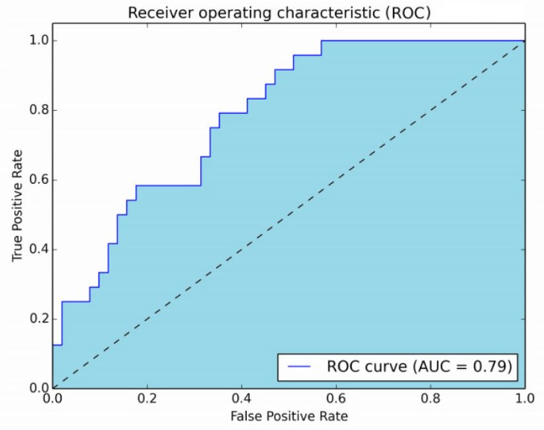
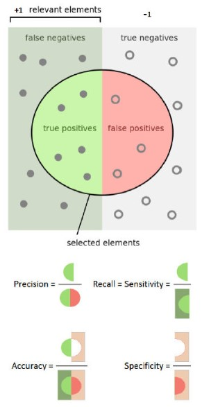
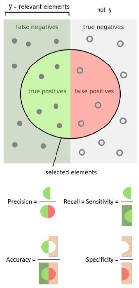
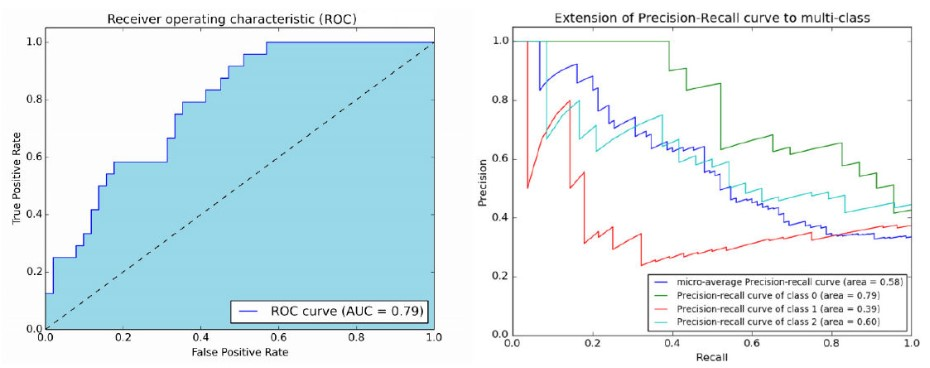

___
___
___
## Информация о занятии
- __Дисциплина:__ Машинное обучение в системах искусственного интеллекта (MLiAIS)
- __Преподаватель:__ Смагин Сергей Владимирович
- __Тип занятия:__ Лекционное занятие №8
- __Формат занятия:__ Очно (ДВФУ, D735)
- __Дата и время занятия:__ 28.12.2022, ср (нечет.), 16:50-18:20
___
___
___

&nbsp;

## Дополнительная информация

&nbsp;

- Рассказать на пальцах (настолько просто, насколько возможно, ёмко и основу).
- Если можешь объяснить на пальцах, тогда формулу можно не знать. Если не можешь объяснить на пальцах, вызубри (и пойми) формулу.
- На пальцах и понимаешь, как устроено - это пятерка.
- Четверка - это умение пользоваться.
- Тройка - это... хрен его знает, как это работает.
- Те, кто знает хорошо, получают особо сложные вопросы.
- Нужно очевидно отделать, что ответил на каждый вопрос (например, "с первым вопросом у меня всё!").
- Все вопросы и допы - на 10 минут (на 12 минут максимум).
- Одна пара - на первой неделе (на зачетной неделе пары, скорее всего, не будет, но не факт).
- Цель курса - научиться решать задачи кластеризации и классификации методами машинного обучения.

&nbsp;

___

&nbsp;

## Лекционное занятие - Лекция ?.

&nbsp;

### ___1. Лекция. Оценка качества классификации___

&nbsp;

### ___2. Содержание___

&nbsp;

Оценка качества классификации:
- доля правильных классификаций;
- чувствительность и специфичность;
- точность (precision) и полнота (recall);
- площадь под кривой ROC (AUROC);
- площать под кривой Precision-Recall (AUPRC).

&nbsp;

### ___3. Анализ ошибок классификации___

&nbsp;

Задача классификации на два класса, $y_i \in {\lbrace -1, +1 \rbrace}$.

Алгоритм классификации $a{(x_i)} \in {\lbrace -1, +1 \rbrace}$

||ответ классификатора|правильный ответ|
|:-|:-:|:-:|
|TP, True Positive|$a{(x_i)} = +1$|$y_i = +1$|
|TN, True Negative|$a{(x_i)} = -1$|$y_i = -1$|
|FP, False Positive|$a{(x_i)} = +1$|$y_i = -1$|
|FN, False Negative|$a{(x_i)} = -1$|$y_i = +1$|

_Доля правильных классификаций (чем больше, тем лучше):_
$$\text{Accuracy} = \frac{1}{l} \sum_{i=1}^{l}{\left[ a{(x_i)} = y_i \right]} = \frac{\text{TP} + \text{TN}}{\text{FP} + \text{FN} + \text{TP} + \text{TN}}$$

__Недостаток:__ не учитывается ни численность (дисбаланс) классов, ни цена
ошибки на объектах разных классов.

Positive и Negative - это ответы классификатора.

True и False - это правильность ответа.

Дисбаланс классов - это ситуация, когда экземпляров одного класса в выборке
существенно больше, чем экземпляров другого класса.

&nbsp;

### ___4. Функции потерь, зависящие от штрафов за ошибку___

&nbsp;

Задача классификации на два класса, $y_i \in {\lbrace -1, +1 \rbrace}$.\
Модель классификации: $a{(x; w, w_0)} = \text{sign}{\left( g{(x, w)} - w_0 \right)}$.\
Чем больше $w_0$, тем больше $x_i$ таких, что $a{(x_i)} = -1$.

Пусть $\lambda_y$ - штраф за ошибку на объекте класса $y$.\
Функция потерь теперь зависит от штрафов:$$\displaystyle \mathscr{L}{(a, y)} = \lambda_{y_i}{\left[ a{(x_i ; \: w, w_0) \neq y_i} \right]} = \lambda_{y_i}{\left[ {\left( g{(x_i, w)} - w_0 \right)} y_i < 0 \right]}.$$

> __Проблема__\
На практике штрафы ${\lbrace \lambda_y \rbrace}$ могут пересматриваться
> - Нужен удобный способ выбора $w_0$ в зависимости от ${\lbrace \lambda_y \rbrace}$, не требующий построения $w$ заново.
> - Нужна характеристика качества модели $g{(x, w)}$, не зависащая от
штрафов ${\lbrace \lambda_y \rbrace}$ и численности классов.

Потеря зависит от того, к какому классу на самом деле принадлежит объект.

Примеры разной цены ошибки: "свой-чужой" (зенитная установка на границе),
"хороший-плохой" (заемщик в банке).

Хотелось бы получить меру качества параметра $w$.

&nbsp;

### ___5. Определение ROC-кривой___

&nbsp;

Кривая ошибок ROC (receiver operating characteristic).\
Каждая точка кривой соответствует некоторому $a{(x; w, w_0)}$.
- по оси $X$: доля _ошибочных положительных классификаций_ (FPR - false positive rate):$$\text{FPR}{(a, X^l)} = \frac{\sum_{i=1}^{l}{\left[ y_i = -1 \right]}{\left[ a{(x_i; w, w_0)} = +1 \right]}}{\sum_{i=1}^{l}{\left[ y_i = -1 \right]}};$$
$1 - \text{FPR}{(a)}$ называется _специфичностью_ алгоритма $a$.
- по оси $Y$: доля _правильных положительных классификаций_ (TPR - true positive rate):$$\text{TPR}{(a, X^l)} = \frac{\sum_{i=1}^{l}{\left[ y_i = +1 \right]}{\left[ a{(x_i; w, w_0)} = +1 \right]}}{\sum_{i=1}^{l}{\left[ y_i = +1 \right]}};$$
$\text{TPR}{(a)}$ называется также _чувствительностью_ алгоритма $a$.

Решалась проблема "свой-чужой" для военных приемников сигнала, поэтому
такая терминология.

Чем выше специфичность алгоритма, тем лучше.

Чем выше чувствительность алгоритма, тем лучше.

&nbsp;

### ___6. Пример ROC-кривой___

&nbsp;

Лучшие классификаторы находятся в левом верхнем углу, средние - ближе к
диагонали.

AUC - Area Under the Curve.

FPR и TPR - это относительные характеристики, нормированные на мощность
каждого класса.

&nbsp;

### ___7. Алгоритм эффективного построения ROC-кривой___

&nbsp;

> __Вход:__ выборка $X^l$; дискриминантная функция $g{(x, w)}$;\
__Выход:__ ${\lbrace {(\text{FPR}_i, \text{TPR}_i)} \rbrace}_{i=0}^{l}$, AUC - площадь под ROC-кривой.\
$l_y \coloneqq \sum_{i=1}^{l}{\left[ y_i = y \right]}$, для всех $y \in Y$;\
упорядочить выборку $X^l$ по убыванию значений $g{(x_i, w)}$;\
поставить первую точку в начало координат:\
${(\text{FPR}_0, \text{TPR}_0)} \coloneqq {(0, 0)}; \; \text{AUC} \coloneqq 0;$\
__для__ $i \coloneqq 1, \ldots, l$
> - __если__ $y_i = -1$ __то__
>   - $\text{FPR}_i \coloneqq \text{FPR}_{i-1} + \frac{1}{l_{-}}; \quad \text{TPR}_i \coloneqq \text{TPR}_{i - 1};$
>   - $\text{AUC} \coloneqq \text{AUC} + \frac{1}{l_{-}}\text{TPR}_i;$
> - __иначе__
>   - $\text{FPR}_i \coloneqq \text{FPR}_{i-1}; \quad \text{TPR}_i \coloneqq \text{TPR}_{i-1} + \frac{1}{l_{+}}$

Построение за один проход по выборке.

Площадь под ROC-кривой показывает, насколько хорошо построена модель
классификации (насколько хорошо подобран параметр $w$).

По ROC-кривой определяется точка, которая ближе всего к (0, 1) - выбирается
значение $w_0$.

&nbsp;

### ___8. Оценки качества двухклассовой классификации___

&nbsp;

В информационном поиске:
- Точность, $\text{Precision} = \frac{\text{TP}}{\text{TP} + \text{FP}}$ - доля релевантных среди найденных
- Полнота, $\text{Recall} = \frac{\text{TP}}{\text{TP} + \text{FN}}$ - доля найденных среди релевантных

В медицинской диагностике:
- Чувствительность, $\text{Sensitivity} = \frac{\text{TP}}{\text{TP} + \text{FN}}$ - доля верных положительных диагнозов
- Специфичность, $\text{Specificity} = \frac{\text{TN}}{\text{TN} + \text{FP}}$ - доля верных отрицательных диагнозов

Мера качества AUC плохо работает в информационном поиске, когда ищется
небольшое число релевантной информации в большом объеме данных.

Важно найти то, что нужно (релевантные и при этом редкие объекты), но
также не найти в процессе много лишнего.

&nbsp;

### ___9. Точность и полнота многоклассовой классификации___

&nbsp;

Для каждого класса $y \in Y$:
- $\text{TP}_y$ - верные положительные
- $\text{FP}_y$ - ложные положительные
- $\text{FN}_y$ - ложные отрицательные

Точность и полнота с __мИкроусреднением__:
- Precision: $\displaystyle P = \frac{\sum_y{\text{TP}_y}}{\sum_y{(\text{TP}_y + \text{FP}_y)}}$;
- Recall: $\displaystyle R = \frac{\sum_y{\text{TP}_y}}{\sum_y{(\text{TP}_y + \text{FN}_y)}}$;

Микроусреднение НЕ чувствительно к ошибкам на малочисленных классах

Если классов много и численность их разная, нужно определиться, что важнее
(чего должно быть больше): __классов__, которые определяются правильно, или
__объектов__, которые определяются правильно.

Когда много классов, отличаем один конкретный класс $y$ от всех остальных.

&nbsp;

### ___10. Точность и полнота многоклассовой классификации___

&nbsp;

Для каждого класса $y \in Y$:
- $\text{TP}_y$ - верные положительные
- $\text{FP}_y$ - ложные положительные
- $\text{FN}_y$ - ложные отрицательные

Точность и полнота с __мАкроусреднением__:
- Precision: $\displaystyle P = \frac{1}{\vert Y \vert} \sum_{y}{\frac{\text{TP}_y}{\text{TP}_y + \text{FP}_y}}$;
- Recall: $\displaystyle R = \frac{1}{\vert Y \vert} \sum_{y}{\frac{\text{TP}_y}{\text{TP}_y + \text{FN}_y}}$;

Макроусреднение чувствительно к ошибкам на малочисленных классах

В макроусреднение добавляется усреднение на классах.

Это нужно тогда, когда нужно чтобы алгоритм работал хорошо в независимости
от число классов (с учетом всех малочисленных) и для большинства этих
классов.

&nbsp;

### ___11. Кривые ROC и Precision-Recall___

&nbsp;

Модель классификации: $a{(x)} = \text{sign}{\left( {\langle x, w \rangle} - w_0 \right)}$

Каждая точка кривой соответствует значению порога $w_0$

- AUROC - площадь под ROC-кривой
- AUPRC - площадь под кривой Precision-Recall

На левом графике нужно стремиться в левый верхний угол.

На правом графике нужно стремиться в правый верхний угол (потому что и
точность, и полнота должны быть как можно больше).

При увеличении полноты, точность может увеличиваться или уменьшаться.

&nbsp;

### ___12. Резюме по оценкам качества___

&nbsp;

- Чувствительность и специфичность лучше подходят для задач с несбалансированными классами.
- Точность и полнота лучше подходят для задач поиска, когда доля объектов релевантного класса очень мала.
- AUROC лучше подходит для оценивания качества, когда соотношение цены
ошибок не фиксировано.
- AUPRC - площадь под кривой точность-полнота.

AUROC для одноклассовой классификации.

AUPRC для многоклассовой классификации.

&nbsp;

___