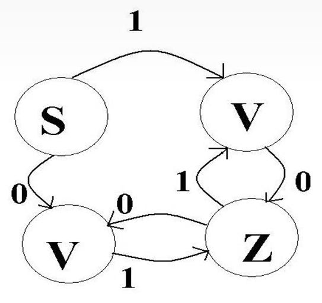

___

&nbsp;

## __Ответы на вопросы коллоквиума по дисциплине "Формализация и работа с естественным языком"__

&nbsp;

Добавить содержание, через которое можно перемещаться к ответам и обратно.
1. 12652 chars
2. 3170 chars (completed, normalize length) (weak)
3. 2196 chars (completed, normalize length) (almost strong)
4. 3032 chars (completed, normalize length) (weak)
5. 2003 chars (completed, normalize length) (almost strong)
6. 1185 chars (completed, normalize length) (strong)
7.
8. 2824 chars
9. 1435 chars (completed, normalize length) (strong)
10. 2141 chars
11. 1320 chars
12. 2604 chars
13. 3907 chars
14.
15.
16.
17.
18.
19.
20. 149 chars (completed, normalize length) (WAY TOO STRONG, but not for the right reasons)

&nbsp;

___

&nbsp;

## __1. Формальные грамматики и языки (WIP - overall last check) (12652 chars) (Topic 1: pra1: 2. -> 12.; pra2: 13. -> 20.; pra3: 21. -> 22.)__

&nbsp;

__2. Формальные грамматики__

- _Формальные грамматики - это системы правил, которые математически строго
задают (или характеризуют) множества цепочек, т.е.
конечных последовательностей символов._

Цепочки могут состоять из языковых элементов разных уровней: например,
- словоформы - это цепочки морфем,
- словосочетания и предложения - это цепочки слов.

Поэтому мы можем сказать, что формальные грамматики имеют дело с
абстрактными объектами.

__3. Классы формальных грамматик__

|_распознающие_|_порождающие_|
|-|-|
|т.е. такие, которые могут определять правильность цепочек.  В тех случаях, когда цепочки признаются грамматически правильными, грамматика может дать информацию о строении этой цепочки.|т.е. такие, которые могут строить правильные цепочки, давать информацию о грамматических характеристиках этих цепочек, а так же избегать порождения неграмматичных цепочек.|

И в распознающих, и в порождающих грамматиках все утверждения
формулируются в четко определенных символах с применением строго
определенных правил.
Это делает формальные грамматики очень простыми с точки зрения их
логического строения.

__4. Формальные грамматики и языки__

- Можно формально определить язык как подмножество множества всех
предложений из "слов" или символов некоторого основного словаря.
- _Алфавит_ - это непустое множество элементов.
Назовем элементы алфавита _символами_ (алфавит не обязан быть
конечным или счётным, но во всех практических приложениях он будет
конечным, может счётным).
- Всякая конечная последовательность символов алфавита $A$ называется
_цепочкой_.

___5. Формальные грамматики и языки (часть 2)__

Вот несколько цепочек в алфавите
$A = \{a, b, c\}\colon  a, \; b, \; c, \; ab,  \; aabb$.
Мы также допускаем существование пустой цепочки $\lambda{(e)}$, т.е.
цепочки не содержащей ни одного слова. Порядок символов в цепочке
важен.

Так цепочка $\textbf{аб}$, не то же самое, что и $\textbf{ба}$.
Длина цепочки $x$ - $|x|$ - равна числу символов в цепочке.:
$|\lambda| = 0, \; |a| = 1, \; |abc| = 3$.

Будем использовать буквы $a$, $b$, $c$, как имена символов алфавита,
в то время как $x$, $y$, $z$, $w$ - для обозначения цепочек символов.

Если $x$ и $y$ - цепочки, то их _конкатенация_ $xy$ является цепочкой,
полученная путём дописывания символов цепочки $y$ вслед за символами
цепочки $x$. Если $x=de$ и $y=ec$, то $xy=deec$.

__6. Формальные грамматики и языки (часть 3)__

Т.к. пустая цепочка $\lambda$ не содержит символов, то
$\lambda x = x \; \lambda = x$.

Если $z=xy$ - цепочка, то $x$ голова, а $y$ - хвост $z$.
И, наконец, $x$ - правильная голова, если $y$ - непустая цепочка
(не $\lambda$), $y$ - правильный хвост, если $x$ - не $\lambda$.

Если $x=\textbf{абс}$, то $\lambda$, $\textbf{а}$, $\textbf{аб}$,
$\textbf{абс}$ - голова, все правильные, кроме $\textbf{абс}$.
(Будем обозначать множество цепочек заглавными буквами).

- Произведение $AB$ двух множеств цепочек $A$, и $B$ определяется
как $AB = \{xy| \; x \; A,y \; B\}$.
Пусть $A=\{a,b\}$ и $B=\{c,d\}$, то $AB = \{ac, ad, bc, bd\}$

Т.к. $\lambda x = x \; \lambda = x$ для любой цепочки, то
$\{\lambda\} A = A \{\lambda\} = A$ (множество из пустых цепочек можно
и слева, и справа домножать).

__7. Формальные грамматики и языки (часть 4)__

Определим степень цепочки:
- $x^0$ - пустая цепочка $\lambda$
- $x^1 = x$
- $x^2 = xx$
- $x^3 = xxx$
- $\ldots$
- $x^n = xx^{n-1} = x^{n-1}x \;\;\;\;\;\;\; (n>0)$

Аналогично определяется степень алфавита $A$:
$$A^0 = \{\lambda\}, \; A^1 = 1, \ldots, A^n=AA^{n-1}=A^{n-1}A, \quad n>0$$

Определим 2 операции:
- Итерацию $A^*$ множества $A$: $\;\;\;$ $A^* = A^0 A^+$
и усечённую итерацию $A^+$ множества
$A$: $\;\;$ $A^+ = A^1 A^2 \ldots A^n \ldots$
- Таким образом, если $A=\{a,b\}$, то $A^*$ включает цепочки $\lambda$,
$\textbf{а}$, $\textbf{б}$, $\textbf{аа}$, $\textbf{аб}$, $\textbf{ба}$
$\textbf{ааа}$, $\textbf{ааб}$, $\textbf{бб}$, $\ldots$
- $A^+ = A A^* = A^* A$

__8. Определение 1__

- _Продукцией_ или _правилами_ подстановки называется упорядоченная пара
$(u,x)$, которая записывается так $u\text{::}\!\!=\!\!x$, где $u$ - символ, а $x$ -
непустая конечная цепочка символов, где $u$ - называется левой частью
правила, $x$ - правой.

__9. Определение 2__

_Грамматикой_ $G[z]$ называется конечное, непустые множество правил.

$z$ - это символ, который должен встертиться в левой части по крайней
мере одного правила.

Он называется начальным символом.
Все символы, которые встречаются в левых и правых частях правил, образуют
словарь $V$.

пчс - последовательность чисел.

__Пример__
```
Грамматика G1[<число>]
<число>::=<пчс>
<пчс>::=<пчс><цифра>
<пчс>::=<цифра>
<цифра>::=0
<цифра>::=1
...
<цифра>::=9
```

Словарь $V$ для этой грамматики следующий:
$$V=\{0,1,2,3,4,5,6,7,8,9, \; \text{<цифра>, <пчс>, <число>}\}.$$

__10. Определение 3__

В заданной грамматике $G$ символы, которые встречаются в левой части правил,
называются _нетерминальными_.
Они образуют множество нетерминальных символов $V_N$.
Символы, которые не входят в множество $V_N$, называется терминальными.
Они образуют множество $V_T$.
Таким образом $V = V_N V_T$.

Нетерминалы будем заключать в угловые скобки $<$ $>$, чтобы отличить
их от терминалов.

В грамматике $G1$ символы $0,1,2,3,\ldots,9$ - терминалы;
число, ПЧС, цифра - нетерминалы.

Множество правил с одинаковой левой частью будем записывать
$V\!\text{::} x|y|\ldots|z$.

Тогда $G1$ будет выглядеть следующим образом:
```
<число>::=<пчс>
<пчс>::=<пчс><цифра>/<цифра>
<цифра>::=0|1|2|3|...|9
```

Такая форма записи называется нормальной формой Бэкуса (НФБ) или формой
Бэкуса-Наура.

__11. Определение 4__

- Пусть $G$ - грамматика. Мы говорим, что цепочка $V$ непосредственно
порождает цепочку $w$ и обозначаем $V\!=>\!w$, если для некоторых цепочек
$x$ и $y$ можно написать: $V=xUy,\ w=xuy$ где $U\text{::}\!\!=\!u$ - правило грамматики
$G$.
Мы также говорим, что $w$ - непосредственно выводима из $V$, цепочки $x$ и
$y$ могут быть пустыми.

__12. Определение 5__

Говорят $V$ порождает $w \qquad V \! =>\!\!{}^+w$, если существует последовательность
непосредственных выводов $V=u_0=>u_1=>u_2=>\ldots=>u_n=w \qquad\qquad n>0$.
Эта последовательность называется _выводом длины_ $n$.

Говорят, также, что цепочка $w$ является _словом_ $V$.
Наконец, пишут $V \! => \!\! {}^*w$, если $V \! => \!\!+w$ или $V=w$;

__13. Пример__

|$V$|$w$|Использованные пр.|$x$|$y$|
|:-:|:-:|:-:|:-:|:-:|
|<число>=><пчс>=><пчс><цифра>=><цифра><цифра>=>7<цифра>=>|<пчс><пчс><цифра><цифра><цифра>7<цифра>75|$\begin{matrix} 1 \\ 2 \\ 3 \\ 6 \\ 6 \end{matrix}$|$\begin{matrix} \lambda \\ \lambda \\ \lambda \\ \lambda \\ 7 \end{matrix}$|$\begin{matrix} \lambda \\ \lambda \\ \text{<цифра>} \\ \text{<цифра>} \\ \lambda \end{matrix}$|

<число>=><пчс>=><пчс><цифра>=><цифра><цифра>=>7<цифра>=>75, таким образом
<число>=>75 и длинна вывода = 5.

__14. Определения 6 и 7__

__Определение 6:__

- Пусть $G[z]$ - грамматика.
Цепочка $x$ называется сентенциальной формой, если $x$ выводима
из начального символа $z, \;\; z \! => \!\! {}^*x$.
- _Предложение_ - это сентенциальная форма, состоящая из терминальных
символов.

__Определение 7:__

- Язык $L(G[z])$ - это множество предложений:
$$L(G)=\{x \, | \;\; z \! => \!\! {}^*x \; \text{и} \;\; x \: V_{T^+}\}.$$
- Таким образом, язык - это просто подмножество множества всех терминальных
цепочек, т.е. цепочек в $V_T$.
Структура предложений задается грамматикой.
Несколько различных грамматик могут порождать один и тот же язык.

__15. Определение 8__

- Пусть $G[z]$ - грамматика.
И пусть $w = xUy$ - тогда $u$ называется фразой сентенциальной формы $w$
для нетерминального символа $U$, если
$z \! => \!\! {}^* \;\; xUy$ и $U \!\! => \!\! +u$ и простая,
$z \!\! => \!\! {}^* \; xUy$ и $U \!\! => \!\! u$.\
Следует быть осторожным с терминалом фраза.
Тот факт, что $U \!\! => \!\! +u$ вовсе не означает, что $u$ является фразой
сентенциальной формы $xuy$, необходим $z \!\! => \!\! {}^* \;\; xUy$.
- В качестве примера рассмотрим сентенциальную форму <пчс>1.
- Значит ли, что <пчс> - является фразой, если существует правило
<число>::=<пчс>? - нет, т.к. невозможно вывод <число>1 начального символа
<число>. Имеет место вывод: $$\text{<число>=><пчс>=><пчс><цифра>=><пчс>1.}$$
- Таким образом: $$\text{<число>=>*<пчс> и <пчс>=>}^+\text{<пчс>1}$$ $$\text{<число>=>*<пчс><цифра> и <цифра>=1}$$
Тогда <пчс>1 и 1 фразы; 1 - простая фраза.

__16. Определение 9__

Основой всякой сентенциальной формы называется самая левая простая фраза.

Грамматика $G1$ описывает бесконечный язык, т.к. существует правило
<пчс>::=<пчс><цифра>.

В общем случае, если $U \!\! => \!\! {}^+ \ldots U \ldots$, мы говорим,
что грамматика _рекурсивна_.
Если $U \!\! => \!\! +U\ldots$, то левая рекурсия,
$U \!\! => \!\! {}^+\ldots U$ - правая.

___17. Определение 10__

- Если две различные грамматики порождают один и тот же язык, то эти
грамматики называются _эквивалентными_.\
Эквивалентные грамматики могут обладать разными свойствами, облегчающими
или, наоборот, затрудняющими разработку алгоритма трансляции (перевода).
- Каждой сентенциальной форме по определению соответствует, по крайней
мере один вывод.
Однако, одной и той же сентенциальной форме может соответствовать более,
чем один вывод.
Вывод можно наглядно представить синтаксическим деревом, которое иначе
называют _деревом вывода_ или _деревом разбора_.
В качестве иллюстрации построим дерево вывода предложения - 75.

__18. Определение 10 (часть 2)__

- _Отправляясь от начального символа <число> нарисуем его куст, для того,
чтобы указать первый непосредственный вывод:_
$$\begin{matrix} \text{Число} \\ \vert \\ \text{<пчс>} \end{matrix}$$

_Куст узла - это множество подчиненных узлов (символов), образующих цепочку,
которая заметает имя куста, в непосредственном выводе._

_Концевые узлы не имеют подчиненного куста.
Для второго вывода получаем:_
$$\begin{matrix} \text{Число} \\ \vert \\ \text{<пчс>} \\ \vert \\ \_\_\_\_\_\_\_\_ \\ \vert \qquad \qquad \vert \\ \text{<пчс>} \quad \text{<цифра>} \end{matrix}$$

__19. Определение 10 (часть 3)__

__Строим три синтаксические диаграммы, каждый раз применяя непосредсвенный
вывод.__

$$\begin{matrix} \text{<число>} \\ \vert \\ \text{<пчс>} \\ \vert \\ \_\_\_\_\_\_\_\_ \\ \vert \qquad \qquad \vert \\ \text{<пчс>} \quad \text{<цифра>} \\ \vert \qquad \qquad \\ \text{<цифра>} \qquad \qquad \\ {} \\ {} \end{matrix} \qquad
\begin{matrix} \text{<число>} \\ \vert \\ \text{<пчс>} \\ \vert \\ \_\_\_\_\_\_\_\_ \\ \vert \qquad \qquad \vert \\ \text{<пчс>} \quad \text{<цифра>} \\ \vert \qquad \qquad \\ \text{<цифра>} \qquad \qquad \\ \vert \qquad \qquad \\ 7 \qquad \qquad\end{matrix} \qquad
\begin{matrix} \text{<число>} \\ \vert \\ \text{<пчс>} \\ \vert \\ \_\_\_\_\_\_\_\_ \\ \vert \qquad \qquad \vert \\ \text{<пчс>} \quad \text{<цифра>} \\ \vert \qquad \qquad \qquad \vert \\ \text{<цифра>} \qquad  5 \\ \vert \qquad \qquad \\ 7 \qquad \qquad\end{matrix}$$

__20. Определение 10 (часть 4)__

- При чтении слева направо концевые узлы образуют цепочку, вывод которой
представлен деревом.
Можно восстановить вывод по синтаксическому дереву при помощи обратного 
процесса.
Самый правый концевой указывает непосредственный вывод
7<цифра>=>75, чтобы пройти по синтаксическому дереву до куста
7<цифра> мы отсекаем куст от дерева - удалаем его.
Продолжаем процесс, всегда восстанавливая последний непосредсвенный вывод.
Концевые узлы дерева образуют выводимую сентенциальную форму.

__21. Определение 11__

- Предложение грамматики _неоднозначно_, если для его вывода
существует два синтаксических дерева.
Грамматика _неоднозначна_, если она допускает неоднозначные
предложения, в противном случае она однозначна.
- Заметим, что мы называем _неоднозначной_ грамматику, а не
сам язык.
Изменяя неоднозначную грамматику, но не заменяя её
предложения, можно получить однозначную грамматику для того
же множества предложений.
Однако, есть языки, для которых не существует однозначной
грамматики.
Такие языки называются _существенно неоднозначными_.
Было доказано, что проблема распознавания неоднозначности
алгоритмически не разрешима (т.е. не существует алгоритма,
определяющего законченное число шагов однозначана или нет.
Проблема Поста).
Но можно разработать условие такие, что если грамматика удовлетворяет им,
то она однозначна.

__22. Пример__

$${\lbrace a^i b^i c^j \: | \; i,j \geq 1 \rbrace} \cup {\lbrace a^i b^i c^j \: | \; i,j \geq 1 \rbrace}$$

&nbsp;

___

&nbsp;

## __2. Задача разбора (WIP - completed, normalize length) (3170 chars) (Topic 1: pra3: 23. -> 26.)__

&nbsp;

Разбор сентенциальной формы означает построение вывода и,
возможно, синтаксического дерева для неё.
Программу разбора также называют распознавателем, т.к. она
распознает только предложения рассматриваемой грамматики
(например, мы можем распознавать программы, написанные на
языке программирования).

Различают две категории алгоритмов разбора:
1. _нисходящий_ (сверху вниз)
2. _восходящий_ (снизу вверх).

Эти термины соответствуют способу построения синтаксических
деревьев.
При нисходящем разборе дерево строится от корня (начального
символа) вниз к концевым узлам.
Рассмотрим предложение 35 в следующей грамматике целых чисел.

__Схема:__

$$N \Coloneqq \text{Д}|N\text{Д}$$

$$\text{Д} \Coloneqq 0|1|2|3|4|5|6|7|8|9$$

$$
\begin{matrix} N \\ \\ \\ \\ \\ \\ \\ \\ \\ \end{matrix} \qquad
\begin{matrix} N \\ \vert \\ \_\_\_\_\_\_\_\_ \\ \vert \qquad \qquad \vert \\ N \qquad \quad \;\; \text{Д} \\ \\ \\ \\ \\ \end{matrix} \qquad
\begin{matrix} N \\ \vert \\ \_\_\_\_\_\_\_\_ \\ \vert \qquad \qquad \vert \\ N \qquad \quad \;\; \text{Д} \\ \vert \qquad \qquad \\ \text{Д} \qquad \qquad \\ \\ \\ \end{matrix} \qquad
\begin{matrix} N \\ \vert \\ \_\_\_\_\_\_\_\_ \\ \vert \qquad \qquad \vert \\ N \qquad \quad \;\; \text{Д} \\ \vert \qquad \qquad \\ \text{Д} \qquad \qquad \\ \vert \qquad \qquad \\ 3 \qquad \qquad \end{matrix} \qquad
\begin{matrix} N \\ \vert \\ \_\_\_\_\_\_\_\_ \\ \vert \qquad \qquad \vert \\ N \qquad \quad \;\; \text{Д} \\ \vert \qquad \qquad \vert \\ \text{Д} \qquad \quad \;\;\; 5 \\ \vert \qquad \qquad \\ 3 \qquad \qquad \end{matrix} \qquad
$$

На каждом последующем шаге самый левый элементарный
символ $V$ текущей сентенциальной формы $xVy$
заменяется на правую часть правила $V \Coloneqq u$,
в результате получается следующая сентенциальная форма.
Этот процесс для предложения 35 представлен в виде пяти (5)
деревьев.
Требуется получить сентециальную форму, которая совпадает с
заданной цепочкой.

Метод восходящего разбора состоит в том, что цепочки, отправляясь от
заданной, пытаются привести её к начальному символу.
На первом шаге терминал 3 приводится к $\text{Д}$, в
результате чего
получается сентенциальная форма $\text{Д5}$.

__Результат__

(рисунок нужно смотреть справа налево)

$$
\begin{matrix} N \\ \\ \\ \\ \\ \\ \\ \\ \\ \end{matrix} \qquad
\begin{matrix}N \\ \vert \\ \_\_\_\_\_\_\_\_ \\ \vert \qquad \qquad \vert \\ N \qquad \quad \;\; \text{Д} \\ \vert \qquad \qquad \vert \\ \text{Д} \qquad \quad \;\;\; 5 \\ \vert \qquad \qquad \\ 3 \qquad \qquad \end{matrix} \qquad \quad
\begin{matrix} \\ \\ \\ \\ N \qquad \text{Д} \\ \vert \qquad \;\; \vert \\ \text{Д} \qquad \; 5 \\ \vert \qquad \;\;\; \\ 3 \qquad \;\;\; \end{matrix} \qquad \qquad \quad
\begin{matrix} \\ \\ \\ \\ N \qquad \;\; \\ \vert \qquad \;\;\; \\ \text{Д} \qquad \; \text{Д} \\ \vert \qquad \;\; \vert \\ 35 \qquad 35 \end{matrix} \qquad \qquad
$$

$$N => N \; \text{Д} => N5 => \text{Д5} => 35$$

Выводы, произведенные двумя распознавателями, различны, но имеют одно
и то же синтескическое дерево.
При разборе слева направо цепочка справа от основы всегда содержит только
терминальные символы.

&nbsp;

___

&nbsp;

## __3. Классификация грамматик по Хомскому (WIP - completed, normalize length) (2196 chars) (Topic 1: pra3: 28. -> 30.)__

&nbsp;

Грамматика по Хомскому - это четверка $(V, T, P, Z)$, где:
- $V$ - алфавит НЕтерминальных символов.
- $T$ - алфавит терминальных символов $(T \cap V = \varnothing)$.
- $P$ - конечный набор правил постановки.
- $Z$ - начальный символ, который не является терминалом $(Z \in V - T)$.

Язык, порождаемый грамматикой - это множество терминальных цепочек, которые
можно вывести из $Z$.

Грамматика по Хомскому разделяется на четыре типа:
- Тип 0 - грамматики с фазовой структурой;
- Тип 1 - контекстно-зависимые (КЗ) грамматики и неукорачивающие грамматики;
- Тип 2 - контекстно-свободные (КС) грамматики;
- Тип 3 - регулярные грамматики.

Различие четырех типов грамматик заключается в форме правил подстановки,
допустимых в $P$.

0. Говорят, что $G$ - это грамматика с фазовой структурой (тип 0), если
правила имеют
вид: $$u \Coloneqq U, \qquad \text{где} \qquad u \in V^{+}; \qquad U \in V^{*},$$
т.е. левая часть $u$ может быть тоже последовательностью символов, а
правая - пустой.
Грамматики с фазовой структурой имеют небольшое употребление.

1. Если ввести ограничения на правила подстановки, то получится класс
контекстно-зависимых (КЗ) языков (тип 1).
Правила подстановки имеют
вид: $$xUy \Coloneqq xuy, \qquad \text{где} \qquad U \in V-T; \qquad u \in V^{+}; \qquad x, y \in V^{*}.$$
Термин контекстно-зависимые отражает тот факт, что можно заменить $U$ на
$u$ в контексте $x{\lbrace U, u \rbrace}y$.

2.  Дальнейшее ограничение правил подстановки дает класс грамматик,
называемых контекстно-свободными (КС) (все языки программирования
описываются с помощью этой
грамматики): $$U \Coloneqq u, \qquad \text{где} \qquad U \in V-T \qquad \text{и} \qquad u \in V^{*}.$$
В КС-грамматиках может появиться правило вида $U \Coloneqq \lambda$.\
По заданной КС-грамматике $G$ можно сконструировать неукорачивающую
грамматику типа $G1$ или $\lambda$ - свободную, такую, что
$L(G1) = L(G) - {\lbrace \lambda \rbrace}$ (тот же самый язык).

3.  Если мы ограничим правила ещё раз, приведя их к
виду: $$U \Coloneqq u \qquad \text{или} \qquad U \Coloneqq WN, \qquad \text{где} \qquad N \in T^{*}; \qquad U, W \in V-T,$$
то мы получим регулярную грамматику (тип 3).

&nbsp;

___

&nbsp;

## __4. Диаграмма состояний (WIP - completed, normalize length) (3032 chars) (Topic 1: pra3: 31 -> 34; pra4: 35 -> 36)__

&nbsp;

Рассмотрим регулярную диаграмму $\mathbf{G[z]}$:
- $Z \Coloneqq V0 \; \vert \; V1$
- $U \Coloneqq Z1 \; \vert \; 1$
- $V \Coloneqq Z0 \; \vert \; 0$

Порожденный ею язык состоит из последовательностей образуемых парами 01 или
10, т.е. $L(G) = \lbrace B \;\: | \, n>0 \rbrace$, где
$B = \lbrace 01, 10 \rbrace$.

Чтобы облегчить распознавание предложений грамматики $G$ нарисуем диаграмму
состояний.



В этой диаграмме каждый нетерминал грамматики $G$ представлен узлом или
состоянием.
Кроме того, есть начальное состояние $S$ (предполагается, что грамматика не
содержит нетерминала $S$).

Каждому правилу $Q \Coloneqq T$ соответствует дуга с пометкой $T$,
направленная от начального состояния $S$ к состоянию $Q$.

Каждому правилу $Q \Coloneqq KT$ соответствует дуга с пометкой $T$,
направленная от состояния $K$ к состоянию $Q$.

Диаграммы состояний используются, чтобы распознать или разработать цепочку
$x$ следующим образом:

1. Первым текущим состоянием считать $S$. Начать с самой левой литеры в
цепочке $x$ и повторить шаг 2 до тех пор, пока не будет достигнут конец $X$.
2. Сканировать следующую литеру $x$, продвинуться по дуге, помеченной этой
литерой, переходя к следующему текущему состоянию.
    - Если при каком-то повторении шага 2 такой дуги не оказывается, то цепочка
    $x$ - не является предположением языка и происходит остановка.
    - Если мы достигнем конца $x$, то $x$ предложение тогда и только тогда, когда
    последнее текущее состояние есть $Z$.

На каждом шаге, кроме первого, основой является имя текущего состояния, за
которым следует входной символ.
Символ, к каждому приводится основа, будет именем следующего состояния.

__Пример:__


Каждая строка отражает состояние разбора перед началом
выполнения шага 2.

В этом примере разбор выглядит столь простым благодаря
характеру правил, т.к. нетерминалы встречаются лишь как первые символы
правой части.
На первом шаге первый символ предложения всегда приводится к нетерминалу.
На каждом последующем шаге первые два символа $VT$ синтециальной формы
$VTt$ приводится к нетерминалу $U$, при этом используется правило
$U \Coloneqq VT$.
При выполнении этой редукции имя текущего состояния $U$, а имя следующего
текущего состояния $V$.
Т.к. каждая правая часть единственна, то единственным оказывается $U$
символ, к которому она приводится.

Синтаксические деревья для предложений регулярных грамматик всегда имеют
вид, подобный изображенному.

Чтобы избавиться от проверки на каждом шаге, есть ли дуга с
соответствующей пометкой, можно добавить ещё одно состояние $F$ (неудача) и
добавить все необходимые дуги от всех состояний к $F$.
Добавляется также дуга, помеченная всеми возможными литерами ведущая из $F$
обратно в $F$. В результате диаграмма имеет вид:


&nbsp;

___

&nbsp;

## __5. Конечный автомат (WIP - completed, normalize length) (2003 chars) (Topic 1: pra4: 37. -> 39.)__

&nbsp;

Детерминированный автомат с конечным числом состояний
(или же конечный автомат, КА) - это пятерка
$(K, \; VT, \; M, \; S, \; Z)$, где:

- $K$ - алфавит элементов, называемых состояниями;
- $VT$ - алфавит, называемый входным алфавитом
(литеры, которые могут встретиться в цепочке или предложении);
- $M$ - отображение (или функция) множества
$K \times VT$ во множество $K$ (если $\overline{M}(Q,T)=R$, то это
означает, что из состояния $Q$ при входной литере $T$ происходит
переключение в состояние $R$);
- $S$ - начальное состояние $(S \in K)$;
- $Z$ - непустое множество заключительных состояний $(Z \subset K)$.

Определим формально, как работает КА с входной цепочкой $t$, расширив
понятие отображение, которое указывает, как переключаются состояния в
зависимости от входной литеры.

Определим:
- $M(Q, \lambda) = Q$ при любом состоянии $Q$;
- $M(Q, \; Tt) = M(M(Q,T), \; t)$ для любых $t \in VT^*$ и любых $T \in VT$.

Первая строка означает, что если на входе пустой символ, то состояние
остается прежним.
Вторая строка показывает, что в состоянии $Q$ и при входной цепочке $Tt$ мы
применяем $M$, чтобы перейти в состояние $P=M(Q, \; T)$, а затем применяем
отображение $M(P,t)$.
Конечный автомат (КА) допускает цепочку (цепочка считается допустимой), если
$M(S,t) = P$, где состояние $P$ принадлежат множеству заключительных
состояний $Z$.

Такие автоматы называются детерминированными, т.к. на каждом шаге входная
литера однозначно определяет следующее текущее состояние.

Рассмотренной диаграмме состояний соответствует следующий КА:
- $\text{КА} \; (\lbrace S, Z, U, V, F \rbrace, \; \lbrace 0, \; 1 \rbrace, \; M, \; S, \; \lbrace Z \rbrace)$, где
    - $M(S,0) = V \;\; M(S,1) = U$
    - $M(V,0) = F \;\; M(V,1) = Z$
    - $M(U,0) = Z \;\; M(U,1) = F$
    - $M(Z,0) = V \;\; M(Z,1) = U$
    - $M(F,0) = F \;\; M(F,1) = F$

Лекго видеть, что если предложение $x$ принадлежит грамматике $G$, то
оно также допускается КА, соответствующим грамматике $G$.

&nbsp;

___

&nbsp;

## __6. Представление автоматов (WIP - completed, normalize length) (1185 chars) (Topic 1: pra4: 41. -> 42.)__

&nbsp;

Один из удобных способов представления КА - таблица переходов.
КА с состояниями $S_1, \ldots, S_n$ и входными литерами $T_1, \ldots, T_m$
можно представить в виде матрицы $B$, состоящей из $n \times m$ элементов.
Элемент $B[i, j]$ содержит число $k$ - номер состояния $S_k$, такое что
$M[S_i, T_j] = S_k$.
Можно условиться, что состояние $S_1$ - начальное, а список заключенных
состояний представлен вектором.

$$
\begin{vmatrix}
\hline
0 \\ \\ 0 \\ \\ 1 \\ \\ 0 \\ \\ 1 \\ \\
\ldots \\
\\
\hline
\end{vmatrix} \;
\begin{matrix}
\\
\leftarrow \text{не закл.} \\ \\
\\ \\
\leftarrow \text{закл.} \quad \; \\ \\
\\ \\ \\ \\ \\ \\ \\
\end{matrix}
$$

Такая матрица называется матрицей переходов, т.к. она указывает, каким
образом происходит переключение из одного состояния в другое.

Другим способом представления может быть списочная структура.
Представление каждого состояния с $k$ дугами, исходящими из него, занимает
$2k+2$ слов.
Первое слово - имя состояния, второе - значение $k$.
Каждая последующая пара слов содержит терминальный символ из входного
алфавита и указатель на начало представления состояния, в которое надо
перейти по этому символу.

&nbsp;

___

&nbsp;

## __7. Моделирование в компьютерной лингвистике (WIP)__

&nbsp;

___

&nbsp;

## __8. Требования, предъявляемые к моделям типа «Смысл <=> Текст» (WIP - overall last check) (2824 chars) (Topic 2: pra4: 6. -> 9.)__

&nbsp;

Общие требования, предъявляемые к моделям типа "Смысл $<=>$ Текст":

1. Модель "Смысл $<=>$ Текст" должна быть действующей моделью.
Она представляет собой устройство, имеющее вход и выход и перерабатывающее
то, что подается ему на вход (задание), в нечто другое, что выдается на его
выходе (результат).  Принципиальная динамичность таких моделей резко
противопоставлена статичности более традиционных классифицирующих
(таксономических) описаний.\
В модели "Смысл $<=>$ Текст" различаются: 
    - "лингвистическая" часть, в которой собраны сведения о данном языке
    (т.е. соответствия "смыслы $<=>$ тексты") и которая представляет собой
    _исчисление_, т.е. перечень разрешений и запрещений
    (что можно/нельзя делать), а не алгоритм, т.е. набор предписаний
    (что надо делать);
    - "алгоритмическая" часть, в которой содержится описание механизма
    (или процедур) использования сведений о языке и которая поэтому носит
    действительно алгоритмический характер.
2. Модель "Смысл $<=>$ Текст" должна быть задана _совершенно формально_ -
посредством однозначных и логически последовательных формулировок, не
требующих привлечения какой-либо добавочной информации.
В качестве контрольного критерия выдвигается принципиальная осуществимость
модели или любого ее фрагмента на вычислительной машине.
3. Модель "Смысл $<=>$ Текст" есть _не порождающее_, а _преобразующее
устройство_ - не генератор текстов, а транслятор смыслов в тексты и
обратно.
Этим она отличается от порождающей грамматики в смысле Хомского, цель
которой - задавать (перечислять) все грамматически правильные
(или все осмысленные) фразы привлекаемых языков.
От модели "Смысл $<=>$ Текст" требуется только умение переработать в
соответствующие тексты содержательно _любое_ "смысловое задание" (при
условии, разумеется, что оно представлено в том формальном виде, т.е.
на том "смысловом" языке, который принят для данной модели) и наоборот -
извлечь из заданного текста его "смысл" или "смыслы".\
Не занимаясь самим смыслом, модель типа "Смысл $<=>$ Текст" отвечает за
формальную правильность текстов и за правильное соответствие текстов и
смыслов.

Другими словами, такая модель обязана:

- при движении от смылса к тексту исключать построение "абсолютно"
неправильных фраз, а при обратном движении - обнаруживать "абсолютную"
неправильность предъявленных фраз;
- обеспечивать приписывание любому заданному смыслу "$\text{Ф}$" всех
правильных
относительно этого смысла фраз $\text{Фi}$ и только таких фраз, а также
приписывание любой заданной фразе $\text{Ф}$ всех смылсов "$\text{Фi}$",
относительно
которых эта фраза является правильной, и только таких смыслов.
(Мы говорим здесь именно о фразах просто для большей определенности;
в действительности, имеются в виду смыслы и тексты любого объема.)

&nbsp;

___

&nbsp;

## __9. В настоящем варианте модель «Смысл <=> Текст» предполагает пять основных уровней представления. (WIP - completed, normalize length) (1435 chars) (Topic 2: pra5: 13. -> 16.)__

&nbsp;

В настоящем варианте модель "Смысл <=> Текст" предполагает следующие пять
основных уровней представления:

1. _Семантический уровень_ - изображение содержания связного фрагмента речи
(= высказывания), без расчленения на фразы и слова, в виде так называемого
_семантического представления_; это и есть запись _смысла_.

2. _Синтаксический уровень_, который в описываемой модели "Смысл <=> Текст"
расчленен на два подуровня:
    - а. "_Глубинный синтаксис_" - изображение высказываения в виде
    последовательности глубинно-синтаксических представлений (ГСП) фраз.
    - б. "_Поверхностный синтаксис_" - изображение высказывания в виде
    последовательности поверхностно-синтаксических представлений фраз (ПСП).

3. Морфологический уровень также расчленен на два подуровня:
    - а. "_Глубинная морфология_" - изображение фразы в виде ее
глубинно-морфологического представления (ГМП).
    - б. "_Поверхностная морфология_" - изображение фразы в виде ее
поверхностно-морфологического представления (ПМП).

4. _Фонологический уровень_ - фонемная транскрипция фразы, т.е.
последовательность символов, представляющих фонемы и просодемы
(фонологически релевантные просодические явления).

5. Фонетический уровень - фонетическая транскрипция фразы, т.е.
последовательность символов, представляющих звуки речи и просодические
явления - просодии (словесные и фразовые ударения, тоны, интонации, паузы,
стыки и т.п.).

&nbsp;

___

&nbsp;

## __10. Переходы от одного уровня представления высказывания к другому выполняются следующими четырьмя основными компонентами модели «Смысл  <=>Текст». (WIP - overall last check) (2141 chars) (Topic 2: pra5: 16. -> 19.)__

&nbsp;

Переходы от одного уровня представления высказывания к другому выполняются
следующими четырьмя основными компонентами модели "Смысл <=> Текст".
1. Семантический компонент должен обеспечивать установление соответствий
между данным семантическим представлением и последовательностью
глубинно-синтаксических представлений фраз, которые образовали бы текст,
отвечающий этому семантическому представлению.
2. Синтаксическому компоненту поручаются соответствия между
глубинно-синтаксическими представлениями фраз и их глубинно-морфологическими
представлениями, которые состоят из цепочек глубинно-морфологических
представлений (ГМП) словоформ, отвечающих этим фразам, и сведений о
просодических характеристиках фраз.
3. Морфологический компонент данной модели устанавливает соответствия между
глубинно-морфологическим представлением отдельной словоформы и
соответствующей словоформой в фонемной транскрипции.
4. Фонологический компонент, к которому мы (достаточно условно) относим и
графическо-орфографические правила, при синтезе преобразует фонемную
транскрипцию словоформы либо в ее детализированное фонетическое
представление, либо в принятую офрографическую запись, а при анализе
выполняет обратные операции.

Каждый из четырех названных компонентов модели "Смысл <=> Текст" повторяет
внутри себя строение всей модели.
А именно, отдельный компонент модели также описывается как состоящий из
нескольких независимых и работающих последовательно преобразователей,
характеризующихся множественостью выходов; каждый перебирает результаты
предыдущего, обрабатывая их, в свою очередь, один за другим.

Таким образом, можно сказать, что каждый компонент модели и каждый
преобразователь внутри этого компонента суть _генераторы_ либо синонимичных
представлений данного содержания на более поверхностном уровне, либо
взаимоисключающих толкований некоторого выражения на более глубинном
уровне.
Одновременно в каждом компоненте и в каждом проебразователе внутри
компонента содержится _селектор_ - набор сведений, позволяющих браковать
недопустимые с точки зрения данного уровня варианты, выданные с
предыдущего уровня.

&nbsp;

___

&nbsp;

## __11. Толково-комбинаторный словарь (ТКС). Словарная статья такого словаря. (WIP - completed, normalize length) (1320 chars) (Topic 2: pra5: 21. -> 22.)__

&nbsp;

Модель "Смысл <=> Текст" существенным образом использует большое количество
сведений о каждом слове рассматриваемого языка (в нашем случае русского).
Эти сведения могут быть представлены в особом словаре, который мы называем
_толково-комбинаторным_ словарем (ТКС) и который занимает в описываемой
модели важное место.
Словарная статья такого словаря должна в идеале содержать все
словоизменительные, словообразовательные, синтаксические, семантические и
стилистические характеристики _заглавного_, или _ключевого_, слова $C_0$;
кроме того, для $C_0$, необходимо указать все слова (или словосочетания),
определенным образом связанные с ним по смыслу, а именно:

1. Его "парадигматические варианты", или "_замены_", - средства, которые
могут или должны заменять $C_0$ в тех или иных контекстах и при тех или иных
условиях;
2. его "синтагматические партнеры", или "_параметры_", - средства,
которыми идиоматично, т.е. несвободно, выражаются при данном слове
некоторые смыслы.

Для обозначения парадигматических вариантов и синтагматических партнеров
слова мы будем использовать термин _лексические корреляты_.
Стремление достаточно полно и систематически представить в словарной статье
каждого слова все его лексические корреляты составляет одну из главных
особенностей толково-комбинаторного словаря.

&nbsp;

___

&nbsp;

## __12. Лексические функции. Стандартная в данном языке лексическая функция (СЛФ) (WIP - overall last check) (2604 chars) (Topic 2: pra5: 23. -> 25.; pra6: 26.)__

&nbsp;

Зависимости, связывающие слова с их лексическими коррелятами, предлагается
описывать с помощью _лексических функций_ (ЛФ).
Лексические функции вводятся как средство описания
_лексической сочетаемости_, а не семантики; тем не менее мы можем
представлять себе ЛФ как весьма общий, не всегда достаточно точно
определенный смысл (в частности, "нулевой") - такой, что его нужное в данном
речевом контексте выражение однозначно (с точностью до синонимии) выбирается
по тому конкретному слову или словосочетанию $C_0$, при котором или для
которого этот смысл выражается.

Среди всевозможных лексических функций мы рассматриваем только те,
_у которых имеются фразеологически связанные выражения_, т.е. те, у которых
есть выражения, допустимые при одних аргументах, но не допустимые при
других. (Такие ЛФ, у которых все выражения возможны при любых аргументах,
или _ЛФ-константы_, не представляют содержательного интереса с точки зрения
описания лексической сочетаемости.)

Среди ЛФ, имеющих фразеологически связанные выражения, различаются
стандарнтые и нестандартные ЛФ.

Стандартная в данном языке лексическая функция (СЛФ) должна - в отличие от
нестандартной ЛФ - удовлетворять двум следующим требованиям:

(1) СЛФ имеет достаточно широкую семантическую сочетаемость, т.е.
соответствующий смысл образует допустимые комбинации с достаточно большим
числом разных смыслов.
Иначе говоря, СЛФ должна быть определена для достаточно большого числа
аргументов.
Это свойство не зависит от языка.

(2) СЛФ характеризуется достаточным богатством ее языковых выражений.
Это свойство, разумеется, полностью зависит от языка.

Примером смысла, имеющего в русском языке (и целом ряде других языков)
фразеологически связанные выражения и при этом удовлетворяющего обоим
требованиям, является смысл "очень" ($\approx$ "крайний",
"в высшей степени"); ясно, что он применим к огромному количеству слов
(требование 1); при этом он имеет необычайно много разных выражений,
например:
- "очень" (болен) = тяжело;
- "очень" (здоров) = абсолютно, полностью, совершенно, как бык;
- "очень" (от- чаяние) = глубокое, полное;
- "очень" (брюнетка) = жгучая;
- "очень" (худой) = необычайно, как щепка, как скелет;
- "очень" (мороз) = трескучий;
- "очень" (беречь) = как зеницу ока;
- "очень" (негодяй) = отъявленный... (требование 2).

Из этих ил- люстраций непосредственно видно, что нужное выражение смысла
"очень" выбирается по ключевому слову, стоящему в скобках, т.е. является
фразеологически связанным.
Таким образом, этот смысл должен быть признан стандартной лексической
функцией.

&nbsp;

___

&nbsp;

## __13. Примеры лексических функций. (WIP - overall last check) (3907 chars) (Topic 2: pra6: 28. -> 40.)__

&nbsp;

1. __Syn__ - синоним: слово, совпадающее со свои ключевым словом $C_0$ по
смыслу, принадлежащей к той же части речи, что и $C_0$, и имеющее такие же
активные синтаксические валентности.

2. __Conv__ - конверсив: слово, которое называет то же самое отношение, что
и ключевое слово $C_0$, но взятое "в ином направлении", т.е. с
перестановкой тех же актантов на другие места (точнее: с изменением
соответствия между семантическими переменными и глубинно-синтаксическими
актантами).
Регулярным способом образования конверсивов во многих языках является
пассив: _Ученый проводит анализ - Анализ проводится ученым._

3. __Anti__ - антоним: слово, обозначающее свойство, состояние или действие,
"противоположное" свойство, состоянию или действию, обозначенному ключевым
словом $C_0$.

4. __Der__ - синтаксический дериват: слово, совпадающее с $C_0$ по смыслу,
но принадлежащее к другой части речи.
Поскольку мы различаем четыре основные части речи:
S - существительное,
A - прилагательное,
Adv - наречие и
V - глагол,
имеется четыре вида дериватов:
$S_0$, $A_0$, $Adv_0$ и $V_0$.

5. __Gener__ - название понятия, родового по отношению к понятию,
обозначенному ключевым словом $C_0$.

6. $\mathbf{S_i}$ $(i = 1, 2, 3, 4)$ - типовое название $i$-го актанта.

7. __Sc__ - типовые названия второстепенных компонентов ситуации -
сирконстантов, таких, как место, инструмент, способ действия и т.п.

8. Соотносительные лексические функции __Sing__ (лат. _singulus_
'отдельный'; "единичность") - типовое название одной "штуки", одного
"кванта" некоторого $C_0$ - и __Mult__ (лат. _multum_ 'множество';
"множественность") - типовое название совокупности, множества $C_0$.

9. __Figur__ ("фигуральное обозначение") - принятая метафора для $C_0$.

10. __Centr__ ("центр", "разгар") - типовое обозначение "центральной" части
предмета или процесса.

11. $\mathbf{A_i}$ ($i = 1, \ldots, 4$) - типовое определение $i$-го
актанта по его реальной роли в ситуации
("такой, который...", "такой, которого..."):

12. $\mathbf{Able_i}$ (лат. habilis 'способный', "способный";
$i = 1, \ldots, 4$) - типовое определение $i$-го актанта по его
потенциальной роли в ситуации ("такой, который может...", "такой, которого
можно..."):

13. $\mathbf{Magn_0}$ и $\mathbf{Magn_i}$ (лат. magnus 'большой';
$i = 1, \ldots, 4$) - обозначение 'высокой степени', 'интенсивности'
($\approx$ 'очень') самой ситуации ($Magn_0$) или ее $i$-го актанта
($Magn_i$):

14. __Ver__ (лат. verus 'истинный') - 'правильный',
'соответствующий назначению', 'какой следует':

15. __Bon__ (лат. bonus 'хороший') - 'хороший':

16. $\mathbf{Adv_{ix}}$ $(i = 1, \ldots, 4; \; x = A, B, C, D)$ - имя
ситуации в роли определения при глаголе, называющем другую ситуацию.

17. __Loc__ (лат. locus 'место') - предлог типовой локализации
(пространст-50 венной, временной или абстрактной).
Под типовой локализацией понимается наиболее "прямое", наиболее
"естественное" расположение, т.е. расположение, наиболее соответствующее
природе и назначению "вещи", обозначенной ключевым словом - $C_0$.

18. $\mathbf{Oper_1}$, $\mathbf{Oper_2}$
(лат. operari 'совершать') - глагол, связывающий
название первого (соответственно второго) актанта в роли подлежащего с
названием ситуации в роли первого дополнения.

19. $\mathbf{Func_0}$, $\mathbf{Func_1}$, $\mathbf{Func_2}$ (лат. function
"исполнение") - глагол, имеющий название ситуации подлежащим, а названия
актантов, если они есть, - дополнениями.

20. $\mathbf{Labor_{12}}$ - глагол, связывающий название первого актанта
в роли
под- лежащего, с названием второго актанта в роли первого дополнения и с
названием ситуации в роли второго дополнения:

21. __Caus__ (лат. causa "причина") - "делать так, чтобы...", "каузировать".
Подлежащим при Caus (без актантных индексов) обязано быть название
неучастника ситуации.

22. __Perm__

23. __Liqu__

&nbsp;

___

&nbsp;

## __14. Модель Тузова В. А.  Адекватность и неадекватность модели. (WIP) (?? lines) (Topic 3: pra7: 1. ->)__

&nbsp;

___

&nbsp;

## __15. Функциональная природа языка. (WIP) (?? lines) (Topic 3: pra8: 24. ->)__

&nbsp;

___

&nbsp;

## __16. Слово как понятие. (WIP) (?? lines) (Topic 3: pra8: 28. ->)__

&nbsp;


&nbsp;

___

&nbsp;

## __17. Слово как функция. (WIP) (?? lines) (Topic 3: pra9: 43. ->)__

&nbsp;

___

&nbsp;

## __18. Семантический словарь. Словарная статья такого словаря. (WIP) (?? lines) (Topic 3: pra10: 64. ->)__

&nbsp;

___

&nbsp;

## __19. Предварительная обработка описания слова. (WIP) (?? lines) (Topic 3: pra10: 84. ->)__

&nbsp;

___

&nbsp;

## __20. Сущность семантического анализа. (WIP - completed, normalize length) (149 chars) (Topic 3: pra10: 91.)__

&nbsp;

На этапе семантического анализа происходит отбор нужных для данного
предложения морфо-семантических альтернатив и связывание их в единую
структуру.

&nbsp;

___